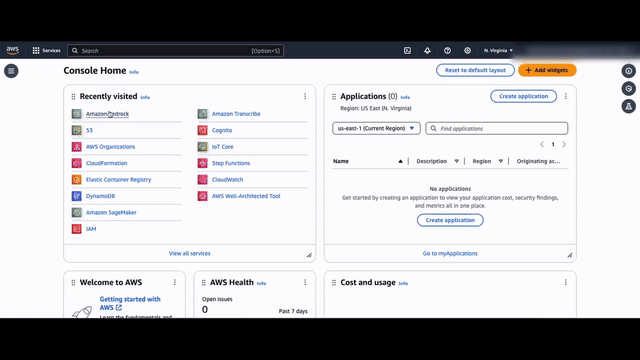
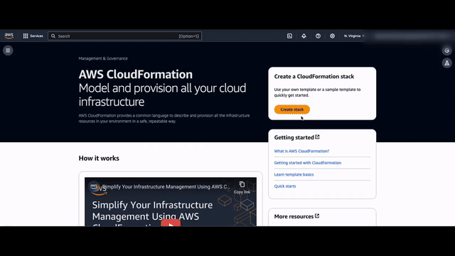

# Guidance for Media2Cloud on AWS

## Table of Contents

- [Compatibility Notes](#compatibility-notes)
- [What's New in V4](#whats-new-in-v4)
- [Introduction](#introduction)
- [Installation](#installation)
- [Building and Customizing the Solution](#building-and-customizing-the-solution)
- [Deep dive into Media2Cloud V4](#deep-dive-into-media2cloud-v4)
- [V4 Demo Video Gallery](#v4-demo-video-gallery)
- [LICENSE](#license)
- [Collection of Operational Metrics](#collection-of-operational-metrics)

__

## Compatibility Notes

If you are running Media2Cloud Version 3, **do not** update your existing stack. Version 4 is **not** compatible with Version 3 in a few areas:

- The format of the generated metadata JSON files is different.
- The indices of the Amazon OpenSearch cluster have been optimized and condensed into a single index, `content`, instead of multiple indices such as `celeb` and `label`.

We are working on a migration path to ensure you can move your Version 3 data files into the Version 4 environment.

If you are looking for Version 3, please switch to [v3/maintenance](https://github.com/aws-solutions-library-samples/guidance-for-media2cloud-on-aws/tree/v3/maintenance) branch.

__

## What's new in V4?

- **Dynamic frame analysis**: V3 introduced frame-based analysis that allows you to specify frames per second to run the AWS AI/ML services. In V4, the Dynamic frame analysis uses two algorithms (Perceptual Hash and Laplacian Variant) to intelligently select frames to analyze.

- **Auto Face Indexer**: This feature automatically indexes `unrecognized faces` during the analysis workflow. After faces are identified, we use the `late binding` technique that allows you to tag the unrecognized faces after the video files have been analyzed. The tagged names are then automatically propagated to all the video files without the need to re-run the analysis workflow.

- **Scene detection**: Using a combination of AWS Generative AI and AI/ML services, including Amazon Bedrock Text & Vision (Anthropic Claude 3 Haiku / Sonnet) model, Amazon Rekognition Segment API, Amazon Transcribe API, and an open-source machine learning model (to generate image embeddings of the frames) and an ephemeral vector store, V4 provides contextual scene change events along with detailed information such as scene description, IAB Content Taxonomies, GARM Taxonomies, scene sentiments, and brands and logos at the scene level.

- **Ad break detection**: Leveraging the scene change events derived from the Scene detection, V4 automatically derives and suggests relevant timestamps that are suitable for ad insertions.

- **Image contextual description**: V4 uses the Amazon Bedrock model to analyze the uploaded image and provides image description, one-line ALT-TEXT, image file name suggestion, and the top five relevant tags for publishers to enhance SEO.

- **Generative AI plugins**: V4 web user inference enables you to try out Amazon Bedrock models.

See quick demo in [V4 Demo Video Gallery](#v4-demo-video-gallery)

__

## Introduction

The AWS Media2Cloud solution is designed to demonstrate a serverless ingest and analysis framework that can quickly set up a baseline ingest and analysis workflow for placing video, image, audio, and document assets and associated metadata under the management control of an AWS customer. The solution will set up the core building blocks that are common in an ingest and analysis strategy:

- Establish a storage policy that manages master materials as well as proxies generated by the ingest process.
- Provide a unique identifier (UUID) for each master video asset.
- Calculate and provide an MD5 checksum.
- Perform a technical metadata extract against the master asset.
- Build standardized proxies for use in a media asset management solution.
- Run the proxies through audio, video, and image analysis.
- Provide a serverless dashboard that allows a developer to set up and monitor the ingest and analysis process.


### Architecture overview


The architecture diagram depicts a media processing and analysis pipeline on Guidance for Media2Cloud on AWS. It leverages various AWS services to ingest, process, analyze, and store different types of media files such as video, audio, images, and documents.

The architecture can be divided into the following key components:

1. **Ingestion Services**: This includes services like AWS Elemental MediaConvert, Mediainfo, PDF.JS, and ExifTool for ingesting different types of media files into the pipeline.

2. **AWS Step Functions Workflows**: The core of the architecture is built around AWS Step Functions workflows, which orchestrate the media processing and analysis tasks. There are separate workflows for ingesting media files, processing them using AWS AI/ML services, and performing analysis tasks.

3. **AWS Lambda Functions**: These serverless functions are used for various tasks such as media ingest, video analysis, audio analysis, image analysis, and document analysis.

4. **AWS AI/ML Services**: The architecture integrates with several AWS AI/ML services like Amazon Bedrock, Amazon Rekognition, Amazon Transcribe, and Amazon Comprehend for performing intelligent media analysis tasks.

5. **Data Storage Services**: The processed media files and analysis results are stored in Amazon S3 buckets. Other storage services like Amazon DynamoDB, Amazon OpenSearch Service, and Amazon Neptune are used for storing metadata and enabling search capabilities.

6. **Integration Services**: The architecture supports integration with external systems through Amazon API Gateway, Amazon Cognito (for user authentication), Amazon CloudWatch (for monitoring), and Amazon EventBridge (for event-driven architectures).

Here is a list of AWS services used in Media2Cloud.

- Orchestration layer
  - AWS Step Functions
  - AWS Lambda
- Generative AI and AI/ML layer
  - Amazon Bedrock
  - Amazon Rekognition
  - Amazon Transcribe
  - Amazon Comprehend
  - Amazon Textract
- Storage and datastore layer
  - Amazon Simple Storage Service (S3)
  - Amazon DynamoDB
  - Amazon OpenSearch Service
  - Amazon Neptune
- Frontend authentication and authorization layer
  - Amazon Cognito
  - Amazon API Gateway
  - Amazon CloudFront
- Notification services
  - AWS IoT Core
  - Amazon Simple Notification layer
- Event layer
  - Amazon EventBridge
  - Amazon CloudWatch
- Media layer
  - AWS Elemental MediaConvert

__

## Installation

### Prerequisite

Before you create the Media2Cloud V4 stack, make sure you have enabled the Anthropic Claude 3 Haiku or Sonnet model through the **Amazon Bedrock** console under the `Manage model access` page.

Currently, the Anthropic Claude 3 Haiku and Sonnet models are available in the US East (N. Virginia) [us-east-1], US West (Oregon) [us-west-2], Europe (Paris) [eu-west-3], and Asia Pacific (Sydney) [ap-southeast-2] regions. If you are creating the Media2Cloud V4 stack in other regions, such as Europe (Ireland), you can still try out the Anthropic Claude 3 Haiku and Sonnet models by choosing the model access in one of these regions: `us-east-1`, `us-west-2`, `eu-west-3`, or `ap-southeast-2`. Keep in mind that there will be additional Data Transfer cost across regions.




### Create Media2Cloud V4 stack with AWS CloudFormation

#### _Using AWS Console_
Log on to AWS CloudFormation console to create a new stack and follow the steps in the following video.



#### _Using AWS CLI_

```sh

aws cloudformation create-stack \
  --stack-name media2cloudv4 \
  --template-url https://{S3URL}/media2cloud.template \
  --parameters \
    "ParameterKey=VersionCompatibilityStatement,ParameterValue=\"Yes, I understand and proceed\"" \
    "ParameterKey=Email,ParameterValue=\"YOUR@EMAIL.COM\"" \
    "ParameterKey=DefaultAIOptions,ParameterValue=\"Recommended V4 features (v4.default)\"" \
    "ParameterKey=PriceClass,ParameterValue=\"Use Only U.S., Canada and Europe (PriceClass_100)\"" \
    "ParameterKey=StartOnObjectCreation,ParameterValue=\"YES\"" \
    "ParameterKey=UserDefinedIngestBucket,ParameterValue=\"\"" \
    "ParameterKey=OpenSearchCluster,ParameterValue=\"Development and Testing (t3.medium=0,m5.large=1,gp2=10,az=1)\"" \
    "ParameterKey=EnableKnowledgeGraph,ParameterValue=\"NO\"" \
    "ParameterKey=CidrBlock,ParameterValue=\"172.31.0.0/16\"" \
    "ParameterKey=BedrockSecondaryRegionAccess,ParameterValue=\"North Virginia [US East] (us-east-1)\"" \
    "ParameterKey=BedrockModel,ParameterValue=\"Anthropic Claude 3 Haiku\"" \
  --tags \
    "Key=SolutionName,Value=Media2Cloud" \
    "Key=SolutionID,Value=SO0050" \
  --capabilities \
    "CAPABILITY_IAM" \
    "CAPABILITY_NAMED_IAM" \
    "CAPABILITY_AUTO_EXPAND"

```

#### _One-click Pre-built template_

|Region|1-click Quick Deploy|Template URL|
|:--|:--|:--|
|US East (N. Virginia)|<a href="https://console.aws.amazon.com/cloudformation/home?region=us-east-1#/stacks/quickcreate?templateURL=https://awsi-megs-guidances-us-east-1.s3.amazonaws.com/media2cloud/latest/media2cloud.template&stackName=media2cloudv4" target="_blank">Launch stack</a>|https://awsi-megs-guidances-us-east-1.s3.amazonaws.com/media2cloud/latest/media2cloud.template|
|US West (Oregon)|<a href="https://console.aws.amazon.com/cloudformation/home?region=us-west-2#/stacks/quickcreate?templateURL=https://awsi-megs-guidances-us-west-2.s3.us-west-2.amazonaws.com/media2cloud/latest/media2cloud.template&stackName=media2cloudv4" target="_blank">Launch stack</a>|https://awsi-megs-guidances-us-west-2.s3.us-west-2.amazonaws.com/media2cloud/latest/media2cloud.template|
|Europe (Ireland)|<a href="https://console.aws.amazon.com/cloudformation/home?region=eu-west-1#/stacks/quickcreate?templateURL=https://awsi-megs-guidances-eu-west-1.s3.eu-west-1.amazonaws.com/media2cloud/latest/media2cloud.template&stackName=media2cloudv4" target="_blank">Launch stack</a>|https://awsi-megs-guidances-eu-west-1.s3.eu-west-1.amazonaws.com/media2cloud/latest/media2cloud.template|
|Asia Pacific (Sydney)|<a href="https://console.aws.amazon.com/cloudformation/home?region=ap-southeast-2#/stacks/quickcreate?templateURL=https://awsi-megs-guidances-ap-southeast-2.s3.ap-southeast-2.amazonaws.com/media2cloud/latest/media2cloud.template&stackName=media2cloudv4" target="_blank">Launch stack</a>|https://awsi-megs-guidances-ap-southeast-2.s3.ap-southeast-2.amazonaws.com/media2cloud/latest/media2cloud.template|

The stack creation takes about 30 minutes to complete. Upon completion, you should receive an email invitation to the Media2Cloud web portal.


#### _Input Parameters_

| ParameterKey | ParameterValue | Description |
|:-- |:-- |:--|
|VersionCompatibilityStatement|Yes, I understand and proceed| (Mandatory) Make sure to read the version compatibility statement before you proceed|
| Email | YOUR@EMAIL.COM | (Mandatory) Fill in your email address. The email address is used to sign up to Amazon Cognito UserPool and to receive an invitation email to the Media2Cloud web portal |
|DefaultAIOptions | Recommended V4 features (v4.default) | Choose the default AI/ML settings. The settings can also be modified via the Media2Cloud web portal under the Settings page |
|PriceClass|Use Only U.S., Canada and Europe (PriceClass_100)|Choose the most appropriate Amazon CloudFront price class for your region |
|StartOnObjectCreation|YES|Enable auto-ingestion when a new object is uploaded to the Amazon S3 bucket (IngestBucket)|
|UserDefinedIngestBucket|LEAVE IT BLANK|Optionally you can connect your existing ingest bucket to the Media2Cloud|
|OpenSearchCluster|Development and Testing (t3.medium=0,m5.large=1,gp2=10,az=1)|For testing and evaluation purpose, recommed to use a single instance. For stagging and production environment, consider to use the Production configuration.|
|EnableKnowledgeGraph|NO|Select **YES** if you would like to enable Amazon Neptune graph database which allows you to visualize how your contents are connected in some ways.|
|CidrBlock|172.31.0.0/16|Applicable only if you enable Amazon Neptune graph|
|BedrockSecondaryRegionAccess|North Virginia [US East] (us-east-1)|Choose between `us-east-1` or `us-west-2` region to try out the Generative AI features in Media2Cloud V4. Highly recommended.|
|BedrockModel|Anthropic Claude 3 Haiku|Choose between `Anthropic Claude 3 Haiku` or `Anthropic Claude 3 Sonnet`. Both models are Text & Vision capable.|

__

## Building Media2Cloud V4 on your environment

#### _Prerequisites_
Make sure you have the following tools installed on your environment:
- [NodeJS 20.x](https://nodejs.org/en/download/current/)
- [AWS Command Line Interface (CLI)](https://aws.amazon.com/cli/)
- [jq](https://stedolan.github.io/jq/)
- [Docker](https://docs.docker.com/get-docker/)

#### _Step 1: Create an Amazon S3 bucket_

When you build the Media2Cloud V4 on your environment, you create artifacts such as the CloudFormation templates and the code packages in zip format. You need a S3 bucket to store the artefact such that you can launch the stack by pointing to your own version of CloudFormation templates.

Skip this step if you already have a S3 bucket that you plan to use.

```sh

aws s3api create-bucket --bucket yourname-artefact-bucket --region us-east-1

```

#### _Step 2: Clone GitHub repo_

```sh

git clone https://github.com/aws-solutions-library-samples/guidance-for-media2cloud-on-aws

```

#### _Step 3: Run the build script_

```sh

# change to the deployment directory
cd guidance-for-media2cloud-on-aws/deployment

bash build-s3-dist.sh \
  --bucket yourname-artefact-bucket \
  --version v4.1234 \
  --single-region > build.log 2>&1 &

# tail the build.log
tail -f build.log

```

\* _Tip 1: Always assign an unique version with `--version` flag to ensure Cloudformation Update stack operation works properly. If the version is not updated, the Update stack operation may skip updating some resources. Alternatively, you can update [.version](source/layers/core-lib/lib/.version) under source/layers/core-lib/lib/._

\* _Tip 2: Always include `--single-region` flag when you are building the stack for a single region use._

#### _Step 4: Deploy the build artefacts to your S3 bucket_

```sh

bash deploy-s3-dist.sh \
  --bucket yourname-artefact-bucket \
  --version v4.1234 \
  --single-region

```

Once the artefacts are uploaded to yourname-artefact-bucket, you can use the HTTPS URL of the `media2cloud.template` to create the stack on CloudFormation.

__

## Deep dive into Media2Cloud V4

#### _Resource naming convention_

The resources created by the Media2Cloud CloudFormation stack follow a naming convention that follows the pattern [SolutionID]-[PartialStackID]-[WorkflowName]. The SolutionID for Media2Cloud is `so0050`, the PartialStackID is a unique ID generated by CloudFormation upon stack creation, and the WorkflowName can be `ingest`, `analysis`, or other workflow names. For example, the Ingestion Main state machine would be named `so0050-000000000000-ingest-main`, and a lambda function in the Analysis Main state machine would be named `so0050-000000000000-analysis-main`.


#### _Backend workflow_

The core part of the Media2Cloud V4 is the backend ingestion and analysis workflows. To learn more, click on the topics.

- [Main state machine](./source/main/README.md)
  - [Ingestion Main state machine](./source/main/ingest/main/README.md)
    - [Video Ingestion state machine](./source/main/ingest/video/README.md)
    - [Audio Ingestion state machine](./source/main/ingest/audio/README.md)
    - [Image Ingestion state machine](./source/main/ingest/image/README.md)
    - [Document Ingestion state machine](./source/main/ingest/document/README.md)
  - [Analysis Main state machine](./source/main/analysis/main/README.md)
    - [Video Analysis state machine](./source/main/analysis/video/README.md)
    - [Audio Analysis state machine](./source/main/analysis/audio/README.md)
    - [Image Analysis state machine](./source/main/analysis/image/README.md)
    - [Document Analysis state machine](./source/main/analysis/document/README.md)
- [Opensource ML models and vector store](./docker/README.md)
  - [CLIP (zeroshot image classification model)](./docker/zero-shot-classifier-on-aws/README.md)
  - [OWL-ViT (zero-shot object detection model)](./docker/zero-shot-object-on-aws/README.md)
  - [Faiss (ephemeral vector store)](./docker/faiss-on-aws/README.md)


#### _Frontend workflow_

- [Web application](./source/webapp/README.md)
- [API Endpoint](./source/api/README.md)

__

## V4 Demo Video Gallery

#### _Scene and Ad break detection_

Demonstrating the differences between scene and shot, the conversation topic analysis, the contextual information at the scene level including scene description, IAB Content Taxonomy, GARM Taxonomy, Sentiment, and Brands and logos.


#### _Dynamic Frame Analysis_

Demonstrating how the Dynamic Frame Analysis feature can significantly reduce the numbers of API calls to Amazon Rekognition services while still extracting the valuable metadata from the media file.


#### _Auto Face Indexer_

Demonstrating how the Auto Face Indexer uses the late binding technique to allow you to "tag" the unrecognized faces without re-analyzing the meda files.


__

## LICENSE

Copyright Amazon.com, Inc. or its affiliates. All Rights Reserved.

Licensed under the Apache License, Version 2.0 (the "License").
You may not use this file except in compliance with the License.
You may obtain a copy of the License at

    http://www.apache.org/licenses/LICENSE-2.0

Unless required by applicable law or agreed to in writing, software
distributed under the License is distributed on an "AS IS" BASIS,
WITHOUT WARRANTIES OR CONDITIONS OF ANY KIND, either express or implied.
See the License for the specific language governing permissions and
limitations under the License.

__

## Collection of operational metrics

This solution collects anonymous operational metrics to help AWS improve the quality of features of the solution. For more information, including how to disable this capability, please see the [implementation guide](https://aws-solutions-library-samples.github.io/media-entertainment/media2cloud-on-aws.html#anonymized-data-collection).
