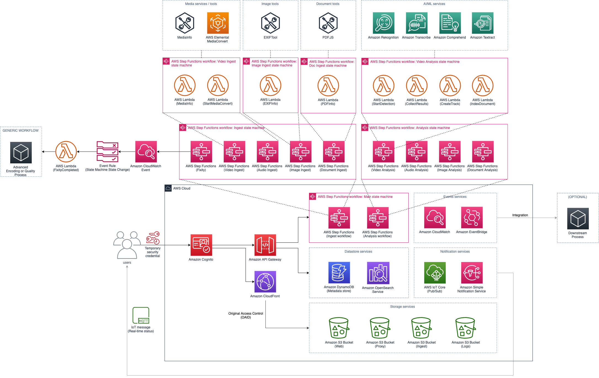

# Guidance for Media2Cloud on AWS (formerly known as AWS Media2Cloud Solution)

## Table of contents
* [Maintenance notice](#maintenance-notice)
* [What's new in V3](#whats-new-in-v3)
* [Introduction](#introduction)
* [Architecture overview](#architecture-overview)
  * [Main workflow](./source/main/README.md)
  * [Ingest workflow](./source/main/ingest/main/README.md)
  * [Analysis workflow](./source/main/analysis/main/README.md)
  * [Frontend webapp](./source/webapp/README.md)
* [Installation](#installation)
* [Building and customizing the guidance](#building-and-customizing-the-guidance)
* [Code structure](#code-structure)
* [License](#license)
* [Collection of operational metrics](#collection-of-operational-metrics)

__

## Maintenance notice

With the release of Version 4, Version 3 of Media2Cloud has entered maintenance mode. New features will only be available in Version 4 going forward. The Version 3 branch will only receive critical bug fixes, such as updates to the Node.js version to 20.x.

We encourage you to check out the new Version 4 and take advantage of the latest features and improvements.

__

## What's new in V3?

* New web user interface makes it easier to navigate different categories
* Advanced search feature with [Amazon OpenSearch](https://aws.amazon.com/opensearch-service/the-elk-stack/what-is-opensearch/) service now returns types and timestamps of the search term that allows you to _jump_ to a specific timestamp of the media file that contains the search result.
* Added ```Stats``` view lets you visualize your library.
* Built-in ```Backlog Management System``` to handle large requests of Amazon Rekognition Video processes.
* [Amazon Rekognition Video Segment API](https://docs.aws.amazon.com/rekognition/latest/dg/segment-api.html) allows you to analyze video shot change and technical cues such as black frame, color bar, and end credits event. V3 also converts segment results into Edit Decision List (EDL) format allowing you to import the shot timeline to popular editing software such as Adobe Premerie Pro and BlackMagic DaVinci Resolve.
* [Amazon Rekognition Custom Labels](https://aws.amazon.com/rekognition/custom-labels-features/) (CL) feature is an AutoML service that lets you easily train computer vision models such as image classification and object detection model. Version 3 can use your trained CL model to analyze content. To train a CL model, check out this open source [custom brand detection](https://github.com/aws-samples/amazon-rekognition-custom-brand-detection) project. Version 3 also manages the runtime of your CL models (auto-start and stop the model after use) to minimize inference cost.
* ```Frame based analysis``` option lets you specify the framerate (ie., one frame every second or one frame very two seconds) to run Amazon Rekognition Image API instead of Amazon Rekognition Video API. Note that for Video-specific APIs such as ```Amazon Rekognition Segment``` and ```Amazon Rekognition Person Pathing```, Version 3 continues to use the Video APIs.
* Integrated [Amazon Transcribe Custom Language Model](https://docs.aws.amazon.com/transcribe/latest/dg/create-custom-language-model.html) (CLM) and [Amazon Transcribe Custom Vocabulary](https://docs.aws.amazon.com/transcribe/latest/dg/how-vocabulary.html) features that improve the transcription results. Check out [Building custom language models to supercharge speech-to-text performance for Amazon Transcribe](https://aws.amazon.com/blogs/machine-learning/building-custom-language-models-to-supercharge-speech-to-text-performance-for-amazon-transcribe/) blog post to learn more how you can train a domain specific CLM to improve transcription accuracy.

__

## Introduction

Guidance for Media2Cloud on AWS is designed to demonstrate a serverless ingest and analysis framework that can quickly setup a baseline ingest and analysis workflow for placing video, image, audio, and document assets and associated metadata under management control of an AWS customer. The guidance will setup the core building blocks that are common in an ingest and analysis strategy:
* Establish a storage policy that manages master materials as well as proxies generated by the ingest process.
* Provide a unique identifier (UUID) for each master video asset.
* Calculate and provide a MD5 checksum.
* Perform a technical metadata extract against the master asset.
* Build standardized proxies for use in a media asset management solution.
* Run the proxies through audio, video, image analysis.
* Provide a serverless dashboard that allows a developer to setup and monitor the ingest and analysis process.

See it in action!


__

## Architecture overview



__

## Installation

Please follow the instructions described in the guidance implementation guide, [Automated deployment section](https://docs.aws.amazon.com/solutions/latest/media2cloud/automated-deployment.html).

__

## Building and customizing the guidance

* **Prerequisites:** building the guidance requires the following tools to be installed on your system.
  * [NodeJS 16.x](https://nodejs.org/en/download/)
  * [AWS Command Line Interface (CLI)](https://aws.amazon.com/cli/)
  * [jq](https://stedolan.github.io/jq/)
* Create a bucket in the AWS region you would like to deploy the guidance. For example, ```media2cloud-template-us-east-1``` in us-east-1 region.
* Make sure to specify ```--single-region``` in the command line indicating you are deploying the templates in a single region

    ```
    bash ./build-s3-dist.sh --bucket media2cloud-template-us-east-1 --single-region
    ```
* Ensure that you are owner of the AWS S3 bucket

    ```
    aws s3api head-bucket \
    --bucket media2cloud-template-us-east-1 \
    --expected-bucket-owner YOUR-AWS-ACCOUNT-NUMBER
    ```
* Deploy the distributable to an Amazon S3 bucket in your account. _Note:_ you must have the AWS Command Line Interface installed.

    ```
    bash ./deploy-s3-dist.sh --bucket media2cloud-template-us-east-1 --single-region
    ```

* Get the HTTPS URL link of ```media2cloud.template``` after you have uploaded to your Amazon S3 bucket.
* Deploy the guidance to your account by launching a new AWS CloudFormation stack using the link of the ```media2cloud.template```.

__

## Code structure

| Path | Description |
| :--- | :---------- |
| deployment/ | -- |
| deployment/build-s3-dist.sh | shell script to build packages |
| deployment/deploy-s3-dist.sh | shell script to deploy packages to your Amazon S3 bucket |
| deployment/media2cloud.yaml | main Amazon CloudFormation template to deploy the stack |
| source/ | -- |
| source/api | Amazon API Gateway handler |
| source/backlog | implementation of internal queue management to handle large numbers of Amazon Rekognition Video requests |
| source/build | build script used by ```build-s3-dist.sh``` |
| source/custom-resources | lambda function used by Amazon CloudFormation during stack creation and deletion |
| LAYERS | -- |
| source/layers | directory of various AWS Lambda Layers |
| source/layers/aws-sdk-layer | latest AWS SDK layer |
| source/layers/canvas-lib | canvas layer for processing images |
| source/layers/core-lib | core library shared by all lambdas |
| source/layers/fixity-lib | fixity library to compute MD5/SHA1 |
| source/layers/image-process-lib | wrapper to exif-tool to extract image metadata |
| source/layers/mediainfo | mediainfo layer |
| source/layers/pdf-lib | wrapper of pdfjs package |
| source/layers/service-backlog-lib | service backlog of internal queue management |
| WORKFLOWS | -- |
| [source/main](./source/main/README.md) | main state machine |
| [source/main/ingest](./source/main/ingest/README.md) | ingest state machine implementation |
| [source/main/analysis](./source/main/analysis/README.md) | analysis state machine implementation |
| [source/main/automation](./source/main/automation/README.md) | triggers and automations of workflows |
| WEBAPP | -- |
| [source/webapp](./source/webapp/README.md) | implementation of webapp |

__


## License

Copyright Amazon.com, Inc. or its affiliates. All Rights Reserved.

Licensed under the Apache License, Version 2.0 (the "License").
You may not use this file except in compliance with the License.
You may obtain a copy of the License at

    http://www.apache.org/licenses/LICENSE-2.0

Unless required by applicable law or agreed to in writing, software
distributed under the License is distributed on an "AS IS" BASIS,
WITHOUT WARRANTIES OR CONDITIONS OF ANY KIND, either express or implied.
See the License for the specific language governing permissions and
limitations under the License.

__

## Collection of operational metrics

This guidance collects anonymized operational metrics to help AWS improve the
quality of features of the guidance. For more information, including how to disable
this capability, please see the [implementation guide](https://docs.aws.amazon.com/solutions/latest/media2cloud/collection-of-operational-metrics.html).
