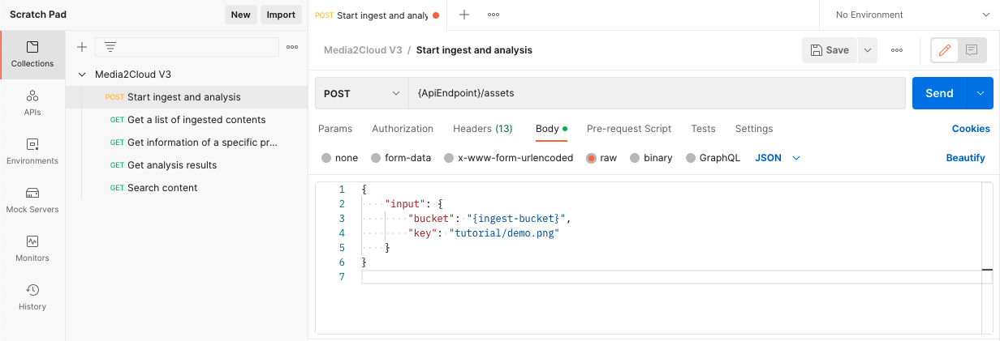

## Tutorial 2. Using the Media2Cloud RESTful APIs to ingest, analyze, and search contents

In [Tutorial 1: Creating the Guidance for Media2Cloud on AWS using AWS CloudFormation service](./1-creating-media2cloud-stack.md), we have created our own Guidance for Media2Cloud on AWS and were able to upload images and videos using the Media2Cloud Web Portal.

In this tutorial, we will use the Media2Cloud RESTful APIs to programmatically drive different workflows. This is useful when we plan to integrate Guidance for Media2Cloud on AWS into other workflows such as Media Supply Chain, Media Asset Management, Archive Migration workflows.

_

_Check out how UKTV uses Guidance for Media2Cloud on AWS in their Media Supply Chain_

[](https://www.youtube.com/watch?v=cz03AFD1T-c)

_And, how Formula 1 uses Media2Cloud for the archive migration workflow_
[](https://www.youtube.com/watch?v=CANn5FdkNbA)


### In this tutorial, we will
1. [Create an IAM user that allows us to authenticate with the Media2Cloud RESTful APIs](#step-1-create-an-iam-user)
2. [Locate the Media2Cloud API Endpoint from the stack we just created](#step-2-locate-media2cloud-api-endpoint)
3. [Using AWS CLI command to upload an image file](#step-3-aws-cli-command-to-upload-an-image-file)
4. [Using cURL command to start the ingest and analysis workflow](#step-4-curl-command-to-start-ingest-and-analysis-workflow)
5. [Using cURL command to query assets](#step-5-curl-command-to-query-assets-assets)
    * [Querying a list of assets](#step-51-querying-a-list-of-assets)
    * [Querying a specific asset](#step-52-querying-a-specific-asset)
    * [Querying analysis results of a specific asset](#step-53-querying-analysis-results-of-a-specific-asset)
6. [Using cURL command to search contents from Amazon OpenSearch engine](#step-6-curl-command-to-search-contents-from-amazon-opensearch-engine)
7. [BONUS: Using Postman](#bonus-using-postman)

__

## Step 1: Create an IAM user

Make sure [AWS Command Line Interface (CLI)](https://docs.aws.amazon.com/cli/latest/userguide/cli-chap-install.html) and [JQ](https://stedolan.github.io/jq/) JSON parser are installed.


### Create an user

```shell
#
# Create the IAM user, called Media2CloudApiUser
#
aws iam create-user \
    --user Media2CloudApiUser

# Response should look like this:
{
    "User": {
        "Path": "/",
        "UserName": "Media2CloudApiUser",
        "UserId": "{userId}",
        "Arn": "arn:aws:iam::{account}:user/Media2CloudApiUser",
        "CreateDate": "2022-10-27T16:15:27+00:00"
    }
}

```
_

### Attach policy to the user

```shell
#
# Attach AmazonAPIGatewayInvokeFullAccess to Media2CloudApiUser
#
aws iam attach-user-policy \
    --policy-arn arn:aws:iam::aws:policy/AmazonAPIGatewayInvokeFullAccess \
    --user Media2CloudApiUser

#
# Attach AmazonS3FullAccess to Media2CloudApiUser
#
aws iam attach-user-policy \
    --policy-arn arn:aws:iam::aws:policy/AmazonS3FullAccess \
    --user Media2CloudApiUser

```

**Important note:** For simplicity, we attach full access policies of `AmazonS3FullAccess` and `AmazonAPIGatewayInvokeFullAccess` to the IAM user.

In practice, we should always grant the least privileges to the IAM user or IAM role by limiting the `Resource` and `Action` in the IAM Policy as follows.

```json
{
    "Version": "2012-10-17",
    "Statement": [
        /* Amazon S3 permission */
        {
            "Effect": "Allow",
            "Action": [
                "s3:ListBucket",
                "s3:GetObject",
                "s3:PutObject"
            ],
            "Resource": [
                "arn:aws:s3:::{ingest-bucket}",
                "arn:aws:s3:::{ingest-bucket}/*",
                "arn:aws:s3:::{proxy-bucket}",
                "arn:aws:s3:::{proxy-bucket}/*"
            ]
        },
        /* Amazon API Gateway permission */
        {
            "Effect": "Allow",
            "Action": "execute-api:Invoke",
            "Resource": "arn:aws:execute-api:{region}:{accountId}:{apiId}/demo/*/*"
        }
    ]
}

```

_

### Create access key for the user

```shell

aws iam create-access-key \
    --user Media2CloudApiUser

# Response should look like this:
{
    "AccessKey": {
        "UserName": "Media2CloudApiUser",
        "AccessKeyId": "{accessKeyId}",
        "Status": "Active",
        "SecretAccessKey": "{secretAccessKey}",
        "CreateDate": "2022-10-27T16:27:58+00:00"
    }
}

```

**Important note:** Save the `AccessKeyId` and `SecretAccessKey` in notepad or text editor. This is the credentials that will be used to authenticate with the Media2Cloud RESTful APIs.

__

## Step 2: Locate Media2Cloud API Endpoint

Now that we have created an IAM User, `Media2CloudApiUser` that allows us to call and authenticate with the Media2Cloud API Endpoint. Let's locate the Media2CLoud API Endponint created by the AWS CloudFormation stack.

```shell

#
# Describe stack outputs and look for `ApiEndpoint` OutputKey
#
aws cloudformation describe-stacks \
    --stack-name m2c-demo | \
    jq '.Stacks[0].Outputs[] | select(.OutputKey == "ApiEndpoint")'

# Response looks like this. This `OutpuValue` is the API endpoint to use
{
  "OutputKey": "ApiEndpoint",
  "OutputValue": "https://{apiId}.execute-api.{region}.amazonaws.com/demo",
  "Description": "ApiEndpoint"
}


```

__

## Step 3: AWS CLI command to upload an image file

Before we upload an image file, we need to know where (or which bucket) we should upload the file to. Let's find out the bucket information from the stack.

### Find the ingest bucket from the CloudFormation stack

Guidance for Media2Cloud on AWS creates numbers of buckets for different purposes. The bucket naming convention is `so0050-{stackId}-{accountId}-{region}-{suffix}` where

| Component | Description |
| :-- | :-- |
| so0050 | A solution Id of Guidance for Media2Cloud on AWS. This is always `so0050`. |
| {stackId} | The last 12 characters of the stack id. | 
| {accountId} | Our AWS Account Id |
| {region} | AWS region the stack is created |
| {suffix} | Bucket suffix will be `ingest \| proxy \| web \| logs` |

#### Buckets the stack creates:

| Bucket | Description |
| :-- | :-- |
| so0050-{stackId}-{accountId}-{region}-ingest | stores original contents, uploaded contents. This bucket has a Lifecycle Policy to transition the content to Archive Storage after 30 days |
| so0050-{stackId}-{accountId}-{region}-proxy | stores proxy files such as thumbnails, MP4 video and audio created by AWS Elemental MediaConvert and metadata files created by AWS AI/ML services |
| so0050-{stackId}-{accountId}-{region}-web | hosts static files of the web application such as html, javascript, or css |
| so0050-{stackId}-{accountId}-{region}-logs | stores access logs |

_

To upload our media files, we would need to find the `ingest` bucket created by the stack. Run the following command:

```shell

aws cloudformation describe-stacks \
    --stack-name $(\
        aws cloudformation describe-stack-resources \
            --stack-name m2c-demo | \
            jq '.StackResources[] | select(.LogicalResourceId == "CoreStack") | .PhysicalResourceId' | \
            tr -d '"' \
        ) | \
    jq '.Stacks[0].Outputs[] | select(.OutputKey == "IngestBucket")'

#
# The `OutputValue` of IngestBucket is the bucket that we upload our media files.
#
{
  "OutputKey": "IngestBucket",
  "OutputValue": "so0050-{stackId}-{accountId}-{region}-ingest",
  "Description": "IngestBucket"
}

```

Let's dissect the command we ran earlier.

#### 1: Describe all resources created by `m2c-demo` stack including all nested stacks

```shell
aws cloudformation describe-stack-resources --stack-name m2c-demo

```

#### 2: Find the nested stack called `CoreStack` which is the stack that creates all the buckets for the solution. Find the `PhysicalResourceId` of the `CoreStack` based on `LogicalResourceId`

```shell
jq '.StackResources[] | select(.LogicalResourceId == "CoreStack") | .PhysicalResourceId' | tr -d '"'

```

#### 3: Describe the `CoreStack` using the `PhysicalResourceId`

```shell
aws cloudformation describe-stack-resources --stack-name {PhysicalResourceId}

```

#### 4: Select from the `Outputs` where `OutputKey` is equal to `IngestBucket`

```shell
jq '.Stacks[0].Outputs[] | select(.OutputKey == "IngestBucket")'

```

_

### Let's upload an image

Now that we have the bucket that we are going to use to upload our files to. Let's do that now.

```shell
aws s3 cp demo.png s3://{ingest-bucket}/tutorial/demo.png

#
# Double check the file
#
aws s3api head-object --bucket {ingest-bucket} --key tutorial/demo.png

# Response
{
    "AcceptRanges": "bytes",
    "LastModified": "2022-10-28T09:09:20+00:00",
    "ContentLength": 134461,
    "ETag": "\"0362bc0166eef1cb33ce50f05743274e\"",
    "VersionId": "uRok5lfkUsJNM_CjK02lc2xZD7BxN.1n",
    "ContentType": "image/png",
    "ServerSideEncryption": "AES256",
    "Metadata": {}
}

```

__

## Step 4: cURL command to start ingest and analysis workflow

Now that we have an image file upload, we can start the ingest and analysis workflow using `cURL` command.

We will need the information we obtained from the previous steps:
* `accessKeyId` and `secretAccessKey` from [Step 1: Create an IAM user](#create-access-key-for-the-user)
* `ApiEndpoint` from [Step 2: Locate Media2Cloud API Endpoint](step-2-locate-media2cloud-api-endpoint)


### Putting it all together

| Parameter | Value | Description |
| :-- | :-- | :-- |
| Request | POST /demo/assets | `demo` is the `stage` when we deploy the API Gateway endpoint.<br/>`assets` refers as `{operation}` to start ingest and analysis workflow on a specific file |
| Headers | Content-type: application/json | Specific request body is a JSON object |
| Body | {<br/>&nbsp;&nbsp;"input": {<br/>&nbsp;&nbsp;&nbsp;&nbsp;"bucket": "{ingest-bucket}",<br/>&nbsp;&nbsp;&nbsp;&nbsp;"key": "tutorial/demo.png"<br/>&nbsp;&nbsp;}<br/>} | JSON payload contains the `bucket` and `key` of the file |
| aws-sigv4 | aws:amz:{region}:execute-api | Generates an AWS Signature V4 for authentication |
| user | `{accessKeyId}:{secretAccessKey}` | Using `accessKeyId` and `secretAccessKey` to hash the AWS Signature V4 |

```shell

curl https://{apiId}.execute-api.{region}.amazonaws.com/demo/assets \
    -X POST \
    -H "Content-type: application/json" \
    --aws-sigv4 "aws:amz:eu-west-1:execute-api" \
    --user "{accessKeyId}:{secretAccessKey}" \
    -d "{\
        \"input\": {\
            \"bucket\": \"{ingest-bucket}\",
            \"key\": \"tutorial/demo.png\"
        }\
    }"


# Response should look like this
{
    "uuid":"00000000-0000-0000-0000-000000000000",
    "status":"STARTED",
    "executionArn":"{executionArn}",
    "startDate":"2022-10-28T10:06:00.114Z"
}

```
where `uuid` is the unique Id of the content now being ingested to the Guidance for Media2Cloud on AWS.

__

## Step 5: cURL command to query assets (/assets)

Now that we have an image file uploaded to Media2Cloud. The section we will explore how we can query the contents (assets) from our Media2Cloud library.

_

### Step 5.1: Querying a list of assets

| Parameter | Value | Description |
| :-- | :-- | :-- |
| Request | GET /demo/assets | Path to query a list of assets |
| Headers | Content-type: application/json | - |
| Body | None | - |
| aws-sigv4 | aws:amz:{region}:execute-api | Generates an AWS Signature V4 for authentication |
| user | `{accessKeyId}:{secretAccessKey}` | Using `accessKeyId` and `secretAccessKey` to hash the AWS Signature V4 |
| data-urlencode | pageSize=`10`<br/>type=`image\|video\|audio\|document`<br/>token=`{nextToken}` | querstring (query options) encoded URI components |

```shell

#
# Return atmost 10 items (pageSize=10)
#
curl https://{apiId}.execute-api.eu-west-1.amazonaws.com/demo/assets \
    -H "Content-Type: application/json" \
    --aws-sigv4 "aws:amz:{region}:execute-api" \
    --user "{accessKeyId}:{secretAccessKey}" \
    --get \
    --data-urlencode "pageSize=10"

# JSON response looks like the followings:
{
  "Items": [
    {
      "uuid": "{uuid1}",
      "schemaVersion": 1,
      "type": "video",
      "timestamp": 1666954739988
    },
    {
      "uuid": "{uuid2}",
      "schemaVersion": 1,
      "type": "video",
      "timestamp": 1666954735175
    }
    ...
  ],
  "NextToken": "{nextToken}"
}

#
# Get image type content only
#
curl https://{apiId}.execute-api.eu-west-1.amazonaws.com/demo/assets \
    -H "Content-Type: application/json" \
    --aws-sigv4 "aws:amz:{region}:execute-api" \
    --user "{accessKeyId}:{secretAccessKey}" \
    --get \
    --data-urlencode "pageSize=10" \
    --data-urlencode "type=image"

#
# Get next page of image type contents
#
curl https://{apiId}.execute-api.eu-west-1.amazonaws.com/demo/assets \
    -H "Content-Type: application/json" \
    --aws-sigv4 "aws:amz:{region}:execute-api" \
    --user "{accessKeyId}:{secretAccessKey}" \
    --get \
    --data-urlencode "pageSize=10" \
    --data-urlencode "type=image" \
    --data-urlencode "token={nextToken}"

```

_

### Step 5.2: Querying a specific asset

| Parameter | Value | Description |
| :-- | :-- | :-- |
| Request | GET /demo/assets/{uuid} | Path to query overall information of a specific asset where `{uuid}` is the uuid of content to be retrieved |
| Headers | Content-type: application/json | - |
| Body | None | - |
| aws-sigv4 | aws:amz:{region}:execute-api | Generates an AWS Signature V4 for authentication |
| user | `{accessKeyId}:{secretAccessKey}` | Using `accessKeyId` and `secretAccessKey` to hash the AWS Signature V4 |
| data-urlencode | None | - |

```shell

curl https://{apiId}.execute-api.{region}.amazonaws.com/demo/assets/00000000-0000-0000-0000-000000000000 \
    -H "Content-Type: application/json" \
    --aws-sigv4 "aws:amz:{region}:execute-api" \
    --user "{accessKeyId}:{secretAccessKey}" \
    --get

# JSON response looks like the followings:
{
  "uuid": "{uuid}",
  "bucket": "{ingest-bucket}",
  "key": "tutorial/demo.png",
  "destination": {
    "bucket": "{proxy-bucket}",
    "prefix": "{uuid}/tutorial/"
  },
  "mime": "image/png",
  "imageinfo": "{uuid}/tutorial/imageinfo/imageinfo.json",
  "type": "image",
  "md5": "32 hex characters"
  "aiOptions": {
    "celeb": true,
    "label": true,
    "facematch": false,
    "text": true,
    ...
  },
  "analysis": [
    "image"
  ],
  "proxies": [
    {
      "key": "{uuid}/tutorial/transcode/proxy/demo.jpg"
      "type": "image",
      ...
    }
  ],
  "overallStatus": "COMPLETED"
}

```

| Field | Description |
| :-- | :-- |
| uuid | uuid of the content |
| bucket | ingest bucket that stores the uploaded content |
| key | file path of the uploaded content |
| destination.bucket | proxy bucket that stores proxies generated by the workflow |
| destination.prefix | prefix of intermediate files including proxies and metadata generated by the workflow |
| mime | Mime type of the uploaded content |
| imageinfo | JSON file of the technical metadata embedded in the image file and extracted by [ExifTool](https://exiftool.org/) |
| type | type of the uploaded content |
| md5 | MD5 checksum of the uploaded content |
| aiOptions | a set of AI/ML detections were specified |
| analysis | a list of analysis workflow has run |
| proxies | a list of proxy files generated by the workflow |
| overallStatus | the final status of the ingest and analysis workflow |

With the information, you can download the proxies or the technical metadata extracted by the ExifTool.

```shell

# Download EXIF technical metadata
aws s3 cp \
    s3://{proxy-bucket}/{uuid}/tutorial/imageinfo/imageinfo.json \
    ./imageinfo.json

# View EXIF technical metadata
cat imageinfo.json

```

_

### Step 5.3: Querying analysis results of a specific asset

The previous GET request returns the overall information of a specific content. To get the information related to the analysis process of the content, we will use `/analysis/{uuid}` path instead of `/assets/{uuid}`.

| Parameter | Value | Description |
| :-- | :-- | :-- |
| Request | GET /demo/analysis/{uuid} | Path to query analysis results of a specific asset where `{uuid}` is the uuid of the content to be retrieved |
| Headers | Content-type: application/json | - |
| Body | None | - |
| aws-sigv4 | aws:amz:{region}:execute-api | Generates an AWS Signature V4 for authentication |
| user | `{accessKeyId}:{secretAccessKey}` | Using `accessKeyId` and `secretAccessKey` to hash the AWS Signature V4 |
| data-urlencode | None | - |


```shell

curl https://{apiId}.execute-api.{region}.amazonaws.com/demo/analysis/00000000-0000-0000-0000-000000000000 \
    -H "Content-Type: application/json" \
    --aws-sigv4 "aws:amz:{region}:execute-api" \
    --user "{accessKeyId}:{secretAccessKey}" \
    --get

# JSON response looks like the followings:
[
  {
    "uuid": "{uuid}",
    "type": "image"
    "startTime": 1666951581568,
    "endTime": 1666951839257,
    "executionArn": "{executionArn}",
    "status": "COMPLETED",
    "rekog-image": {
      "face": {
        "output": "{uuid}/tutorial/raw/20221028T100619/rekog-image/face/output.json",
        "startTime": 1666951583193,
        "endTime": 1666951583823
      },
      "label": {
        "output": "{uuid}/tutorial/raw/20221028T100619/rekog-image/label/output.json",
        "startTime": 1666951583212,
        "endTime": 1666951584362
      },
      "text": {
        "output": "{uuid}/tutorial/raw/20221028T100619/rekog-image/text/output.json",
        "startTime": 1666951583252,
        "endTime": 1666951585015
      },
      "celeb": {
        "output": "{uuid}/tutorial/raw/20221028T100619/rekog-image/celeb/output.json",
        "startTime": 1666951583172,
        "endTime": 1666951583844
      },
      "moderation": {
        "output": "{uuid}/tutorial/raw/20221028T100619/rekog-image/moderation/output.json",
        "startTime": 1666951583232,
        "endTime": 1666951583873
      }
    },
  }
]

```

| Field | Description |
| :-- | :-- |
| uuid | uuid of the content |
| type | type of the content |
| startTime | start time of the analysis workflow |
| endTime | end time of the analysis workflow |
| executionArn | the Step Functions State Machine execution Arn |
| status | status of the analysis workflow |
| rekog-image.{aiCategory} | AI/ML detection category, `face\|celeb\|faceMatch\|label\|text\|moderation` |
| rekog-image.{aiCategory}.startTime | start time of a specific aiCategory process |
| rekog-image.{aiCategory}.endTime | end time of a specific aiCategory process |
| rekog-image.{aiCategory}.output | JSON output of a specific aiCategory process |

With these information, you can examine the JSON output of individual AI/ML process.

```shell

# Download the Celebrity JSON response
aws s3 cp \
    s3://{proxy-bucket}/{uuid}/tutorial/raw/20221028T100619/rekog-image/celeb/output.json \
    ./celeb.json

# View the celebrity JSON output
cat celeb.json

```

__

## Step 6: cURL command to search contents from Amazon OpenSearch engine

In the previous [Step 5: cURL command to query assets](#step-5-curl-command-to-query-assets-assets), we query the information that are stored in an Amazon DynamoDB table. Media2Cloud also indexes all technical and analysis metadata into an Amazon OpenSearch engine to power the search functionality.

This section demonstrates how we can use the `/search` operation to search contents from Media2Cloud search engine.

| Parameter | Value | Description |
| :-- | :-- | :-- |
| Request | GET /demo/search | Path to search contents |
| Headers | Content-type: application/json | - |
| Body | None | - |
| aws-sigv4 | aws:amz:{region}:execute-api | Generates an AWS Signature V4 for authentication |
| user | `{accessKeyId}:{secretAccessKey}` | Using `accessKeyId` and `secretAccessKey` to hash the AWS Signature V4 |
| data-urlencode | see a list of search options in the table below | - |

### Search options

| Name | Type | Description |
| :-- | :-- | :-- |
| query | String | (Mandatory) search term (keyword) of the search request |
| exact | String | Search for exact term, `true\|false`. Default to `false` |
| pageSize | Number | maximum number of items to return. If not specify, default to `30` |
| {category} | String | Search contents in specific category, `celeb\|face\|faceMatch\|text\|moderation\|ingest`. `ingest` refers to title and description of the content. The rest refers to individual AI/ML category such as Celebrity, Label, Moderation, Text, and so forth. If not specified, search across all categories |
| {mediaType} | String | Filter based on the media type, `image\|video\|audio`. If not specified, return all types. |
| token | String | Pagination. If the previous GET request has more items, the JSON response returns a `nextToken` field. Use the `nextToken` value to fetch the next page |


```shell
#
# IMPORTANT: If your search team contains `space` character,
# replace the `space` character with `%20`.
#
curl https://{apiId}.execute-api.{region}.amazonaws.com/demo/search/ \
    -H "Content-Type: application/json" \
    --aws-sigv4 "aws:amz:{region}:execute-api" \
    --user "{accessKeyId}:{secretAccessKey}" \
    --get \
    --data-urlencode "exact=true" \
    --data-urlencode "pageSize=2" \
    --data-urlencode "query=Andy%20Jassy"

# JSON response contains a list of hits
{
  "term": "Andy Jassy",
  "operator": "AND",
  "nextToken": 2,
  "hits": [
    /* image content */
    {
      "uuid": "{uuid}",
      "type": "image",
      "indices": {
        "ingest": {
          "basename": "andy-jassy",
          "attributes": {},
          "type": "image",
          "timestamp": 1664194624680
        },
        "celeb": {
          "Andy Jassy": {}
        }
      }
    },
    /* video content */
    {
      "uuid": "{uuid}",
      "type": "video",
      "indices": {
        "celeb": {
          "Andy Jassy": {
            "timecodes": [
              {
                "begin": 18363,
                "end": 23827
              },
              ...
          }
        }
      }
    }
  ]
}

```

| Field | Description |
| :-- | :-- |
| term | The search term of the `query` field |
| operator | `AND` matches exact term. `OR` matches any word. This was specified in the `exact` querystring |
| nextToken | Use this in the `token` to search the next page |
| hits\[0\].uuid | uuid of the content that matches the search criteria |
| hits\[0\].type | type of the content that matches the search criteria |
| hits\[0\].indices | a list of indices (categories) this content matches the search term |
| hits\[0\].indices.ingest | `ingest` category |
| hits\[0\].indices.ingest.basename | title basename that matches the search criteria |
| hits\[0\].indices.celeb | `celeb` category |
| hits\[0\].indices.celeb\["Andy Jassy"\] | The celebrity name that matched |
| hits\[0\].indices.celeb\["Andy Jassy"\].timecodes | If the matched content is an video, it returns a list of the timecodes as well |
| hits\[0\].indices.celeb\["Andy Jassy"\].timecodes\[0\].begin | begin timecode of the matched celebrity |
| hits\[0\].indices.celeb\["Andy Jassy"\].timecodes\[0\].end | end timecode of the matched celebrity |

As you may notice, the search engine not only returns a list of `uuids` of the contents but also `timecodes` within the contents where the search term is matched.

__

## BONUS: Using Postman

#### 1. Copy and paste the JSON document below to a text editor. 

```json
{
	"info": {
		"name": "Media2Cloud V3",
		"description": "Examples of Media2Cloud V3 RESTful APIs to ingest, analyze, and search contents.",
		"schema": "https://schema.getpostman.com/json/collection/v2.1.0/collection.json"
	},
	"auth": {
		"type": "awsv4",
		"awsv4": [
			{
				"key": "accessKey",
				"value": "{accessKey}",
				"type": "string"
			},
			{
				"key": "secretKey",
				"value": "{secretKey}",
				"type": "string"
			},
			{
				"key": "region",
				"value": "{region}",
				"type": "string"
			},
			{
				"key": "service",
				"value": "execute-api",
				"type": "string"
			}
		]
	},
	"item": [
		{
			"name": "Start ingest and analysis",
			"request": {
				"method": "POST",
				"header": [
					{
						"key": "Content-Type",
						"name": "Content-Type",
						"value": "application/json",
						"type": "text"
					}
				],
				"body": {
					"mode": "raw",
					"raw": "{\"input\": {\"bucket\": \"{ingest-bucket}\",\"key\": \"tutorial/demo.png\"}}",
					"options": {
						"raw": {
							"language": "json"
						}
					}
				},
				"url": {
					"raw": "",
					"protocol": "",
					"host": [
						"{ApiEndpoint}"
					],
					"path": [
						"assets"
					]
				},
				"description": "Starting ingest and analysis workflow. \"bucket\" and \"key\" are required. File must already exist in the S3 bucket.\n"
			},
			"response": []
		},
		{
			"name": "Get a list of ingested contents",
			"request": {
				"method": "GET",
				"header": [
					{
						"key": "Content-Type",
						"name": "Content-Type",
						"value": "application/json",
						"type": "text"
					}
				],
				"url": {
					"raw": "",
					"protocol": "",
					"host": [
						"{ApiEndpoint}"
					],
					"path": [
						"assets"
					]
				},
				"description": "Example of getting a list of processed contents in Media2Cloud collection"
			},
			"response": []
		},
		{
			"name": "Get information of a specific processed content",
			"request": {
				"method": "GET",
				"header": [
					{
						"key": "Content-Type",
						"name": "Content-Type",
						"value": "application/json",
						"type": "text"
					}
				],
				"url": {
					"raw": "",
					"protocol": "",
					"host": [
						"{ApiEndpoint}"
					],
					"path": [
						"assets",
						"{uuid}"
					]
				},
				"description": "Example to get processed asset information by providing uuid of the asset"
			},
			"response": []
		},
		{
			"name": "Get analysis results",
			"request": {
				"method": "GET",
				"header": [],
				"url": {
					"raw": "",
					"protocol": "",
					"host": [
						"{ApiEndpoint}"
					],
					"path": [
						"analysis",
						"{uuid}"
					]
				},
				"description": "Example of getting analysis result of an asset with the uuid of the asset."
			},
			"response": []
		},
		{
			"name": "Search content",
			"request": {
				"method": "GET",
				"header": [],
				"url": {
					"raw": "",
					"protocol": "",
					"host": [
						"{ApiEndpoint}"
					],
					"path": [
						"search"
					],
					"query": [
						{
							"key": "query",
							"value": "john"
						}
					]
				},
				"description": "Example of searching content that matches the search term."
			},
			"response": []
		}
	],
	"protocolProfileBehavior": {}
}

```

#### 2. Replace the curly bracket-ed parameters:

* `{accessKey}` and `{secretKey}` with the credentials in [Step 1: Create an IAM user](#create-access-key-for-the-user)
* `{region}` with the AWS region we created the Guidance for Media2Cloud on AWS
* `{ApiEndpoint}` with the [Media2Cloud API Endpoint from Step 2](#step-2-locate-media2cloud-api-endpoint).

#### 3. Save the file as `Media2CloudPostmanCollection.json`

#### 4. Open Postman app and import `Media2CloudPostmanCollection.json` to Collection tab

#### 5. Run through each of the HTTP requests



__

Now that we have learnt the basic Media2Cloud RESTful APIs to start an ingest and analysis process, to query assets and asset information, and search contents from the Amazon OpenSearch search engine.

In the next tutorial [Tutorial 3: Automating the ingest workflow with Amazon EventBridge](./3-automate-ingest-analysis-workflow.md), we will discuss how we can use [Amazon EventBridge](https://aws.amazon.com/eventbridge/) to automatically start an ingest and analysis process when we upload a file to the Amazon S3 ingest bucket.
