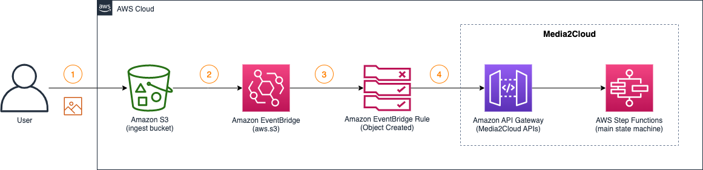
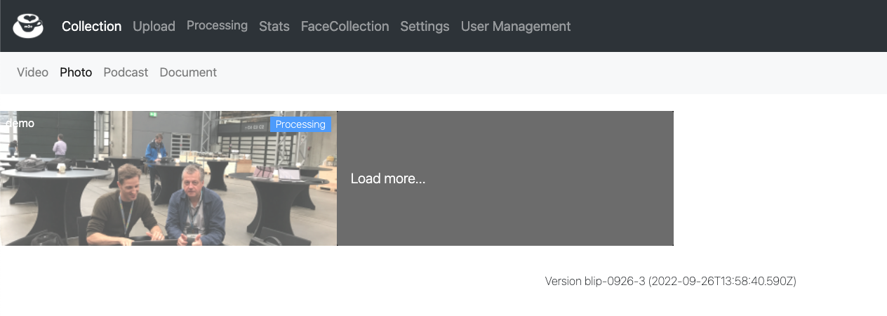

## Tutorial 3: Automating ingest and analysis workflow with Amazon EventBridge

Amazon S3 supports [numbers of event notification](https://docs.aws.amazon.com/AmazonS3/latest/userguide/notification-how-to-event-types-and-destinations.html) mechanisms. In this tutorial, we will focus on using Amazon EventBridge service to automate the ingest and analysis workflow of Media2Cloud such that when we upload a file to the Amazon S3 ingest bucket, it automatically starts the process. The diagram below illustrates the sequences of the event-driven approach.




(1) upload an image file to the Amazon S3 ingest bucket. Follow the instruction discussed in the previous tutorial, [Using AWS CLI command to upload an image file](./2-using-media2cloud-restful-api.md#lets-upload-an-image)

(2) When an image file is uploaded to the ingest bucket, Amazon S3 sends an `Object Created` event to Amazon EventBridge service.

(3) and (4) By configuring an Event Rule and Rule Target, we can receive the `Object Created` event and then re-route the event to the Media2Cloud API endpoint (Amazon API Gateway service) which automatically starts the ingest and analysis process.


### In this tutorial, we will

1. [Enable Amazon EventBridge on ingest bucket](#step-1-enable-amazon-eventbridge-on-ingest-bucket)
2. [Amazon EventBridge Event Rule and Target](#step-2-create-event-rule-and-target)
    * [Create an Event Rule targeted on `Object Created` event only](#step-21-create-an-event-rule-targeted-on-object-created-event-only)
    * [Create an Event Rule Target](#step-22-create-an-event-rule-target)
        * [Rule Target: Amazon CloudWatch Logs](#step-221-rule-target-1-amazon-cloudwatch-logs)
        * [Rule Target: Amazon API Gateway, Media2Cloud Endpoint](#step-222-rule-target-2-amazon-api-gateway-media2cloud-endpoint)
        * [Put things together](#step-223-put-all-rule-targets-together-and-create-the-rule-target)
3. [Testing the workflow](#testing-the-automated-ingest-and-analysis-workflow)

__

## Step 1: Enable Amazon EventBridge on ingest bucket

Amazon EventBridge notification on an Amazon S3 bucket is disabled by default. To [enable Amazon EventBridge](https://docs.aws.amazon.com/AmazonS3/latest/userguide/enable-event-notifications-eventbridge.html) on a specific bucket, use the following command:

```shell

aws s3api put-bucket-notification-configuration \
  --bucket {ingest-bucket} \
  --notification-configuration '{ "EventBridgeConfiguration": {} }'

```

where
* `{ingest-bucket}` is the ingest bucket. Refer to [Find the ingest bucket from the CloudFormation stack](.2-using-media2cloud-restful-api.md#find-the-ingest-bucket-from-the-cloudformation-stack) in the previous tutorial.

__

## Step 2: Create Event Rule and Target

Once the Amazon EventBridge notification is enabled on the `ingest` bucket, Amazon S3 service sends events to Amazon EventBridge service whenever an S3 operation is performed on the bucket.

To receive and process the S3 events, we will create an `Event Rule` to listen to the specific type of the S3 events and a `Event Rule Target` that we can take action on the events.

_


### Step 2.1: Create an Event Rule targeted on `Object Created` event only

Copy and paste the following JSON document to a text editor and save it as `Media2CloudObjectCreatedEventRule.json`.

Make sure to replace
* `{ingest-bucket}` to the [ingest bucket name obtained in the previous tutorial](./2-using-media2cloud-restful-api.md#find-the-ingest-bucket-from-the-cloudformation-stack) and
* `{region}` to the AWS region such as `us-east-1` you are running the Media2Cloud


```json
{
  "detail-type": [
    "Object Created"
  ],
  "source": [
    "aws.s3"
  ],
  "detail": {
    "bucket": {
      "name": [
        "{ingest-bucket}"
      ]
    }
  },
  "region": [
    "{region}"
  ]
}

```

The JSON document describes the Event Rule we are interested:
* source of the event must be `aws.s3` service
* type of S3 event we care. In this exercise, we are only interested in `Object Created` that includes PutObject, POST Object, CopyObject, and CompleteMultipartUpload operations. See more details of [S3 events that send to Amazon EventBridge](https://docs.aws.amazon.com/AmazonS3/latest/userguide/EventBridge.html)
* We only process events that are targeted to our Media2Cloud's `{ingest-bucket}`
* At last, optionally filtering out events that are not in `{region}` region.


Now, let's create the event rule

```shell

aws events put-rule \
    --name Media2CloudObjectCreatedEventRule \
    --event-pattern file://./Media2CloudObjectCreatedEventRule.json \
    --state ENABLED


# Response looks like this:
{
    "RuleArn": "arn:aws:events:{region}:{accountId}:rule/Media2CloudObjectCreatedEventRule"
}

#
# To describe the event rule we just created
#
aws events describe-rule \
    --name Media2CloudObjectCreatedEventRule


# Response looks like this:
{
    "Name": "Media2CloudObjectCreatedEventRule",
    "Arn": "arn:aws:events:{region}:{accountId}:rule/Media2CloudObjectCreatedEventRule",
    "EventPattern": "{\n  \"detail-type\": [\n    \"Object Created\"\n  ],\n  \"source\": [\n    \"aws.s3\"\n  ],\n  \"detail\": {\n    \"bucket\": {\n      \"name\": [\n        \"{ingest-bucket}\"\n      ]\n    }\n  },\n  \"region\": [\n    \"{region}\"\n  ]\n}\n",
    "State": "ENABLED",
    "EventBusName": "default",
    "CreatedBy": "{accountId}"
}

```

-

### Step 2.2: Create an Event Rule Target

After we created an Event Rule, `Media2CloudObjectCreatedEventRule`, we will create the target(s) where the matched events should send to. In this exercise, we will create `TWO` targets; one goes to the Amazon CloudWatch Logs (to log all the events we receive for debug purpose) and another goes to the Amazon API Gateway, Media2Cloud API Endpoint to start the ingest and analysis workflow.

_

#### Step 2.2.1: Rule Target #1: Amazon CloudWatch Logs

For Rule Target #1, we will create an Amazon CloudWatch LogGroup to log all events we received from the `Media2CloudObjectCreatedEventRule` Event Rule. This allows us to trace and debug any issue we may encounter.

```shell

aws logs create-log-group \
    --log-group-name /aws/events/Media2CloudObjectCreatedEventLogs

# Optionally, set the retention to 7 days
aws logs put-retention-policy \
    --log-group-name /aws/events/Media2CloudObjectCreatedEventLogs \
    --retention-in-days 7

```

The Rule Target JSON document of the Amazon CloudWatch Logs target is as follows:

```json
{
    "Id": "Media2CloudObjectCreatedEventLogsTarget",
    "Arn": "arn:aws:logs:{region}:{accountId}:log-group:/aws/events/Media2CloudObjectCreatedEventLogs"
}

```

| Field | Value | Description |
| :-- | :-- | :-- |
| Id | Media2CloudObjectCreatedEventLogsTarget | An unique Id of the rule target |
| Arn | Arn of the loggroup | Arn of the Amazon CloudWatch LogGroup we created |


Don't worry about the Rule Target JSON document for now. In [Step 2.2.3](#step-223-put-all-rule-targets-together-and-create-the-rule-target), we will put together a final list of the targets for the Event Rule.

_

#### Step 2.2.2: Rule Target #2: Amazon API Gateway, Media2Cloud Endpoint

For Rule Target #2, we will need to grant permission to Amazon EventBridge to invoke the Amazon API Gateway, Media2Cloud API Endpoint. To do that, we create an IAM role similar to how we [created the IAM user](./2-using-media2cloud-restful-api.md#step-1-create-an-iam-user) in previous tutorial, but this time, we create an `IAM role` instead `IAM user` and attach the `AmazonAPIGatewayInvokeFullAccess` Policy to the role.


```shell
#
# Create the IAM role, called `EventBridgeToMedia2CloudApiEndpoint`
#
aws iam create-role \
    --role-name EventBridgeToMedia2CloudApiEndpoint \
    --assume-role-policy-document \
    '{"Version":"2012-10-17","Statement":[{"Effect":"Allow","Principal":{"Service":"events.amazonaws.com"},"Action":"sts:AssumeRole"}]}'

# Response looks like
{
    "Role": {
        "Path": "/",
        "RoleName": "EventBridgeToMedia2CloudApiEndpoint",
        "RoleId": "{roleId}",
        "Arn": "arn:aws:iam::{accountId}:role/EventBridgeToMedia2CloudApiEndpoint",
        "CreateDate": "2022-10-31T11:12:37+00:00",
        "AssumeRolePolicyDocument": {
            "Version": "2012-10-17",
            "Statement": [
                {
                    "Effect": "Allow",
                    "Principal": {
                        "Service": "events.amazonaws.com"
                    },
                    "Action": "sts:AssumeRole"
                }
            ]
        }
    }
}

```

We then attach the `AmazonAPIGatewayInvokeFullAccess` access to the role.

```shell

#
# Attach AmazonAPIGatewayInvokeFullAccess to EventBridgeToMedia2CloudApiEndpoint
#
aws iam attach-role-policy \
    --role-name EventBridgeToMedia2CloudApiEndpoint \
    --policy-arn arn:aws:iam::aws:policy/AmazonAPIGatewayInvokeFullAccess

```
_

The Rule Target JSON document of the Amazon API Gateway Media2Cloud Endpoint target is as follows:

```json
{
    "Id": "Media2CloudObjectCreatedEventApiGateway",
    "Arn": "arn:aws:execute-api:{region}:{accountId}:{apiId}/demo/POST/*",
    "RoleArn": "arn:aws:iam::{accountId}:role/EventBridgeToMedia2CloudApiEndpoint",
    "InputTransformer": {
        "InputPathsMap": {
            "Bucket": "$.detail.bucket.name",
            "Key": "$.detail.object.key"
        },
        "InputTemplate": "{\"input\": {\"bucket\": <Bucket>,\"key\": <Key>}}"
    },
    "HttpParameters": {
        "PathParameterValues": [
            "assets"
        ],
        "HeaderParameters": {},
        "QueryStringParameters": {}
    }
}

```

| Field | Value | Description |
| :-- | :-- | :-- |
| Id | Media2CloudObjectCreatedEventApiGateway | An unique Id of this rule target |
| Arn | arn:aws:execute-api:{region}:{accountId}:{apiId}/{stage}/POST/* | The API Gateway POST HTTP endpoint where `{region}` is the AWS region, `{accountId}` is your AWS account Id, `{apiId}` is the API ID of the Media2Cloud API, and `/POST/*` refers to a POST request. |
| RoleArn | arn:aws:iam::{accountId}:role/EventBridgeToMedia2CloudApiEndpoint | The IAM role to access our Media2Cloud API Endpoint |
| InputTransformer.InputPathsMap.Bucket | $.detail.bucket.name | transforming the [Object Created event payload](https://docs.aws.amazon.com/AmazonS3/latest/userguide/ev-events.html#ev-events-list) and store the  `$.detail.bucket.name` into a variable name, `Bucket`. |
| InputTransformer.InputPathsMap.Key | $.detail.object.key | transforming the [Object Created event payload](https://docs.aws.amazon.com/AmazonS3/latest/userguide/ev-events.html#ev-events-list) and store the  `$.detail.object.key` into a variable name, `Key`. |
| InputTransformer.InputTemplate | "{\"input\": {\"bucket\": \<Bucket\>,\"key\": \<Key\>}}" | Mapping the transformed variables, `Bucket` and `Key` into the input parameter for our Media2Cloud API Endpoint |
| HttpParameters.PathParameterValues | assets | Set the path parameter to `assets` |

So, what this JSON document does is that it is essentially sending a POST request on `/demo/assets` with the JSON payload that specifies the `bucket` and `key`, identical to [cURL command to start ingest and analysis workflow in previous tutorial](2-using-media2cloud-restful-api.md#step-4-curl-command-to-start-ingest-and-analysis-workflow).

_

#### Step 2.2.3: Put all rule targets together and create the rule target!

Copy and paste the following JSON document to a text editor and save it to `Media2CloudObjectCreatedEventRuleTargets.json`.

Make sure to replace:
* `{region}` with an AWS Region where you created the Media2Cloud soluion such as `us-east-1` region.
* `{accountId}` with your AWS Account Id
* `{apiId}` can be found in previous tutorial, [Locate the Media2Cloud API Endpoint](./2-using-media2cloud-restful-api.md#step-2-locate-media2cloud-api-endpoint) section


```json
[
    {
        "Id": "Media2CloudObjectCreatedEventLogsTarget",
        "Arn": "arn:aws:logs:{region}:{accountId}:log-group:/aws/events/Media2CloudObjectCreatedEventLogs"
    },
    {
        "Id": "Media2CloudObjectCreatedEventApiGateway",
        "Arn": "arn:aws:execute-api:{region}:{accountId}:{apiId}/demo/POST/*",
        "RoleArn": "arn:aws:iam::{accountId}:role/EventBridgeToMedia2CloudApiEndpoint",
        "InputTransformer": {
            "InputPathsMap": {
                "Bucket": "$.detail.bucket.name",
                "Key": "$.detail.object.key"
            },
            "InputTemplate": "{\"input\": {\"bucket\": <Bucket>,\"key\": <Key>}}"
        },
        "HttpParameters": {
            "PathParameterValues": [
                "assets"
            ],
            "HeaderParameters": {},
            "QueryStringParameters": {}
        }
    }
]

```

```shell

aws events put-targets \
    --rule Media2CloudObjectCreatedEventRule \
    --targets file://./Media2CloudObjectCreatedEventRuleTargets.json

# Response should look like this.
{
    "FailedEntryCount": 0,
    "FailedEntries": []
}

```

__

## Testing the automated ingest and analysis workflow

By now, we have created an automated, event driven mechanism to start the ingest and analysis workflow when a new file is uploaded to the S3 bucket. Let's give it a try!

#### 1. Run the following command to upload a file

```shell
#
# upload an image file to the ingest bucket
#
aws s3 cp ./demo.png s3://{ingest-bucket}/tutorial/demo.png

```

#### 2. Log in to the Media2Cloud Web Portal in your browser, navigate to the `Photo` tab.

#### 3. In a minute, you should see the file is being `Processed`.



#### 4. Alternatively, check to see if we are logging the events in Amazon CloudWatch Logs

```shell

aws logs filter-log-events \
    --log-group-name /aws/events/Media2CloudObjectCreatedEventLogs

# Response shows a list of the recent log entries where
# the `message` is the payload of the S3 Object Created event.
{
    "events": [
        {
            "logStreamName": "3330000c-4ade-3c3b-8bb7-5459e15714db",
            "timestamp": 1667228119000,
            "message": "{\"version\":\"0\",\"id\":\"97b054c8-e44e-8856-63d7-676f96077ed5\",\"detail-type\":\"Object Created\",\"source\":\"aws.s3\",\"account\":\"{accountId}\",\"time\":\"2022-10-31T14:55:19Z\",\"region\":\"{region}\",\"resources\":[\"arn:aws:s3:::{ingest-bucket}\"],\"detail\":{\"version\":\"0\",\"bucket\":{\"name\":\"{ingest-bucket}\"},\"object\":{\"key\":\"testing/C4-00.png\",\"size\":532679,\"etag\":\"61d0cee70a8f0181c85087da9f3c0036\",\"version-id\":\"wyf9DWWQ_VEDaPohPu6uAhu36pgwN.Tk\",\"sequencer\":\"00635FE1D5CE74B246\"},\"request-id\":\"6JN1NFJ30WT902W2\",\"requester\":\"{accountId}\",\"source-ip-address\":\"0.0.0.0\",\"reason\":\"PutObject\"}}",
            "ingestionTime": 1667228121677,
            "eventId": "37180429469644492386176021470504718587485298234178535424"
        }
    ],
    "searchedLogStreams": []
}

```

__


In this tutorial, we built an event driven workflow to automatically start the ingest and analysis workflow whenever a new file is uploaded to the Amazon S3 ingest bucket. We covered how we enabled Amazon EventBridge notifications on the ingest bucket; how we created a `Event Rule` to focus on specific event (`Object Created` in a specific bucket); and how we created `Rule Targets` to log received events to Amazon CloudWatch Logs and to invoke the Amazon API Gateway Media2Cloud Endpoint to start the process.

In the next tutorial [Integrating Media2Cloud workflow to downstream process](./4-downstream-integration.md), we will explore how we can integrate Media2Cloud workflow to downstream processes and parse the analysis metadata when the ingest and analysis workflow is completed.
