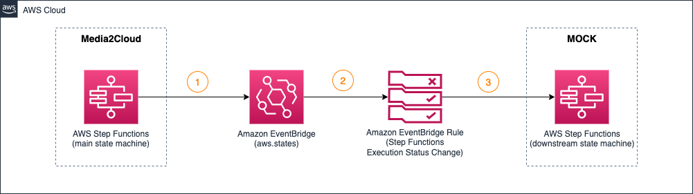

## 4. Integrating Media2Cloud workflow to downstream process

In this tutorial, we will discuss how we can integrate Media2Cloud ingest and analysis workflow to a downstream process using Amazon EventBridge events from the AWS Step Functions. The diagram illustrates how it works.



For this exercise, we will simulate a downstream process by creating a `mock` AWS Step Functions state machine acting as our dummy downstream process. In the state machine, we defined an AWS Lambda function to parse the incoming event (an event from Media2Cloud ingest and analysis workflow) and collect all analysis results.

* [Step 1: Create the (dummy) downstream process](#step-1-create-the-dummy-downstream-process)
    * [Step 1.1: Download the Cloudformation template locally](#step-11-download-the-cloudformation-template-locally)
    * [Step 1.2: Launch the downstream process CloudFormation stack](#step-12-launch-the-downstream-process-cloudformation-stack)
* [Step 2: Connecting Media2Cloud workflow to downstream process](#step-2-connecting-media2cloud-workflow-to-downstream-process)
    * [Step 2.1: Locate Media2Cloud Main Step Functions State Machine](#step-21-locate-media2cloud-main-step-functions-state-machine)
    * [Step 2.2: Create an Event Rule](#step-22-create-an-event-rule)
    * [Step 2.3: Create an Event Rule Target to downstream process](#step-23-create-an-event-rule-target-to-downstream-process)
* [Step 3: Testing the integration flow](#step-3-testing-the-integration-flow)
    * [Step 3.1: Run the command to upload an image to Media2Cloud](#step-31-run-the-command-to-upload-an-image-to-media2cloud)
    * [Step 3.2: Log in to AWS Step Function Console](#step-32-log-in-to-aws-step-function-console)
    * [Step 3.3: Collecing analysis results](#step-33-collecing-analysis-results)
        * [Step 3.3.1: Parsing the Execution input](#step-331-parsing-the-execution-input)
        * [Step 3.3.2: Download and parse the metadata](#step-332-download-and-parse-the-metadata)
        * [Step 3.3.3: Putting it together](#step-333-putting-it-together)
    * [Bonus: Parsing analysis results for video or audio file](#bonus-parsing-analysis-results-for-video-or-audio-file)

__

### Step 1: Create the (dummy) downstream process

For simplicity, we prepared an AWS CloudFormation template to create the dummy downstream process. 

#### Step 1.1: Download the Cloudformation template locally

```shell
curl \
  -L https://github.com/aws-solutions/media2cloud/raw/master/deployment/tutorials/samples/dummy-downstream-process-stack.yaml \
  -o dummy-downstream-process-stack.yaml

```

_

#### Step 1.2: Launch the downstream process CloudFormation stack

```shell

aws cloudformation create-stack \
  --stack-name \
    downstream-process \
  --template-body \
    file://dummy-downstream-process-stack.yaml \
  --capabilities \
    "CAPABILITY_IAM" \
    "CAPABILITY_NAMED_IAM" \
    "CAPABILITY_AUTO_EXPAND"

#
# Wait for the stack creation completes
#
aws cloudformation wait stack-create-complete \
  --stack-name downstream-process \
  --region us-east-1

#
# Describe stack outputs
#
aws cloudformation describe-stacks \
  --stack-name downstream-process
  --region us-east-1 | \
    jq '.Stacks[0].Outputs[]'

# Response 
{
  "OutputKey": "DownstreamProcessStateMachine",
  "OutputValue": "arn:aws:states:{region}:{accountId}:stateMachine:downstream-process",
  "Description": "DownstreamProcessStateMachine"
}
...

```

Remember the `OutputValue` of the `DownstreamProcessStateMachine`. We will need the Arn of the state machine in the later steps.


The stack creates _one_ AWS Step Functions state machine, `downstream-process` and _one_ AWS Lambda, `downstream-collect-results`. Navigate to AWS Step Functions Console, we will find the state machine. The state machine contains just one state, `Collect analysis results` which invokes the `downstream-collect-results` lambda function to process the data.

__

### Step 2: Connecting Media2Cloud workflow to downstream process

At this point, we created a standalone dummy downstream process. There is no communication / connection between this downstream process and the Media2Cloud workflow.

To build the connection, we will once again use the event-driven approach by using Amazon EventBridge Event Rule and Event Rule Target simliar to the previous [Tutorial 3: Automating the ingest workflow with Amazon EventBridge](./3-automate-ingest-analysis-workflow.md). The only difference is that the source event is the `Media2Cloud Main Step Functions state machine` instead of the `Amazon S3 ingest bucket`.

_

#### Step 2.1: Locate Media2Cloud `Main` Step Functions State Machine

The `Main` Step Functions state machine orchestrates the Media2Cloud ingest and analysis workflow. In the previous tutorial when we called Media2Cloud RESTful APIs, the API eventually invokes this `Main` state machine to start the ingest and analysis process.


```shell

aws cloudformation describe-stacks \
    --stack-name $(\
        aws cloudformation describe-stack-resources \
            --stack-name m2c-demo | \
            jq '.StackResources[] | select(.LogicalResourceId == "BackendStack") | .PhysicalResourceId' | \
            tr -d '"' \
        ) | \
    jq '.Stacks[0].Outputs[] | select(.OutputKey == "MainStateMachine")'

#
# The OutputValue is Main state machine of the Media2Cloud ingest and analysis workflow
#
{
  "OutputKey": "MainStateMachine",
  "OutputValue": "{mainStateMachineArn}",
  "Description": "MainStateMachine"
}

```

_

#### Step 2.2: Create an Event Rule

Copy and paste the following JSON document to a text editor and save it as `MainStateMachineEventRule.json`.

Make sure to replace
* `{mainStateMachineArn}` to the Arn of the Main State Machine we obtained by previous step and
* `{region}` to the AWS region we are running this tutorial.


```json
{
    "detail-type": [
        "Step Functions Execution Status Change"
    ],
    "source": [
        "aws.states"
    ],
    "detail": {
        "stateMachineArn": [
            "{mainStateMachineArn}"
        ],
        "status": [
            "SUCCEEDED"
        ]
    },
    "region": [
        "{region}"
    ]
}

```

The JSON document describes the event rule we are interested:
* source of the event must be `aws.states` service
* type of Step Functions event we care is `Step Functions Execution Status Change`
* events we will process must be from the Main state machine of the Media2Cloud, `{mainStateMachineArn}`
* status we are interested in is `SUCCEEDED` referring to the state machine execution has completed
* At last, optionally filtering out events that are not in `{region}` region.


Now, let's create the event rule

```shell

aws events put-rule \
    --name MainStateMachineEventRule \
    --event-pattern file://./MainStateMachineEventRule.json \
    --state ENABLED


# Response looks like this:
{
    "RuleArn": "arn:aws:events:{region}:{accountId}:rule/MainStateMachineEventRule"
}
```

_

#### Step 2.3: Create an Event Rule Target to downstream process

After we created the Event Rule, `MainStateMachineEventRule`. We then create an Event Rule Target where the matched event should send to. In this exercise, the target is our `Downstream Process` state machine.

_

##### Step 2.3.1: Create an IAM role to start Downstream Process execution

Create an IAM role, `EventBridgeToDownstreamProcessRole` to attach to the Event Rule Target later on.

```shell
#
# Create the IAM role, called `EventBridgeToDownstreamProcessRole`
#
aws iam create-role \
    --role-name EventBridgeToDownstreamProcessRole \
    --assume-role-policy-document \
    '{"Version":"2012-10-17","Statement":[{"Effect":"Allow","Principal":{"Service":"events.amazonaws.com"},"Action":"sts:AssumeRole"}]}'

# Response should looke like
{
    "Role": {
        "Path": "/",
        "RoleName": "EventBridgeToDownstreamProcessRole",
        "Arn": "arn:aws:iam::{accountId}:role/EventBridgeToDownstreamProcessRole",
        ...
    }
}

```
_

##### Step 2.3.2: Attach policy to the IAM role

The policy grants permission to the Amazon EventBridge service to start a new execution of our `Downstream Process` state machine.

For simplicity, we are granting the AWSStepFunctionsFullAccess managed policy to the IAM role.

```shell

#
# Attach AWSStepFunctionsFullAccess to EventBridgeToDownstreamProcessRole
#
aws iam attach-role-policy \
    --role-name EventBridgeToDownstreamProcessRole \
    --policy-arn arn:aws:iam::aws:policy/AWSStepFunctionsFullAccess

```

Recommended policy should narrow down to just the state machine, `{DownstreamProcessStateMachine}` and only allow it to perform `states:StartExecution` action as follows:

```json
{
    "Version": "2012-10-17",
    "Statement": [
        {
            "Effect": "Allow",
            "Action": "states:StartExecution",
            "Resource": "{DownstreamProcessStateMachine}"
        }
    ]
}

```

_

##### Step 2.3.3: Putting it together

Copy and paste the following JSON document to a text editor and save it as `StartDownstreamProcessStateMachineTarget.json`.

Make sure to replace:
* `{DownstreamProcessStateMachine}` with the Downstream Process state machine Arn
* `{accountId}` with your AWS Account Id


```json
[
    {
        "Id": "StartDownstreamProcessStateMachineTarget",
        "Arn": "{DownstreamProcessStateMachine}",
        "RoleArn": "arn:aws:iam::{accountId}:role/EventBridgeToDownstreamProcessRole"
    }
]

```


```shell

aws events put-targets \
    --rule MainStateMachineEventRule \
    --targets file://./StartDownstreamProcessStateMachineTarget.json

# Response should look like this.
{
    "FailedEntryCount": 0,
    "FailedEntries": []
}

```
__

## Step 3: Testing the integration flow

Now that we have created a connection between the Media2Cloud ingest and analysis workflow and our (dummy) Downstream Process workflow.

Let's give it a try.

#### Step 3.1: Run the command to upload an image to Media2Cloud

```shell
#
# upload an image file to the ingest bucket
#
aws s3 cp ./demo.png s3://{ingest-bucket}/tutorial/demo.png

```
_

#### Step 3.2: Log in to AWS Step Function Console

Navigate to the Downstream Process state machine. In a few minutes, we should see a new execution starts in the `Executions` tab.

At this point, the lambda function, `downstream-collect-results` in the state machine doesn't do much. It simply return the input event.

```javascript
const AWS = require('aws-sdk');

exports.handler = async (event, context) => {
    console.log(JSON.stringify(event, null, 2));
    return event;
}

```

_

#### Step 3.3: Collecing analysis results

In this exercise, we take a closer look at the event from the Media2Cloud Main state machine (sent via the Amazon EventBridge). Then, use the information to collect and process the analysis results.

##### Step 3.3.1: Parsing the Execution input

```json
{
  "version": "0",
  "id": "00000000-0000-0000-0000-000000000000",
  "detail-type": "Step Functions Execution Status Change",
  "source": "aws.states",
  "account": "{accountId}",
  ...
  "detail": {
    "status": "SUCCEEDED",
    "startDate": 1667311111348,
    "stopDate": 1667311169504,
    "input": "JSON string of the input parameters of the Media2Cloud Main state machine",
    "output": "JSON string of the output from Media2Cloud Main state machine",
    ...
  }
}

```

We only care about the `$.detail.output`. Let's write a simple function to extract, parse, and return the output from the execution input.

```javascript

function parseEvent(event) {
    const execOutput = JSON.parse(event.detail.output);
    /* execOutput contains the 'Output' field which is what we need  */
    const output = JSON.parse(execOutput.Output);
    return output;
}

```

The function parseEvent() returns a nested JSON object that contains locations of different analysis metadata files and that we could use to collect the analysis results.

In particularly, we are interested in `$.data.image['rekog-image'].celeb` and `$.data.image['rekog-image'].label`. The `$.input.destination.bucket` also provides the proxy bucket name `{proxy-bucket}` where the metadata is stored.

```json

{
  "uuid": "{uuid}",
  "overallStatus": "COMPLETED",
  "input": {
    "bucket": "{ingest-bucket}",
    "key": "tutorial/demo.png",
    "uuid": "{uuid}",
    "destination": {
      "bucket": "{proxy-bucket}",
      "prefix": "{uuid}/tutorial/"
    },
    "aiOptions": {
      "celeb": true,
      ...
    },
    "image": {
      "enabled": true,
      "key": "{uuid}/tutorial/transcode/proxy/demo.jpg"
    },
    ...
  },
  "data": {
    "image": {
      "rekog-image": {
        "celeb": {
          "output": "{uuid}/tutorial/raw/20221101T144804/rekog-image/celeb/output.json",
          "startTime": 1667314088597,
          "endTime": 1667314091039
        },
        "label": {
          "output": "{uuid}/tutorial/raw/20221101T144804/rekog-image/label/output.json",
          "startTime": 1667314088637,
          "endTime": 1667314090237
        },
        ...
      }
    },
    ...
  }
}

```

_

##### Step 3.3.2: Download and parse the metadata

Using the JSON object from `parseEvent()`, let's write a function to download and parse the celebrity detection metadata, `function parseCelebResult()`.

This function, `parseCelebResult()` downloads the celebrity detection results from the `{proxy-bucket}` and filters the result where the Confidence score is below 80%.


```javascript

const s3 = new AWS.S3();

async function parseCelebResult(jsonData) {
  /* test to make sure celeb is not null */
  const metadata = ((jsonData.data.image || {})['rekog-image'] || {}).celeb;
  if (metadata === undefined || metadata.output === undefined) {
    return [];
  }

  /* download Celebrity Detection result */
  const bucket = jsonData.input.destination.bucket;
  const key = metadata.output;
  const data = await s3.getObject({
    Bucket: bucket,
    Key: key,
  }).promise();

  /* parse the celebrity result */
  const parsed = JSON.parse(data.Body.toString());
  /* filter low confidence score */
  const filtered = parsed.CelebrityFaces
    .filter((celeb) =>
      celeb.MatchConfidence > 80.0);
  return filtered;
}

```

The `parseCelebResult()` function returns a JSON object output as follows:

```json
[
    {
        "Name": "Jeff Bezos",
        "Id": "1SK7cR8M",
        "MatchConfidence": 99.28,
        "Face": {
            "BoundingBox": {
                "Width": 0.16,
                "Height": 0.34,
                "Left": 0.42,
                "Top": 0.08
            },
            "Confidence": 99.0,
            "Landmarks": [
            ],
            "Pose": {
            },
            "Emotions": [
                {
                    "Type": "HAPPY",
                    "Confidence": 47.0
                },
                ...
            ],
            ...
        },
        "KnownGender": {
            "Type": "Male"
        }
    },
    ...
]

```

_

Let's create another function to parse the label detection results, `function parseLabelResult()`. This time we are only interested in `object labels` such as Person, Beer bottle, Soccer ball that provide BoundingBox (Width, Height, Top, and Left) information. In other words, we are ignoring `image classification (scene) labels` such as Human, Clothing, Audience.


```javascript
async function parseLabelResult(jsonData) {
  /* test to make sure label is not null */
  const metadata = ((jsonData.data.image || {})['rekog-image'] || {}).label;
  if (metadata === undefined || metadata.output === undefined) {
    return [];
  }

  /* download Label Detection result */
  const bucket = jsonData.input.destination.bucket;
  const key = metadata.output;
  const data = await s3.getObject({
    Bucket: bucket,
    Key: key,
  }).promise();

  /* parse the label result */
  const parsed = JSON.parse(data.Body.toString());
  /* filter labels that has low confidence score */
  /* and are not 'object' label */
  const filtered = parsed.Labels
    .filter((label) =>
      label.Confidence > 80.0
      && label.Instances.length > 0);
  return filtered;
}

```

THe `parseLabelResult()` function returns a JSON object output as follows:

```json
[
    {
        "Name": "Person",
        "Confidence": 99.89,
        "Instances": [
            {
                "BoundingBox": {
                    "Width": 0.23,
                    "Height": 0.37,
                    "Left": 0.25,
                    "Top": 0.43
                },
                "Confidence": 99.89
            },
            ...
        ]
    }
]

```

_

##### Step 3.3.3: Putting it together

###### Copy and paste the NodeJS code below and save it as `index.js` file.

```javascript
const AWS = require('aws-sdk');

const s3 = new AWS.S3();

function parseEvent(event) {
  const execOutput = JSON.parse(event.detail.output);
  /* execOutput contains the 'Output' field which is what we need  */
  const output = JSON.parse(execOutput.Output);
  return output;
}

async function parseCelebResult(jsonData) {
  /* test to make sure celeb is not null */
  const metadata = ((jsonData.data.image || {})['rekog-image'] || {}).celeb;
  if (metadata === undefined || metadata.output === undefined) {
    return [];
  }

  /* download Celebrity Detection result */
  const bucket = jsonData.input.destination.bucket;
  const key = metadata.output;
  const data = await s3.getObject({
    Bucket: bucket,
    Key: key,
  }).promise();

  /* parse the celebrity result */
  const parsed = JSON.parse(data.Body.toString());
  /* filter low confidence score */
  const filtered = parsed.CelebrityFaces
    .filter((celeb) =>
      celeb.MatchConfidence > 80.0);
  return filtered;
}

async function parseLabelResult(jsonData) {
  /* test to make sure label is not null */
  const metadata = ((jsonData.data.image || {})['rekog-image'] || {}).label;
  if (metadata === undefined || metadata.output === undefined) {
    return [];
  }

  /* download Label Detection result */
  const bucket = jsonData.input.destination.bucket;
  const key = metadata.output;
  const data = await s3.getObject({
    Bucket: bucket,
    Key: key,
  }).promise();

  /* parse the label result */
  const parsed = JSON.parse(data.Body.toString());
  /* filter labels that has low confidence score */
  /* and are not 'object' label */
  const filtered = parsed.Labels
    .filter((label) =>
      label.Confidence > 80.0
      && label.Instances.length > 0);
  return filtered;
}

/* lambda function entrypoint */
exports.handler = async (event, context) => {
  console.log(JSON.stringify(event, null, 2));

  const jsonData = parseEvent(event);
  const celebs = await parseCelebResult(jsonData);
  const labels = await parseLabelResult(jsonData);
  const stateOutput = {
    celebs,
    labels,
  };

  console.log(JSON.stringify(stateOutput));

  return stateOutput;
}

```
_

###### Package the file

```shell
zip package.zip ./index.js

```
_

###### Update the lambda function code

```shell
aws lambda update-function-code \
    --function-name downstream-collect-results \
    --zip-file fileb://package.zip

```

Now that the lambda function is updated, re-run [Step 3.1: Run the command to upload an image to Media2Cloud](#step-31-run-the-command-to-upload-an-image-to-media2cloud) to see the new execution output of the Downstream Process state machine. This time, you should the execution output contains `celebs` and `labels` results.

_

#### Bonus: Parsing analysis results for video or audio file

The lambda function we modified earlier can process image file. Processing video and audio analysis results are similar but does require code changes.

_(Hints: the JSON path of the video analysis is `$.data.video.rekognition` and `$.data.audio.transcribe` for audio analysis.)_


__

**Congrats!** This concludes our Media2Cloud mini workshop series.

