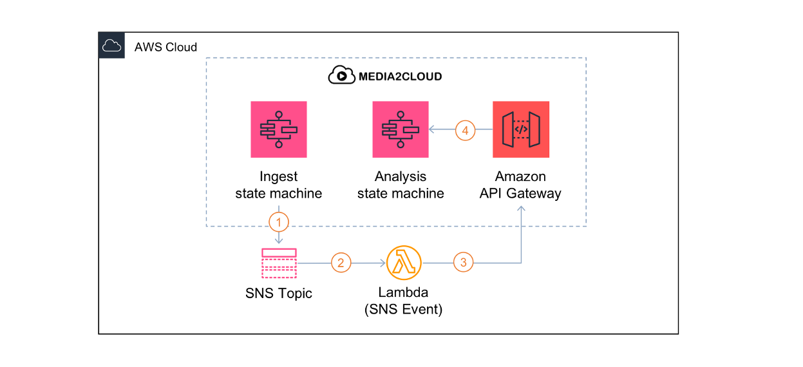
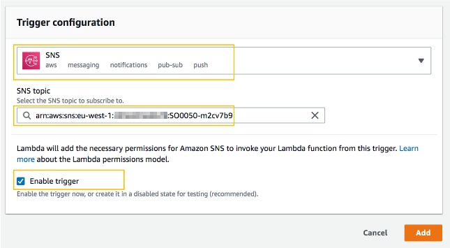

## 4. Using Amazon SNS notification to autostart analysis process

This tutorial extends what you have built from [S3 event exercise](./3-s3-event-trigger.md) to handle Amazon SNS notification and auto start the analysis process.
When you create your Media2Cloud solution, Media2Cloud creates the SNS notifications and publishes to the SNS topic when an ingest, an analysis,  or a labeling process is completed. The diagram illustrates the notification flow.



where
1. when an ingest process is completed, the state machine publishes a notificaiton to Amazon SNS topic.
2. A lambda function is triggered by the SNS notification to process the notification.
3. The lambda function then calls Media2Cloud RESTful API to start the analysis process.
4. The analysis API (POST /analysis) invokes the analysis process by starting a state machine.

So, to get this to work, we will:
* reuse the lambda function we created earlier
* add a trigger to let Amazon SNS service invoke our lambda function
* modify the code to support SNS notification
* test it out

----

### Step 1: Add trigger to handle Amazon SNS notification
Go back to the lambda configuration page, click on **Add trigger**

| Field | Value |
|:---  |:------------|
| Select a trigger | Select **Amazon SNS** |
| SNS topic | Select the topic. It should be arn:aws:sns:\<region\>:\<account-id\>:**SO0050-\<stack-name\>** |
| Enable trigger | Make sure it is checked |



Click on _Add_.

--

### Step 2: Modify code to parse and process notification
**TWO** places you need to pay attention to. Look for:
* **TODO#6** where you need to specify the HTTP **method** to start **analysis** process
```
  /**
  * TODO#6: What should the HTTP method be for starting analysis process?
  * Tips: Review Tutorial #2, Using Media2Cloud RESTful API
  */
  function getAnalysisHttpMethod() {
    return '#HTTP_METHOD';
  }
```
* **TODO#7** where you need to specify the HTTP **path** to start **analysis** process.
```
  /**
  * TODO#7: What should the HTTP method be for starting analysis process?
  * Tips: Review Tutorial #2, Using Media2Cloud RESTful API. Do not include '/demo'
  */
  function getAnalysisHttpPath() {
    return '#ANALYSIS_PATH';
  }
```
* This function we have already written for you shows how to parse an SNS message
```
  function getUuidFromSnsEvent(event) {
    const message = JSON.parse(event.Records[0].Sns.Message);
    return  (message.operation === 'job-completed' && message.stateMachine.indexOf('-ingest') > 0)
      ? message.uuid
      : undefined;
  }
```

--

### Step 3: Test the lambda function
Create a test event by clicking on **Select a test event** menu and select **Cofigure test events**.

Select **Create new test event** and name your test event, ie. MyAnalysisTestEvent.

Copy and modify the following JSON event to the code area. 
* replace **\<uuid\>** with a valid one. From Media2Cloud web portal, find a file you already ingested and copy the uuid.

```
{
  "Records": [
    {
      "Sns": {
        "Message": "{\"uuid\":\"<uuid>\",\"stateMachine\":\"SO0050-guid-ingest\",\"operation\":\"job-completed\"}"
      }
    }
  ]
}
```

Click **Test**

Observe the **Execution result:**

--

### Step 7: Upload an image or video
Let's put your logic in test.

* Open Amazon S3 Console and find your ingest bucket.
* Click **Upload** button
* Drag and drop an image (or video) to it. Click **Upload**
* Observe your Media2Cloud web portal. You should see Media2Cloud first start ingest process and then start analysis process automatically.

----

[Next tutorial](./appendix-a-add-cognito-user.md) Appendix A describes how you can add and manage Media2Cloud users with Amazon Cognito service.
