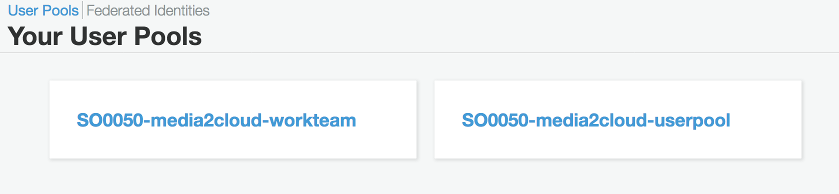
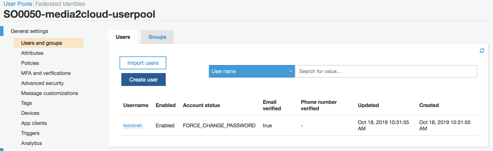
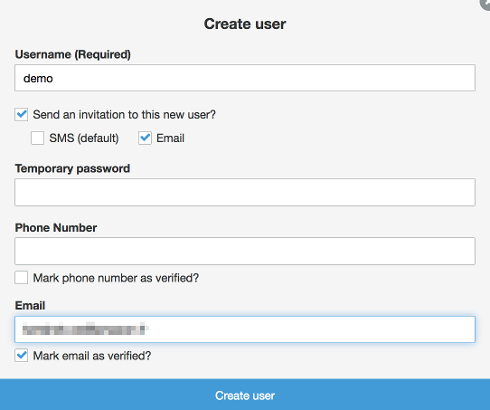

## Appendix A: adding user to Media2Cloud web portal with Amazon Cognito User Pool service

This tutorial describes how you can create a new user and grant permission to access Media2Cloud web portal by either
* [Using AWS CLI](#method-1-using-aws-cli)
* [Using AWS Management Console](#method-2-using-aws-management-console)

___

## Method 1: Using AWS CLI
If you have installed AWS CLI, checkout this [AWS CLI documentation](https://docs.aws.amazon.com/cli/latest/userguide/cli-chap-welcome.html)

### Step 1: Configure environment variables
Open a command line terminal and set the following AWS environment variables.

For **Linux** and **macOS**,
```
export AWS_DEFAULT_REGION=<aws-region>
export AWS_ACCESS_KEY_ID=<aws-access-key-id>
export AWS_SECRET_ACCESS_KEY=<aws-secret-access-key>
export AWS_SESSION_TOKEN=<aws-session-token>
```

For **Windows Command Prompt**
```
setx AWS_DEFAULT_REGION <aws-region>
setx AWS_ACCESS_KEY_ID <aws-access-key-id>
setx AWS_SECRET_ACCESS_KEY <aws-secret-access-key>
setx AWS_SESSION_TOKEN <aws-session-token>
```

For **PowerShell**
```
$Env:AWS_DEFAULT_REGION=<aws-region>
$Env:AWS_ACCESS_KEY_ID=<aws-access-key-id>
$Env:AWS_SECRET_ACCESS_KEY=<aws-secret-access-key>
$Env:AWS_SESSION_TOKEN=<aws-session-token>
```

__

### Step 2: Get Amazon Congito User Pool Id
To create a new user, we need to get the Id of the Media2Cloud Amazon Cognito User Pool

```
aws cognito-idp list-user-pools --max-results 10

## The response contains a list of user pool names and Ids
{
    "UserPools": [
        {
            "Id": "us-west-2_012345",
            "Name": "SO0050-media2cloud-workteam",
            ...
        },
        {
            "Id": "us-west-2_ABCDEFG",
            "Name": "SO0050-media2cloud-userpool",
            ...
        }
    ]
}
```
You should find two user pools: **SO0050-media2cloud-workteam** that used by **AWS SageMaker Ground Truth private workforce**, a labeling team and **SO0050-media2cloud-userpool** that is the user pool used by the **Media2Cloud** web portal.

Copy the **Id** of **SO0050-media2cloud-userpool**.

__

### Step 3: Create a new user in the user pool
Run the command below. Make sure to provide the actual values for:
* **\<user-pool-id\>**, obtained from previous step
* **\<yourname\>**, a login name to access Media2Cloud web portal
* **\<your-email-address\>**, a valid email address to receive a _Welcome email_ to Media2Cloud web portal

```
aws cognito-idp admin-create-user \
--user-pool-id <user-pool-id> \
--username <yourname> \
--user-attributes Name=email_verified,Value=True Name=email,Value=<your-email-address>

```

__

### Step 4: Receive a Welcome email to Media2Cloud web portal
In a few minutes, you should receive a Welcome email that contains the URL link to access Media2Cloud web portal.


Open the link with [Mozilla Firefox](https://www.mozilla.org/en-US/firefox/new/) or [Google Chrome](https://www.google.com/chrome/) browser.

___

## Method 2: Using AWS Management Console

### Step 1: Amazon Cognito service
Under _AWS Management console_, choose **Amazon Cognito service** and select _Manage User Pools_


--

### Step 2: Select Media2Cloud user pool
You should see two user pools created by Media2Cloud: one for your labeling workteam and one for Media2Cloud web portal.
Select the user pool suffixed with **-userpool**. (The name convention is SO0050-**\<stack-name\>**-userpool)



--

### Step 3: Create new user
Under _General settings_, select **Users and groups**. Click on **Create user**.



--

### Step 4: Fill in user details
Fill in the following information:

| Field | Description | Required? |
|:------|:------------|:----------|
| Username | your log in name to Media2Cloud web portal | Yes |
| Send an invitation to this new user? | Make sure **Email** is **CHECKED** and **SMS** is **UNCHECKED** | Yes on Email. No on SMS |
| Temporary password | Leave it blank | No |
| Phone number | Leave it blank | No |
| Mark phone number as verified? | Leave it blank | No |
| Email | a valid email address to receive a Welcome email from Media2Cloud | Yes |
| Mark email as verified? | Make sure this is **CHECKED** | Yes |




Click on **Create user**.

--

### Step 5: Welcome email
In a few minutes, you should receive a **Welcome email** as follows.


Open the link with [Mozilla Firefox](https://www.mozilla.org/en-US/firefox/new/) or [Google Chrome](https://www.google.com/chrome/) browser.

----

Back to [README](./README.md)
