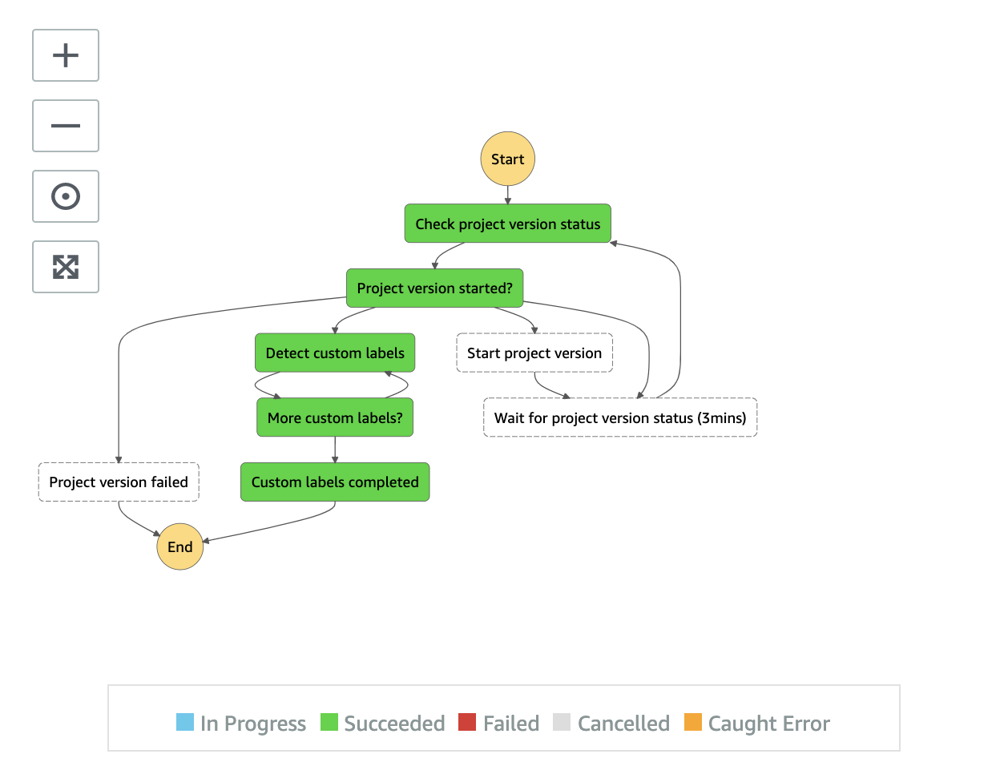

# Custom Labels State Machine

Custom Labels state machine detects labels using user-trained computer vision (image classification and/or object detection) models using Amazon Rekognition Custom Labels feature. It also manages the runtime of the model to minimize cost.

__

* **Check project version status** state checks the model status to ensure it is in RUNNING state
* **Project version started?** state a Choice state to switch between _Start project version_ or _Detect custom labels_ state
* **Start project version** state starts a specific Custom Labels model if it has not be started
* **Wait for project version status (5min)** states waits for 5 minutes and recheck the status
* **Detect custom labels** state loops throughs frames and sends requests to Amazon Rekognition DetectCustomLabels API (image, synchronized API) to detect labels
* **More custom labels?** state is a Choice state to ensure all the frames are processed. Otherwise, it switches back to _Detect custom labels_ state to process the rest
* **Custom labels completes** state is an end state

__

Back to [Video Analysis state machine](../../main/analysis/video/README.md) | Back to [Analysis State Machine](../../main/README.md) | Back to [Table of contents](../../../README.md#table-of-contents)
