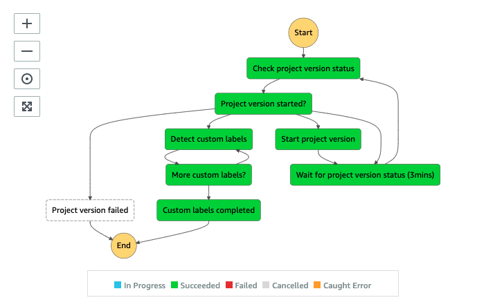
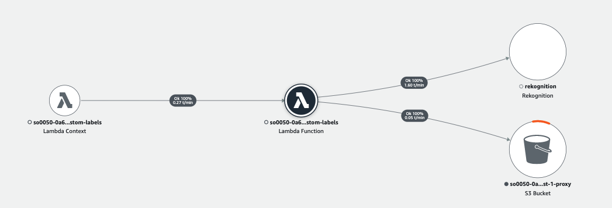

# Backlog Custom Labels State Machine

The Backlog Custom Labels State Machine detects the labels using an user-trained Computer Vision (image classification or object detection) models built with [Amazon Rekognition Custom Labels](https://aws.amazon.com/rekognition/custom-labels-features/) feature.

The state machine manages the runtime of the Custom Labels model to minmize the runtime cost.



__

## Execution Input

```json
{
  "jobTag": "JOB_ID",
  "input": {
    "customLabelModels": "CUSTOM_LABEL_MODEL_NAME",
    "bucket": "PROXY_BUCKET",
    "prefix": "OUTPUT_PREFIX",
    "key": "VIDEO_PROXY_KEY",
    "duration": 60581,
    "frameCaptureMode": 1002,
    "framerate": 30,
    "requestTime": 1637756442690,
    "minConfidence": 80,
    "inferenceUnits": 5,
    "frameCapture": {
      "prefix": "FRAMECAPTURE_PREFIX",
      "numFrames": 31,
      "numerator": 500,
      "denominator": 1000
    },
    "sampling": 2000,
    "cursor": 0,
    "numOutputs": 0,
    "projectArn": "CUSTOM_LABEL_PROJECT_ARN",
    "projectVersionArn": "CUSTOM_LABEL_PROJECT_VERSION_ARN"
  },
  "output": {
    "bucket": "PROXY_BUCKET",
    "prefix": "CUSTOM_LABEL_OUTPUT_PREFIX/"
  }
}
```

| Field | Description | Comments |
| :-----| :-----------| :---------|
| jobTag | Unique identifier | Used as the name of the state machine execution |
| input.customLabelModels | Custom Label Model name | Informative. Refer to input.projectArn and input.projectVersionArn |
| input.bucket | Proxy bucket | |
| input.prefix | Metadata output prefix | Informative |
| input.key | Video proxy file location | Informative |
| input.duration | Duration of the video | Informative |
| input.frameCaptureMode | Frame capture mode | Informative |
| input.framerate | Framerate of the video | Used to compute a timestamp of the frame image in conjunction with input.frameCapture.numerator and input.frameCapture.denominator |
| input.requestTime | Request time of the workflow | Used as DATETIME field to store the custom label detection results |
| input.minConfidence | Minimum confidence score | Currently not used |
| input.inferenceUnits | Inference units to start the CL model | Only being used if the model has not been started |
| input.frameCapture.prefix | Location of the frame images | |
| input.frameCapture.numFrames | Numbers of frame images to process | |
| input.frameCapture.numerator | Numerator of the frame capture rate | Used to compute a timestamp of the frame image in conjunction with input.framerate field | 
| input.frameCapture.denominator | denominator of the frame capture rate | Used to compute a timestamp of the frame image in conjunction with input.framerate field |
| input.sampling | Distance in milliseconds between two frame images | Informative |
| input.cursor | Keep track of frame images being processed | |
| input.numOutputs | Total number of output files generated | |
| input.projectArn | The ARN of the Custom Label model project | Required by [DescribeProjectVersions](https://docs.aws.amazon.com/rekognition/latest/dg/API_DescribeProjectVersions.html) to check the model status |
| input.projectVersionArn | The ARN of the specific Custom Label model version | Required by [DescribeProjectVersions](https://docs.aws.amazon.com/rekognition/latest/dg/API_DescribeProjectVersions.html) to check the model status, to start and stop the model [StartProjectVersion](https://docs.aws.amazon.com/rekognition/latest/dg/API_StartProjectVersion.html), and to run inference [DetectCustomLabels](https://docs.aws.amazon.com/rekognition/latest/dg/API_DetectCustomLabels.html) |
| output.bucket | Proxy bucket to store the custom label detection results | |
| output.prefix | Output prefix to store the custom label detection results | Path concatenated with DATETIME and CUSTOM_MODEL_NAME |

__

## State: Check project version status
A state where a lambda function checks the model status by calling [DescribeProjectVersions](https://docs.aws.amazon.com/rekognition/latest/dg/API_DescribeProjectVersions.html).

__

## State: Project version started?

A Choice state to switch to different states based on the _$.output\['check-project-version-status'\].status_ field.

If the status field is set to _TRAINING_FAILED_, _FAILED_, or _DELETING_ indicating the model is not runnable, it transitions to ```Project version failed``` state to terminate the state machine.

If the status field is set to RUNNING indicating the model is already in running mode, transitions to ```Detect custom labels``` state to start the analysis process. 

If the status field is set to _TRAINING_COMPLETED_ or _STOPPED_ indicating the model is runnable but has not been started, it transitions to ```Start project version``` state to start the model.

Otherwise, the model is starting, the state machine transitions to ```Wait for project version status (3mins)``` state to wait for the model to fully started.

__

## State: Wait for project version status (3mins)
A Wait state to wait for 3 minutes and transition back to ```Check project version status``` state.

__

## State: Start project version
A state where a lambda function starts the model by calling [StartProjectVersion](https://docs.aws.amazon.com/rekognition/latest/dg/API_StartProjectVersion.html).

__

## State: Detect custom labels
A state where a lambda function loops through and process the image frames by calling [DetectCustomLabels](https://docs.aws.amazon.com/rekognition/latest/dg/API_DetectCustomLabels.html).

If more frame images needed to be processed before the state lambda function exits, it updates the _$.input.cursor_ field to the current frame index. It also updates the model's TimeToLive (TTL) attribute in an _atomic-lock_ DynamoDB table which is used to keep track of the runtime of the model and auto stop the model when no other process uses it. [Service Backlog Management System](../../layers/service-backlog-lib/README.md#amazon-dynamodb-table-atomic-lock) explains the implementation in details.

__

## State: More custom labels?
A Choice state to check _$.output\['detect-custom-labels'\].status_. If it is set to _completed_ indicating all the frame images have been processed, it transitions to the next state, ```Custom labels completed``` state. Otherwise, it moves back to Detect custom labels state to continue the rest of the frame images.

__

## State: Custom labels completed
An End state indicating the custom label detection is completed.

__

## State: Project version failed
A Fail error indicating the custom label detection cannot be completed.

__

## AWS Lambda function (backlog-custom-labels)
The backlog-custom-labels lambda function provides the implementation to support different states of the Backlog Custom Labels state machine. The following AWS XRAY trace diagram demonstrates the AWS services this lambda function communicates to.



__

## IAM Role Permission

```json
{
    "Version": "2012-10-17",
    "Statement": [
        {
            "Action": [
                "s3:GetObject",
                "s3:PutObject",
                "s3:PutObjectAcl"
            ],
            "Resource": "PROXY_BUCKET",
            "Effect": "Allow"
        },
        {
            "Action": [
                "dynamodb:DescribeTable",
                "dynamodb:Scan",
                "dynamodb:Query",
                "dynamodb:PutItem",
                "dynamodb:UpdateItem",
                "dynamodb:DeleteItem"
            ],
            "Resource": "ATOMIC_LOCK_TABLE",
            "Effect": "Allow"
        },
        {
            "Action": "rekognition:DescribeProjectVersions",
            "Resource": "arn:aws:rekognition:REGION:ACCOUNT:project/*/*",
            "Effect": "Allow"
        },
        {
            "Action": [
                "rekognition:DetectCustomLabels",
                "rekognition:StartProjectVersion"
            ],
            "Resource": "arn:aws:rekognition:REGION:ACCOUNT:project/*/version/*/*",
            "Effect": "Allow"
        }
    ]
}
```

__

## Related topics
* [Service Backlog Management System](../../layers/service-backlog-lib/README.md)


__

Back to [Analysis Video State Machine](../../main/analysis/video/README.md) | Back to [Table of contents](../../../README.md#table-of-contents)

