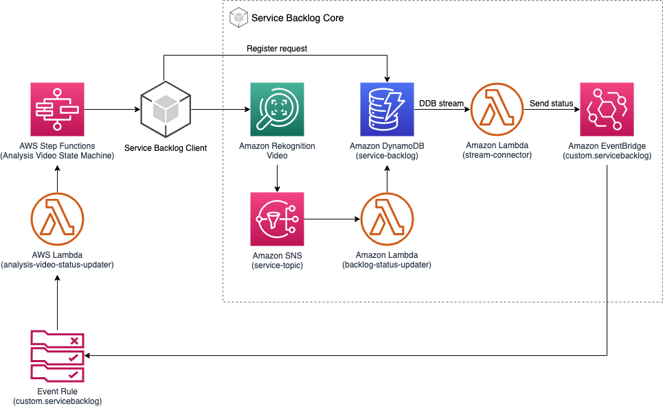
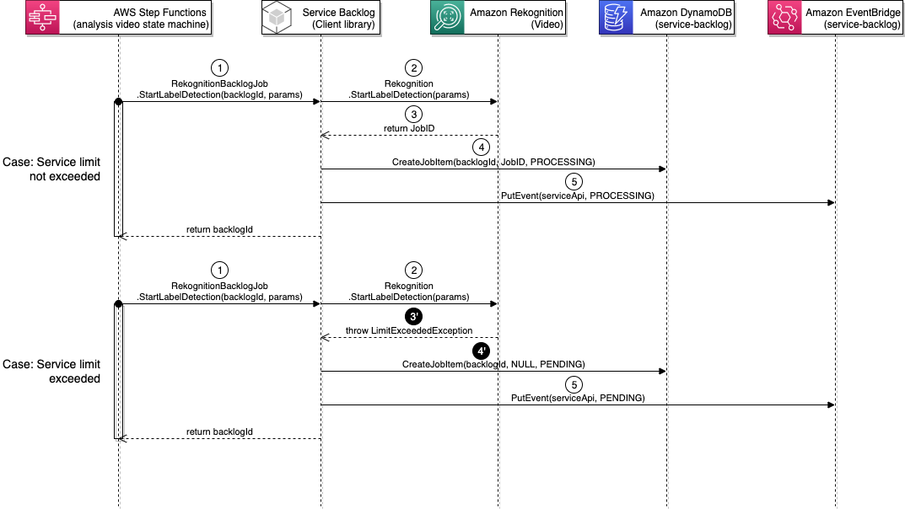
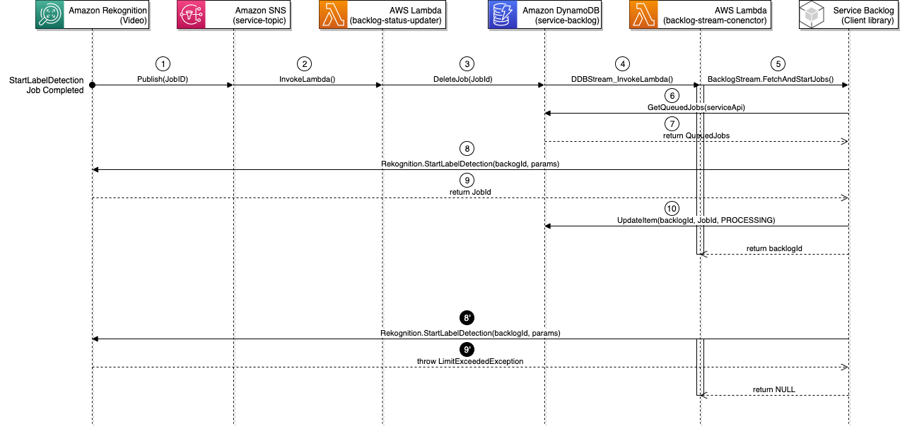
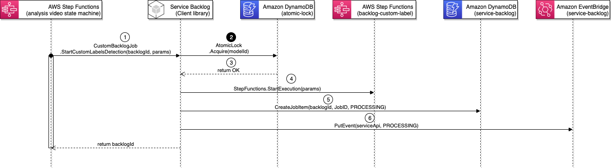
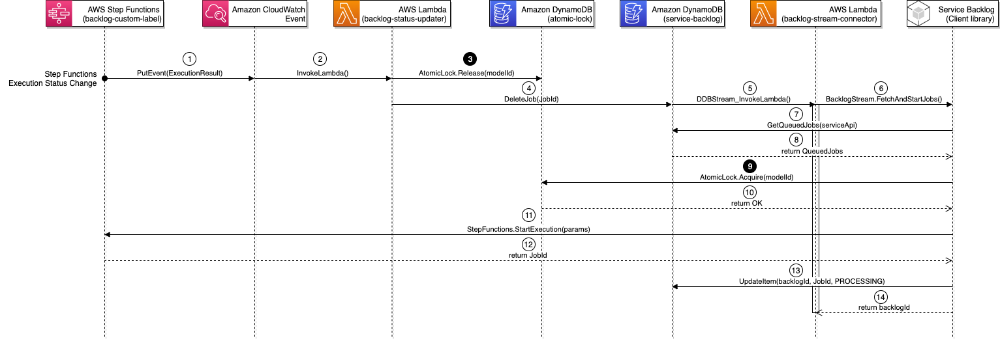

# Service Backlog Management System

The Service Backlog Management System provides an internal mechanism to queue a request when the concurrent limit of the specific AWS service has exceeded. The design is composed of two components: [Service Backlog Client library](#component-service-backlog-client-library) and [Service Backlog Core](#component-service-backlog-core).

The _Service Backlog Client library_ is a lightweight API wrapper to emulate the native AWS service API. To enable the backlog feature, the caller uses the Backlog Client APIs instead of the native AWS service APIs.

The _Service Backlog Core_ provides the implementation to support queuing and processing the incoming requests. It communicates back to the caller through Amazon EventBridge events where the callers implements an Event Rule target to get events from the Service Backlog Management System.



__

## Walkthough
Let us take an example of using the Backlog version of the _Amazon Rekognition StartLabelDetection_ API to walk through the call sequence.



### Case 1: When service limit not exceeded...
In the [Analysis Video State Machine, Start detection and wait state](../../main/analysis/video/README.md#state-start-detection-and-wait-iterator), a lambda function calls [RekognitionBacklogJob.StartLabelDetection](#component-service-backlog-client-library) to start a backlog process in _Step 1_.

The backlog client library first calls the native Amazon Rekognition StartLabelDetection API. If the service limit has not been reached, the API responds and returns a Job ID in _Step 2 & 3_.

The backlog client registers the request to the service-backlog DynamoDB table with the backlogId, Job ID of the actual Amazon Rekognition Video job and PROCESSING status in _Step 4_ and at last sends an event to the service-backlog EventBridge bus.

_

### Case 2: When service limit has reached...
The call sequence is identical. The differences are in _Step 3'_ where Amazon Rekognition Video has exceeded the limit and thrown a _LimitExceededException_ error instead of returning a Job ID.

In _Step 4'_, the backlog client registers the request with the Job ID sets to NULL and status sets to PENDING indicating the job has not been started.

_

Now, let us examine how the _PENDING_ job eventually gets processed.



The Service Backlog Core implements the wiring to get notifications from Amazon Rekognition service through the Amazon SNS notification, discussed in the [later section](#component-service-backlog-core).

When an Amazon Rekognition job is completed, it publishes the job results to our service-topic SNS topic where it triggers our backlog-status-updater lambda function, in _Step 1 & 2_.

The backlog-status-updater lambda function simply deletes the backlog job request from the service-backlog table in _Step 3_.

The backlog-status-updater lambda function is then triggered by the _REMOVE_ event through the DyanmoDB Stream. It then calls BacklogJob.FetchAndStartJobs to start the next available pending jobs in _Step 4 & 5_.

In _Step 6 & 7_, the backlog client queries a list of _PENDING_ jobs. In _Step 8 & 9_, it attempts to start the job by calling the native Amazon Rekognition Video API. If the call succeeds, the Amazon Rekognition returns a JobId. The backlog client then updates the table item to change the status from _PENDING_ to _PROCESSING_ and set the JobId in _Step 10_.

_Step 8' & 9'_ illustrates what happens when the attempt fails. The _PENDING_ jobs would wait for the next job slot becomes available.

__

## Component: Service Backlog Client Library
The backlog client library provides the interface for the caller to request a backlog job with a specific AWS service. It exposes APIs that are almost identical to the native AWS service APIs. The only difference is that the Backlog Client API requries an additional input parameter, _backlogJobId_ an unique ID to identify the backlog request.

Take Amazon Rekognition StartLabelDetection as an example.

### Amazon Rekognition native API
```js
const params = {
  Video: {...},
  ClientRequestToken: ...,
  JobTag: ...,
};
const rekog = new AWS.Rekognition();
await rekog.startLabelDetection(params);

```

### Backlog Rekognition Client API
```js
const params = {
  Video: {...},
  ClientRequestToken: ...,
  JobTag: ...,
};
const uniqueId = 'my-unique-id';
const backlog = new BacklogClient.RekognitionBacklogJob();
await backlog.startLabelDetection(uniqueId, params);

```

The backlog client library implements the following services / APIs; however, the Media2Cloud V3 solution uses only a subset of the APIs, indicated in the _Enabled?_ field.

| Service | API | Comments | Enabled? |
| :------ | :-- | :------- | :----------- |
| [Amazon Comprehend](./lib/client/comprehend/index.js) | StartDocumentClassificationJob | Most Comprehend asynchronous APIs can process 10 active jobs by default. Check [Service Quotas](console.aws.amazon.com/servicequotas/home/services/comprehend/quotas) on your AWS account for details. | &cross; |
| | StartDominantLanguageDetectionJob | | &cross; |
| | StartEntitiesDetectionJob | | &check; <br/> (Used for Custom Entity Recognizer) |
| | StartKeyPhrasesDetectionJob | | &cross; |
| | StartSentimentDetectionJob | | &cross; |
| | StartTopicsDetectionJob | | &cross; |
| [AWS Elemental MediaConvert](./lib/client/mediaconvert/index.js) | CreateJob | [The maximum number of jobs the service will process at one time per on-demand queue.](https://console.aws.amazon.com/servicequotas/home/services/mediaconvert/quotas/L-032C4FB4) \[Default: 200\] | &cross; <br/>(Rely on MediaConvert own queue) |
| [Amazon Rekognition](./lib/client/rekognition/index.js) | StartCelebrityRecognition | [The maximum number of concurrent Amazon Rekognition Video stored video jobs per account](https://console.aws.amazon.com/servicequotas/home/services/rekognition/quotas/L-A6079699) \[Default: 20\] | &check; |
| | StartContentModeration | | &check; |
| | StartFaceDetection | | &check; |
| | StartFaceSearch | | &check; |
| | StartLabelDetection | | &check; |
| | StartPersonTracking | | &check; |
| | StartSegmentDetection | | &check; |
| | StartTextDetection | | &check; |
| [Amazon Textract](./lib/client/textract/index.js) | StartDocumentAnalysis | [Maximum number of concurrent jobs for the Async DocumentAnalysis API that you can perform in this account in the current region](https://console.aws.amazon.com/servicequotas/home/services/textract/quotas/L-5CF3B0DF) \[Default: 600\] | &cross; |
| | StartDocumentTextDetection | | &cross; |
| [Amazon Transcribe](./lib/client/transcribe/index.js) | StartTranscriptionJob | [The maximum number of concurrent transcription jobs in this account in the current Region](https://console.aws.amazon.com/servicequotas/home/services/transcribe/quotas/L-6F7AB1C9) \[Default: 250\] | &cross; <br/> (Rely on Transcribe own queue) |
| | StartMedicalTranscriptionJob | | &cross; |
| Custom | StartCustomLabelsDetection | Special implementation to handle Amazon Rekognition Custom Labels request, discussed in [AWS Step Functions State Machine (backlog-custom-labels)](#aws-step-functions-state-machine-backlog-custom-labels) | &check; |

The implementation of the client library can be found under [source/layer/service-backlog-lib](./lib/client).

__

## Component: Service Backlog Core

### _Amazon DynamoDB table (service-backlog)_
The _service-backlog_ DynamoDB table keeps track of the backlog requests. The table enables both [DynamoDB Stream](https://docs.aws.amazon.com/amazondynamodb/latest/developerguide/Streams.html) and [TimeToLive](https://docs.aws.amazon.com/amazondynamodb/latest/developerguide/TTL.html) features.

Table attributes are described below.
| id (Partition) | serviceApi (Sort) | jobId | serviceParams | status | timestamp | ttl (TTL) |
| :----------- | :---------------- | :---- | :------------ | :----- | :-------- | :-------- |
| Backlog request ID | API string | Job ID returned by the AWS Service API | Payload to the specific AWS Service API |  PROCESSING\|PENDING | Timestamp of the request | Item expiration |
| 0001 | rekognition.startlabeldetection | 1234 | PROCESSING | 1234567 | 1234567 | 1000 |
| 0002 | rekognition.startfacedetection | - | PENDING | 1234567 | 1234567 | 1000 |

The TimeToLive (ttl) attribute provides a safeguard to ensure the Backlog Management System never blocks by any faulty job request / execution. The worst case is that the item expires and the backlog job fails. The ttl protects the system from being deadlocked.

_

### _Amazon DynamoDB table (atomic-lock)_
The _atomic-lock_ DynamoDB table is specifically used by the [Backlog Custom Labels (CL) state machine](#aws-step-functions-state-machine-backlog-custom-labels) to serialize the requests to run inference on a specific CL model by locking the model when is in use.

The table contains two attributes.

| lockId (Partition) | ttl (TTL) |
| :----------------- | :-------- |
| ARN of the Rekognition Cusotm Labels model | Item expiration |
| CUSTOM_MODEL_001 | 1000 |

The _ttl_ attribute that the lock being released eventually.

_

### _AWS Lambda function (backlog-stream-connector)_
The _backlog-stream-connector_ lambda function is attached to the _service-token_ DynamoDB table and gets triggered when changes occur.

The lambda function cares _ITEM REMOVE_ event indicating a backlog request has been removed from the table. Upon _ITEM REMOVE_ event, the lambda function fetches the next available pending requests of the same AWS service and attempts to call the native AWS Service API. If the request succeeds, it updates the item's status to PROCESSING. If the request fails due to _LimitExceededException_, it terminates.

The implementation can be found [source/backlog/stream-connector](../../backlog/stream-connector/).

_

### _IAM Role Permission (backlog-stream-connector)_
```json
{
    "Version": "2012-10-17",
    "Statement": [
        {
            "Action": [
                "dynamodb:Query",
                "dynamodb:UpdateItem"
            ],
            "Resource": "SERVICE_BACKLOG_TABLE",
            "Effect": "Allow"
        },
        {
            "Action": [
                "dynamodb:DescribeStream",
                "dynamodb:GetRecords",
                "dynamodb:GetShardIterator",
                "dynamodb:ListStreams"
            ],
            "Resource": "SERVICE_BACKLOG_DDB_STREAM",
            "Effect": "Allow"
        },
        {
            "Action": "events:PutEvents",
            "Resource": "SERVICE_BACKLOG_BUS",
            "Effect": "Allow"
        },
        {
            "Action": [
                "rekognition:StartContentModeration",
                "rekognition:StartCelebrityRecognition",
                "rekognition:StartFaceDetection",
                "rekognition:StartFaceSearch",
                "rekognition:StartLabelDetection",
                "rekognition:StartPersonTracking",
                "rekognition:StartSegmentDetection",
                "rekognition:StartTextDetection"
            ],
            "Resource": "*",
            "Effect": "Allow"
        },
        {
            "Action": "rekognition:StopProjectVersion",
            "Resource": "arn:aws:rekognition:REGION:ACCOUNT:project/*/version/*/*",
            "Effect": "Allow"
        },
        {
            "Action": [
                "textract:StartDocumentAnalysis",
                "textract:StartDocumentTextDetection"
            ],
            "Resource": "*",
            "Effect": "Allow"
        },
        {
            "Action": [
                "comprehend:StartEntitiesDetectionJob",
                "comprehend:StartKeyPhrasesDetectionJob",
                "comprehend:StartDominantLanguageDetectionJob",
                "comprehend:StartSentimentDetectionJob",
                "comprehend:StartTopicsDetectionJob"
            ],
            "Resource": "*",
            "Effect": "Allow"
        },
        {
            "Action": "s3:GetObject",
            "Resource": "INGEST_BUCKET",
            "Effect": "Allow"
        },
        {
            "Action": "s3:ListBucket",
            "Resource": "PROXY_BUCKET",
            "Effect": "Allow"
        },
        {
            "Action": [
                "s3:GetObject",
                "s3:PutObject"
            ],
            "Resource": "PROXY_BUCKET",
            "Effect": "Allow"
        },
        {
            "Action": "states:StartExecution",
            "Resource": "BACKLOG_CUSTOM_LABEL_STATE_MACHINE",
            "Effect": "Allow"
        },
        {
            "Action": [
                "dynamodb:Query",
                "dynamodb:DeleteItem",
                "dynamodb:PutItem",
                "dynamodb:UpdateItem"
            ],
            "Resource": "ATOMIC_LOCK_TABLE",
            "Effect": "Allow"
        },
        {
            "Action": "iam:PassRole",
            "Resource": "SERVICE_SNS_TOPIC",
            "Effect": "Allow"
        },
        {
            "Action": "iam:PassRole",
            "Resource": "DATA_ACCESS_ROLE",
            "Effect": "Allow"
        }
    ]
}
```

_

### _Amazon EventBridge bus (service-backlog)_
The _service-backlog_ EventBridge bus is used to communicate back to the caller. Events are fired when a backlog job is created, a backlog status changes from _PENDING_ to _PROCESSING_, and a backlog job is deleted from the table.

The caller can implement Event Rule similar to the [Amazon CloudWatch Events by AWS Services](https://docs.aws.amazon.com/AmazonCloudWatch/latest/events/EventTypes.html) to receive the event notifications from the Backlog Management System. 

Here is an example of an Event Rule Pattern to receive Backlog Rekognition API responses with _SUCCEEDED_ or _FAILED_ status. (Note: the status refers to the actual status returned by the native API.)

```json
{
    "detail-type": ["Service Backlog Status Change"],
    "source": ["custom.servicebacklog"],
    "detail": {
        "serviceApi": [
            "rekognition:startcontentmoderation", "rekognition:startcelebrityrecognition", "rekognition:startfacedetection", "rekognition:startfacesearch", "rekognition:startlabeldetection", "rekognition:startpersontracking", "rekognition:startsegmentdetection", "rekognition:starttextdetection"
        ],
        "status": [
            "SUCCEEDED",
            "FAILED"
        ]
    }
}
```

_

### _Amazon SNS topic (service-topic)_
The _service-topic_ SNS topic is implemented to support [Amazon Rekognition Video analysis results notification](https://docs.aws.amazon.com/rekognition/latest/dg/video-notification-payload.html) such that the Backlog Core receives notifications to kickoff other pending backlog requets.

The Backlog Client library automatically configures the NotificationChannel field when it calls the native Amazon Rekognition Video API such as _Rekognition.StartLabelDetection_.

```json
{
    "NotificationChannel": {
        "RoleArn": "BACKLOG_SNS_TOPIC_ROLE",
        "SNSTopicArn": "BACKLOG_TOPIC_ARN"
    },
    "ClientRequestToken": "JOD_TAG",
    "JobTag": "JOD_TAG",
    "Video": {...}
}
```

_

### _AWS Lambda function (backlog-status-updater)_
The _backlog-status-updater_ lambda function handles events from various AWS services:
* Amazon SNS notifications from Amazon Rekognition service
* Amazon CloudWatch Events from Amazon Transcribe
* Amazon CloudWatch Events from AWS Elemental MediaConvert
* and Amazon CloudWatch Events from AWS Step Functions of the Backlog Custom Label state machine

Most events are handled the same way where the lambda function deletes the backlog job request from the _service-token_ table.

With the events from the Backlog Custom Label state machine, the lambda function fetches the state machine execution output before it deletes the backlog job request from the _service-token_ table.

The implementation can be found [source/backlog/status-updater](../../backlog/status-updater/).

_

### _IAM Role Permission (backlog-status-updater)_
```json
{
    "Version": "2012-10-17",
    "Statement": [
        {
            "Action": [
                "dynamodb:DeleteItem",
                "dynamodb:Query"
            ],
            "Resource": "SERVICE_BACKLOG_TABLE",
            "Effect": "Allow"
        },
        {
            "Action": "events:PutEvents",
            "Resource": "SERVICE_BACKLOG_BUS",
            "Effect": "Allow"
        },
        {
            "Action": [
                "dynamodb:DeleteItem",
                "dynamodb:Query"
            ],
            "Resource": "ATOMIC_LOCK_TABLE",
            "Effect": "Allow"
        },
        {
            "Action": "states:DescribeExecution",
            "Resource": "BACKLOG_CUSTOM_LABEL_STATE_MACHINE",
            "Effect": "Allow"
        }
    ]
}
```

_

### _AWS Step Functions State Machine (backlog-custom-labels)_
The Service Backlog Core implements the _backlog-custom-labels_ state machine to queue Amazon Rekognition Custom Labels (CL) request for two reasons: 1) managing the CL model runtime to minimize the inference cost and 2) serializing requests to use the same CL model to ensure we don't throttle the model TPS.

Let us examine the call sequence diagram of starting the backlog-custom-labels state machine and serializing the request.



The call sequence is nearly identical to what we have discussed. The customization to ensure the serialization is an additional call to the _atomic-lock_ table to acquire the lock to use a specific CL model in _Step 2_.

Processing _PENDING_ jobs from the _backlog-status-updater_ lambda function is shown below.



Instead of a SNS notification fired from Amazon Rekognition, the event (_Step Functions Execution Status Change_) comes from the _backlog-custom-labels_ state machine through the Amazon CloudWatch Event.

Prior to deleting the backlog job from _service-backlog_ table, the _backlog-status-updater_ lambda function releases the lock from the _atomic-lock_ table in _Step 3_.

Starting a _PENDING_ job, the client library also makes an extra call to aquire the lock from the _atomic-lock_ table in _Step 9_.

The actual implementation of the _backlog-custom-label_ state machine is not covered in this chapter but is documented in [Backlog Custom Labels State Machine](../../backlog/custom-labels/README.md)

__

## Related topics
* [Backlog Custom Labels State Machine](../../backlog/custom-labels/README.md)
* [Analysis Video State Machine](../../main/analysis/video/README.md)
* [Analysis Audio State Machine](../../main/analysis/audio/README.md)
* [Analysis Worklfow Status Updater](../../main/analysis/automation/status-updater/README.md)

__

Back to [Table of contents](../../../README.md#table-of-contents)
