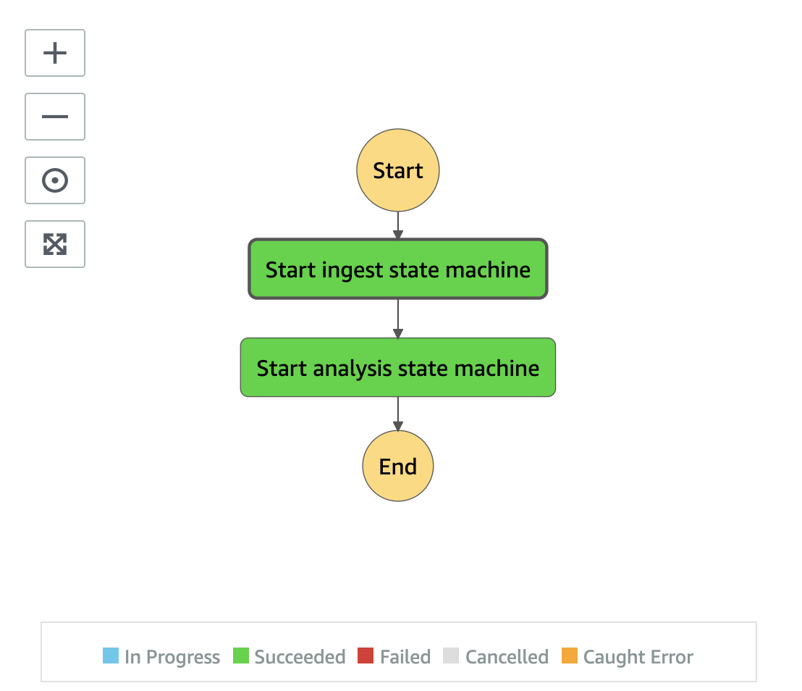

# Main State Machine

The Main state machine is the entry point of the backend workflow. It orchestrates the ingestion workflow and analysis workflow using [AWS Step Function Nested Workflows](https://docs.aws.amazon.com/step-functions/latest/dg/concepts-nested-workflows.html) technique that enables us to build complex workflows.



#### _State: Start ingest state machine_

This is a task state that invokes another Step Functions state machine called "Start ingest state machine." This state machine is responsible for ingesting media assets and performing data processing tasks.

#### _State: Start analysis state machine_

After the ingestion state machine is completed, the next task, "Start analysis state machine" is executed. This state machine is responsible for analyzing the ingested data and performing data analysis tasks.

__

#### _Execution input_

```json
{
  "input": {
    "uuid": "UUID",
    "bucket": "INGEST_BUCKET",
    "key": "S3_OBJECT_KEY",
    "destination": {
      "bucket": "PROXY_BUCKET",
      "prefix": "PREFIX"
    },
    "group": "GROUP",
    "attributes": {
        "key01": "value01",
        ...
    },
    "aiOptions": {
        "celeb": true,
        "label": false,
        ...
        "filters": {
            ...
        }
    }
  }
}
```

| Field | Description | Required? |
| :-----| :-----------| :---------|
| _input.uuid_ | Universally unique identifier (Version 4) | Mandatory |
| _input.bucket_ | Ingest bucket where it stores the uploaded media file | Mandatory |
|_input.key_ | Location of the uploaded media file | Mandatory |
| _input.destination.bucket_ | Proxy bucket where it stores generated proxies, thumbnail images, AI/ML metadata JSON files. If not specified, it uses the proxy bucket created by the solution | Optional |
| _input.destination.prefix_ | Location of where to store generated proxies, thumbnail images, AI/ML metadata JSON files. If not specified, it uses the UUID prefix. | Optional |
| _input.group_ | Grouping multiple uploaded media files and store them in the ingest bucket with a top-level prefix of the specified "GROUP" | Optional |
| _input.attributes.*_ | key value pair of additional attributes of the media file, stored as object metadata. | Optional |
| _input.aiOptions.*_ | AI/ML options to run the analysis workflow. If not specified, the solution uses the default AI/ML options specified when the Amazon CloudFormation stack was created | Optional |

##### _Minimum input parameters_

To start a workflow, the minimum input paramters you need to provde:

```json
{
  "input": {
    "uuid": "UUID",
    "bucket": "INGEST_BUCKET",
    "key": "S3_OBJECT_KEY",
  }
}
```
__

#### _Optional input parameters_

##### _input.group_

When you specify **group** field, the media file is uploaded to `s3://[INGEST_BUCKET]/[GROUP]/`. This can be used to group multiple media files into a logically "folder" structure. The group field is stored in both the Amazon OpenSearch cluster and the Amazon Neptune graph database such that you can search the attributes once the media file has been processed.


##### _input.attributes_

Attributes are arbitrary key-value pairs that are associated with the uploaded media file. They allow you to add additional information to describe the media file.

The attributes are stored as [User-defined object metadata](https://docs.aws.amazon.com/AmazonS3/latest/userguide/UsingMetadata.html#UserMetadata) and are also stored in both the Amazon OpenSearch cluster as well as the Amazon Neptune graph database, enabling you to search the attributes once the media file has been processed.

Here is an example of how to specify the attributes.


```json

{
  "input": {
    ...
    "attributes": {
        "Production": "Amazon Web Services",
        "Programme": "Race to the Cloud",
        "Type": "Dailies",
    }
  }
}

```


##### _input.aiOptions_

There are three different ways that the `aiOptions` are provided. Media2Cloud evaluates the `aiOptions` in the following order:

1. Input parameters when you start the main state machine.
2. Global settings configured from the Media2Cloud web portal's Settings page. The global `aiOptions` settings are stored in `s3://[PROXY_BUCKET]/_settings/aioptions.json`.
3. Default settings you specify when you create the Media2Cloud stack.

Here is a full list of the aiOptions:

```json
{
  "celeb": true,
  "face": true,
  "facematch": true,
  "label": true,
  "moderation": true,
  "text": true,
  "segment": true,
  "customlabel": true,
  "imageprop": false,
  "minConfidence": 80,
  "faceCollectionId": "autofaceindexer",
  "framebased": true,
  "frameCaptureMode": 9999,
  "textROI": [
    false,
    false,
    false,
    false,
    false,
    false,
    false,
    false,
    false
  ],
  "customLabelModels": [
    "[CUSTOM_LABEL_MODEL_1]",
    "[CUSTOM_LABEL_MODEL_2]"
  ],
  "transcribe": true,
  "keyphrase": true,
  "entity": true,
  "sentiment": true,
  "customentity": true,
  "textract": true,
  "autofaceindexer": true,
  "scene": true,
  "adbreak": true,
  "zeroshotlabels": [],
  "shoppable": false,
  "toxicity": false,
  "filters": {
    "transcode": {
      "cropX": 10,
      "cropY": 2
    },
    "adbreak": {
      "breakInterval": 240000,
      "breakOffset": 120000,
      "pauseWeight": 0.9,
      "quietnessWeight": 0.9,
      "contextualWeight": 0.9
    },
    "segment": {
      "maxPixelThreshold": 0.2,
      "minCoveragePercentage": 98.5
    },
    "scene": {
      "minFrameSimilarity": 0.8,
      "maxTimeDistance": 120000
    },
    "autofaceindexer": {
      "minFaceW": 58,
      "minFaceH": 58,
      "minBrightness": 26,
      "minSharpness": 10,
      "maxPitch": 23,
      "maxRoll": 23,
      "maxYaw": 23,
      "minCelebConfidence": 99.5
    }
  },
  "customVocabulary": "[CUSTOM_VOCABULARY]",
  "customLanguageModel": "[CUSTOM_LANGUAGE_MODEL]",
  "customEntityRecognizer": "[CUSTOM_ENTITY_RECOGNIZER_MODEL]",
  "languageCode": "en-US"
}
```

|Name|Type|Description|
|:--|:--|:--|
|_**Visual analysis**_|||
|celeb|Boolean|Enable/Disable Amazon Rekognition Celebrity API|
|face|Boolean|Enable/Disable Amazon Rekognition Face API|
|facematch|Boolean|Enable/Disable Amazon Rekognition SearchFace API. Required `faceCollectionId` to be specified|
|faceCollectionId|String|Amazon Rekognition Face Collection Id. Required `facematch` to be enabled|
|label|Boolean|Enable/Disable Amazon Rekognition Label API|
|imageprop|Boolean|Enable/Disable Amazon Rekognition Label Image Property feature. Required `label` to be enabled|
|moderation|Boolean|Enable/Disable Amazon Rekognition Content Moderation API|
|text|Boolean|Enable/Disable Amazon Rekognition Text API|
|textROI|Array of Boolean|Enable the Text Region of interest when running Amazon Rekognition Text detection. textROI is divided into a 3x3 grids representing [TopLeft, TopCenter, TopRight, CenterLeft, CenterCenter, CenterRight, BottomLeft, BottomCenter, BottomRight]|
|segment|Boolean|Enable/Disable Amazon Rekognition Shot Segment API|
|customlabel|Boolean|Enable/Disable Amazon Rekognition Custom Label Feature API. Required `customLabelModels` to be specified|
|customLabelModels|Array of Strings|A list of Custom Label models trained by Amazon Rekognition Custom Label feature|
|minConfidence|Number|Minimum confidence score of the results, applied to all Amazon Rekognition APIs|
|_**Audio analysis**_|||
|transcribe|Boolean|Enable/Disable Amazon Transcribe API|
|languageCode|String|Specify language code when running Amazon Transcribe API|
|customVocabulary|String|Specify a custom vocabulary name to use when running Amazon Transcribe API. A feature can improve the transcription output|
|customLanguageModel|String|Specify a custom domain language model name to use when running Amazon Transcribe API. A feature can improve the transcription output|
|toxicity|Boolean|Enable/Disable Amazon Transcribe Toxicity feature. Currently disabled|
|_**NLP analysis**_|||
|keyphrase|Boolean|Enable/Disable Amazon Comprehend Keyphrase API|
|entity|Boolean|Enable/Disable Amazon Comprehend Entity API|
|sentiment|Boolean|Enable/Disable Amazon Comprehend Sentiment Analysis API|
|customentity|Boolean|Enable/Disable Amazon Comprehend Custom Entity Feature. Required `customEntityRecognizer` to be specified|
|customEntityRecognizer|String|Specify a custom entity recognizer to use when running Amazon Comprehend Entity API|
|_**Document analysis**_|||
|textract|Boolean|Enable/Disable Amazon Textract Document Analysis API|
|_**Advacned features**_|||
|framebased|Boolean|Enable Frame based analysis that leverages Amazon Rekognition Image API instead of Amazon Rekognition Video API. One exception is the Amazon Rekognition Shot Segment API which is always Video API|
|frameCaptureMode|Number|Mapping to how we sample the frames to analyse. `0` means disabled. `1` means one frame per second. `9999` enables **Dynamic Frame Analysis** feature. Refer to [Frame Capture Mode](../layers/core-lib/lib/frameCaptureMode.js)|
|autofaceindexer|Boolean|Enable/Disable **Auto Face Indexer** feature. This requires `framebased`, `celeb`, and `facematch` enabled|
|scene|Boolean|Enable/Disable **Scene detection** feature. This requires `framebased`, `segment`, and `transcribe` enabled|
|adbreak|Boolean|Enable/Disable **AD Break detection** feature. This requires `scene` enabled|
|zeroshotlabels|Array of Strings|Enable zero-shot image classification and/or zeroshot object detection opensource ML models to identify _custom_ object or _image concept_. Currently disabled|
|shoppable|Boolean|Enable/Disable **Shoppable Experience** feature. Currently disabled. If you are interested in this feature, please contact your AWS representative|
|**filters.\***|JSON Object|Additional fine tuning that applies to the features|
|_**filters.transcode.\***_|||
|cropX|Number|A filter that allows you to crop the input video to remove potential noises introduced by Vertical Blanking Interval (VBI) scan lines. Specify in pixels.|
|cropY|Number|A filter that allows you to crop the input video to remove potential noises introduced by Vertical Blanking Interval (VBI) scan lines. Specify in pixels.|
|_**filters.transcribe.\***_|||
|analyseConversation|Boolean|Use Amazon Bedrock (Anthropic Claude 3 Haiku or Sonnet) to breakdown the conversation (transcript output from Amazon Transcribe) when the topic of the dialogues changes significantly. The result of the conversation changes events is used to enhance the scene and ad break detection later on.|
|_**filters.segment.\***_|||
|maxPixelThreshold|Number|A filter that allows you to define the black level of a BlackFrame when running Amazon Rekognition Shot Segment API. Refer to [Amazon Rekognition BlackFrame](https://docs.aws.amazon.com/rekognition/latest/APIReference/API_BlackFrame.html)|
|minCoveragePercentage|Number|A filter that allows you to define the black level of a BlackFrame when running Amazon Rekognition Shot Segment API. Refer to [Amazon Rekognition BlackFrame](https://docs.aws.amazon.com/rekognition/latest/APIReference/API_BlackFrame.html)|
|_**filters.autofaceindexer.\***_|||
|minFaceW|Number|Mininum width of the face to consider if the face should be ignored or indexed.|
|minFaceH|Number|Mininum height of the face to consider if the face should be ignored or indexed.|
|minBrightness|Number|Mininum brightness of the face to consider if the face should be ignored or indexed.|
|minSharpness|Number|Mininum sharpness of the face to consider if the face should be ignored or indexed.|
|maxPitch|Number|Maximum pose pitch of the face to consider if the face should be ignored or indexed.|
|maxRoll|Number|Maximum roll pitch of the face to consider if the face should be ignored or indexed.|
|maxYaw|Number|Maximum roll yaw of the face to consider if the face should be ignored or indexed.|
|minCelebConfidence|Number|Minimum confidence score of a face that has already been recognized as a know celebrity from Amazon Rekognition Celebrity detection. If you specify `100`, the Auto Face Indexer indexes all faces even through the face can be recognized by Amazon Rekognition Celebrity detection. This is one way to grow your own face collection. As your face collection grows, you can decide to disable Amazon Rekognition Celebrity API.|
|_**filters.scene.\***_|||
|minFrameSimilarity|Number|Control how contextually similar of the frames we should consider to group them together to create a scene|
|maxTimeDistance|Number|In a set of frames that are contextually similar, how far apart of these frames (measured by the frame's timestamp) we should consider to group them together a scene|
|enhanceWithTranscript|Boolean|Merge scenes together based on the timestamps of the transcript timestamps generated by Amazon Transcribe.|
|enhanceWithLLM|Boolean|Use Amazon Bedrock (Anthropic Claude 3 Haiku or Sonnet) to generate scene description, IAB Content Taxonomies, GARM Taxonomies, scene sentiment, and brands and logos at the scene level.|
|_**filters.adbreak.\***_|||
|breakInterval|Number|How often we should evaluate the ad break? Every 3 minutes? Every 10 minutes? Specify the interval in milliseconds.|
|breakOffset|Number|+/- offset of the breakInterval. If you specify 10 minutes breakInterval and 2 minutes breakOffset. We report ad breaks between every 8 minutes to 12 minutes|
|pauseWeight|Number|A factor of the dialogue pause duration when we compute the weight of the ad break|
|quietnessWeight|Number|A factor of the momentary loudness when we compute the weight of the ad break|
|contextualWeight|Number|A factor of the visual difference when we compute the weight of the ad break|

__

## Next topics

- [Ingestion Main State Machine](./ingest/main/README.md)
- [Analysis Main State Machine](./analysis/main/README.md)
- [State Machine Error Handling](./automation/error-handler/README.md)
- [Auto-start Main state machine on uploading S3 object](./automation/s3event/README.md)

__

Back to [Table of contents](../../README.md#table-of-contents)