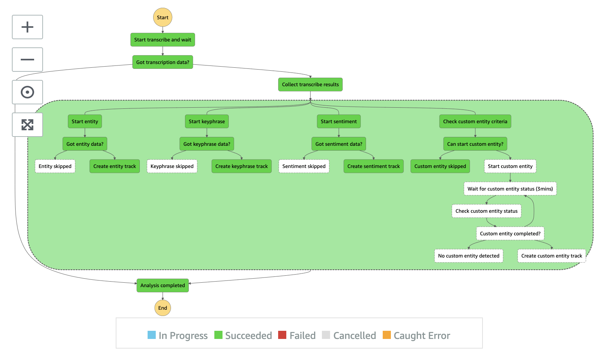

# Audio Analysis State Machine

Audio Analysis state machine extracts AI metadata from audio stream including transcription, keyphrases, entities, locations, people, quantities, and so forth. It uses Amazon Transcribe (ASR) to convert audio to text that can be used to create subtitle track. Then, it uses Amazon Comprehend (NLP) to analyze the speech content and extract valuable information.

__

* **Start transcribe and wait** state submits a job request to Amazon Transcribe service and wait for it to complete. V3 uses [Amazon CloudWatch Events, Transcribe Job State Change](https://docs.aws.amazon.com/transcribe/latest/dg/cloud-watch-events.html) to _signal_ back the state machine when a job is completed
* **Got transcription data?** state ensures transcription is available. In a case where the audio is silent or contains no speech, it skips the rest of the detection
* **Collect transcribe results** state creates subtitle and metadata tracks and stores the results to Amazon S3 proxy bucket.
* **NLP Parallel branch** starts parallel processing with Amazon Comprehend service
* **Start entity** state calls Amazon Comprehend BatchDetectEntities API to detect entities from the transcription
* **Got entity data?** state is a Choice state to ensure the result contains entities
* **Create entity track** state converts character offset to timestamps and creates metadata tracks
* **Start keyphrase** state calls Amazon Comprehend BatchDetectKephrases API to detect keyphrases from the transcription
* **Got keyphrase data?** state is a Choice state to ensure the result contains keyphrases
* **Create keyphrase track** state converts character offset to timestamps and creates metadata tracks
* **Start sentiment** state calls Amazon Comprehend BatchDetectSentiment API to detect keyphrases from the transcription
* **Got entity data?** state is a Choice state to ensure the result contains sentiment
* **Create sentiment track** state converts character offset to timestamps and creates metadata tracks
* **Check custom entity criteria** state ensures the specified custom entity model can be used such as is it the right language code as the transcription, do we have enough transcription data to run the model and so forth
* **Can start custom entity?** state is a Choice state to either starts the custom entity detection or skip it
* **Start custom entity** state calls StartEntitiesDetectionJob API with the specific entity reocognizer (EntityRecognizerArn)
* **Wait for custom entity status (3min)** state a Wait state to wait for 3 minutes and recheck the detection status
* **Check custom entity status** state checks the detection status
* **Custom entity completed?** state is a Choice state to switch to _Wait for custom entity status (3min)_ state or proceed to the next state, _Create custom entity track_
* **Create custom entity track** state converts character offset to timestamps and creates custom entity metadata tracks

Learn more about how to [Build a custom entity recognizer using Amazon Comprehend](https://aws.amazon.com/blogs/machine-learning/build-a-custom-entity-recognizer-using-amazon-comprehend/)

__

Back to [Analysis State Machine](../main/README.md) | Back to [Table of contents](../../../../README.md#table-of-contents)
