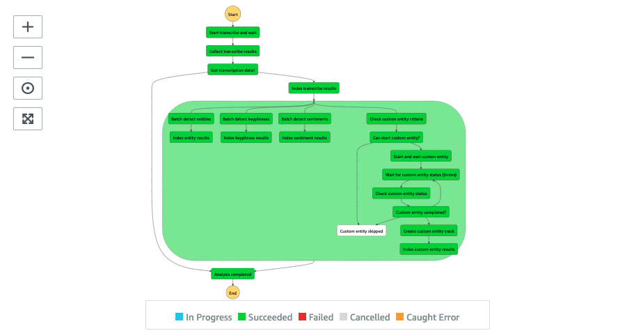
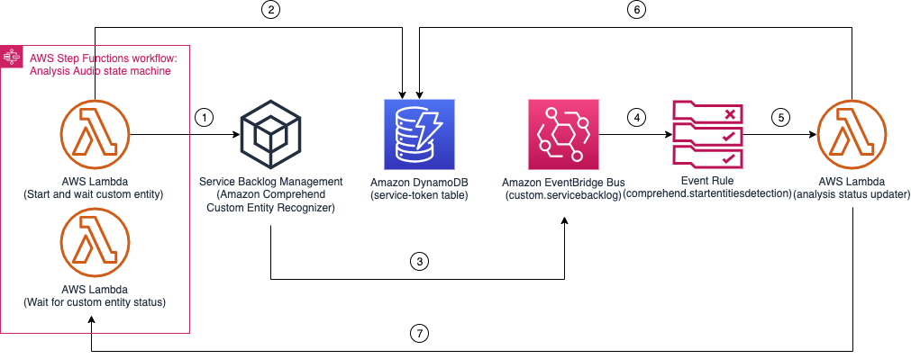
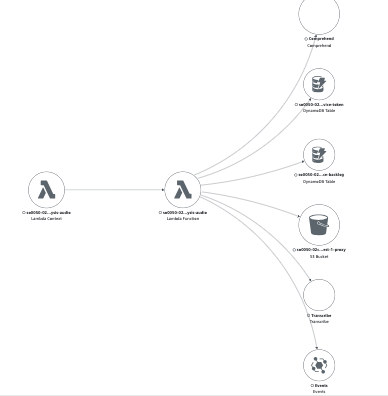

# Analysis Audio State Machine

The Analysis Audio state machine focuses on analyzing the audio stream of the uploaded content using Amazon Transcribe (ASR) service to convert the speech to text and create subtitle (WebVTT) track. It then uses Amazon Comprehend (NLP) service to further analyze the speech content to extract key phrases, entities, organizations, quantities, and so forth.



__

## Execution input
The state execution input is similar to the [Analysis Main State Machine](../main/README.md#execution-input) with additional fields generated by the [Prepare analysis](../main/README.md#state-prepare-analysis) state.

```json
{
    "input": {
        ...,
        "duration": 1508414,
        "aiOptions": {
            ...,
            /* Transcribe settings */
            "transcribe": true,
            "languageCode": "en-US",
            "customLanguageModel": "TRANSCRIBE_CUSTOM_LANGUAGE_MODEL",
            "customVocabulary": "TRANSCRIBE_CUSTOM_VOCABULARY",
            /* Comprehend settings */
            "keyphrase": true,
            "entity": true,
            "sentiment": true,
            "customentity": true,
            "customEntityRecognizer": "COMPREHEND_CUSTOM_ENTITY_RECOGNIZER",
        },
        "audio": {
            "enabled": true,
            "key": "PROXY_AUDIO_KEY"
        },
        "request": {
            "timestamp": 1637743896177
        }
    }
}
```

| Field | Description | Comments |
| :-----| :-----------| :---------|
| input.duration | indicates the audio duration | Information from MediaInfo |
| input.aiOptions.transcribe | run Amazon Transcribe | |
| input.aiOptions.languageCode | forces the language code when running Amazon Transcribe | If the field is not present, Amazon Transcribe auto-detects the language code |
| input.aiOptions.customLanguageModel | specifies an Amazon Transcribe Custom Language Model (CLM) to use | If languageCode is specified, the CLM must also be trained with the same language code |
| input.aiOptions.customVocabulary | specifies an Amazon Transcribe Custom Vocabulary (CV) to use | If languageCode is specified, the CV must also match the language code |
| input.aiOptions.keyphrase | run Amazon Comprehend Key Phrases detection | |
| input.aiOptions.entity | run Amazon Comprehend Entities detection | |
| input.aiOptions.sentiment | run Amazon Comprehend Sentiment detection | |
| input.aiOptions.customentity | run Amazon Comprehend Custom Entities detection | |
| input.aiOptions.customEntityRecognizer | specifies the Custom Entity Recognizer (CER) to use | customentity field must be true. If languageCode is specified, the CER must also match the language code |
| input.audio.enabled | indicates audio analysis is required | Must be true |
| input.audio.key | the M4A proxy audio generated by AWS Elemental MediaConvert | Must exist |
| input.request.timestamp | request timestamp | If present, the timestamp (_DATETIME_) is concatenated to the path to store the raw analysis results |

__

## State: Start transcribe and wait
A state where a lambda function uses [Amazon Transcribe](https://aws.amazon.com/transcribe/) service to start a transcription job asynchronously and wait for the job to complete. It uses [Step Functions Service Integration Pattern](https://docs.aws.amazon.com/step-functions/latest/dg/connect-to-resource.html) which is similar to and is covered in [Using State Machine Service Integration with AWS Elemental MediaConvert service](../../ingest/automation/README.md#state-machine-service-integration) chapter.

__

## State: Collect transcribe results
A state where a lambda function ensures that the transcription job is completed (not failed) and the transcription results (JSON file) and the [Amazon Transcribe generated subtitle file](https://docs.aws.amazon.com/transcribe/latest/dg/subtitles.html) (WebVTT format) are present and stored in the S3 proxy bucket.

__

## State: Got transcription data?
A Choice state that checks whether we got transcription data by checking the presence of the following fields: _$.data.transcribe.languageCode_, _$.data.transcribe.output_, and _$.data.transcribe.vtt_. If all fields are set, it transitions to the next state, ```Index transcribe results``` state. If one of the fields is not present, it moves to the ```Analysis completed``` state indicating the audio analysis has completed.

__

## State: Index transcribe results
A state where a lambda function downloads and parses the WebVTT file using an open source package [node-webvtt](https://github.com/osk/node-webvtt) and indexes the timestamped transcription results to the Amazon OpenSearch cluster under the ```transcribe``` indice.

__

## State: Batch detect entities
A state where a lambda function runs Amazon Comprehend [BatchDetectEntities](https://docs.aws.amazon.com/comprehend/latest/dg/API_BatchDetectEntities.html) to extract entities from the transcription and converts the character based offset to timestamp based results. The lambda function preserves and stores the _original_ entity results from Amazon Comprehend service to the S3 proxy bucket under _s3://PROXY_BUCKET/UUID/FILE_BASENAME/raw/DATETIME/comprehend/entity/output.manifest_ and stores the timestamped version of metadata result in JSON results to _s3://PROXY_BUCKET/UUID/FILE_BASENAME/metadata/entity/output.json_ which is used to index the entities later on.

__

## State: Index entity results
A state where it downloads the metadata result and indexes the entity results to the Amazon OpenSearch cluster under ```entity``` indice.

__

## State: Batch detect keyphrases
A state where a lambda function runs Amazon Comprehend [BatchDetectKeyPhrases](https://docs.aws.amazon.com/comprehend/latest/dg/API_BatchDetectKeyPhrases.html) and stores the original keyphrase results to _s3://PROXY_BUCKET/UUID/FILE_BASENAME/raw/DATETIME/comprehend/keyphrase/output.manifest_ and the timestamped metadata JSON file to _s3://PROXY_BUCKET/UUID/FILE_BASENAME/metadata/keyphrase/output.json_.

__

## State: Index keyphrase results
A state where it downloads the metadata result and indexes the keyphrase results to the Amazon OpenSearch cluster under ```keyphrase``` indice.

__

## State: Batch detect sentiments
A state where a lambda function runs Amazon Comprehend [BatchDetectSentiment](https://docs.aws.amazon.com/comprehend/latest/dg/API_BatchDetectSentiment.html) and stores the original sentiment results to _s3://PROXY_BUCKET/UUID/FILE_BASENAME/raw/DATETIME/comprehend/sentiment/output.manifest_ and the timestamped metadata JSON file to _s3://PROXY_BUCKET/UUID/FILE_BASENAME/metadata/sentiment/output.json_.

__

## State: Index sentiment results
A state where it downloads the metadata result and indexes the sentiment results to the Amazon OpenSearch cluster under ```sentiment``` indice.

__

## _Custom Entity Recognition branch_
_The Custom Entity Recognition branch is a slightly different compared to other Amazon Comprehend processes. It requires an asynchrouous operation, [StartEntitiesDetectionJob](https://docs.aws.amazon.com/comprehend/latest/dg/API_StartEntitiesDetectionJob.html) to analyze the transcription with the Custom Entity Recognizer. Learn more about how to [Build a custom entity recognizer using Amazon Comprehend](https://aws.amazon.com/blogs/machine-learning/build-a-custom-entity-recognizer-using-amazon-comprehend/)._

_In addition, the default maximum number of active (concurrent) Custom Entity Recognizer jobs allowed per account is **10 jobs**. Therefore, the Custom Entity Recognition branch uses the [Service Backlog Management System](../../../layers/service-backlog-lib/README.md) to queue the request internally to avoid hitting the concurrent limit._

## State: Check custom entity criteria
A state where a lambda function ensures that the Custom Entity Recognizer is runnable and the language code of the transcription result is same as the language code of the trained recognizer.

If the criteria are met, the state lambda function prepares the documents to be analyzed, stores them to _s3://PROXY_BUCKET/UUID/FILE_BASENAME/raw/DATETIME/comprehend/customentity/document-XXX.txt_, and set the _$.data.comprehend.customentity.prefix_ field indicating there are documents to be processed.

__

## State: Can start custom entity?
A Choice state to determine where we can continue with the Custom Entity detection by checking _$.data.comprehend.customentity.prefix_ field.

__

## State: Start and wait custom entity
A state where a lambda function starts the entity detection with the Custom Entity Recognizer by registering the request to the [Service Backlog Management System](../../../layers/service-backlog-lib/README.md) and waits for the Backlog service to start the process by using the [Step Functions Service Integration Pattern](https://docs.aws.amazon.com/step-functions/latest/dg/connect-to-resource.html) discussed in an earlier chapter. The diagram shown below demonstrates the wiring of the service integration pattern and backlog management system.



In _Step 1_, the _Start and wait custom entity_ state lambda function registers a request to the Service Backlog Management System to start the custom entity detection. The Service Backlog queues the request internally and starts the process whenever possilbe.

The state lambda then stores the backlog request ID and the state machine execution token to the _service-token_ table in _Step 2_.

When the job is started by Amazon Comprehend service, the Service Backlog Management System sends an event to the Amazon EventBridge where an Event Rule is configured to listen to _Service Backlog Status Change_ event and triggers a lambda function (_analysis-status-updater_) to process in _Step 3, 4 and 5_.

The _analysis-status-updater_ lambda function fetches the execution token from the _service-token_ table using the backlog request ID and notifies the state machine to resume the execution in _Step 6 & 7_, described in [Analysis Workflow Status Updater](../automation/status-updater/README.md).

The state machine transitions to the next state, _Wait for custom entity status (3 mins)_ state.

__

## State: Wait for custom entity status (3 mins)
Amazon Comprehend service does not currently support Amazon CloudWatch Events nor Amazon SNS notifications. Therfore, the state machine proactively polls the job status every 3 minutes.

This is a Wait state where it waits for 3 minutes and transitions to the next state, ```Check custom entity status``` state.

__

## State: Check custom entity status
A state where a lambda function checks the status of the Custom Entity Detection job. If the job is completed or failed, the lambda function deletes its backlog item from the Service Backlog Management System and sets the state data, _$.status_ to _COMPLETED_ or _ERROR_.  

__

## State: Custom entity completed?
A Choice state that checks _$.status_ field. If it is set to _COMPLETED_, transitions to the ```Create custom entity track``` state. If _$.status_ is set to _ERROR_ or _NO_DATA_, moves to ```Custom entity skipped``` state. Otherwise, transitions back to ```Wait for custom entity status (3mins)``` state to wait for the job to complete.

__

## State: Create custom entity track
A state where a lambda function untar the custom entity results stored in _s3://PROXY_BUCKET/UUID/FILE_BASENAME/raw/DATETIME/comprehend/customentity/NER_FOLDER/output/output.tar.gz_ . Then, it parses and converts the results into timestamp based metadata and stores it back to _s3://PROXY_BUCKET/UUID/FILE_BASENAME/metadata/customentity/output.json_ which is used to index the entities later on.

__

## State: Index custom entity results
A state where it downloads the metadata result and indexes the custom entity results to the Amazon OpenSearch cluster under ```customentity``` indice.

__

## State: Custom entity skipped
A End state indicates that there is no custom entity being detected.

__

## AWS Lambda function (analysis-audio)
The analysis-audio lambda function provides the implementation to support different states of the Analysis Audio state machine. The following AWS XRAY trace diagram illustrates the AWS resources this lambda function communicates to.



__

## IAM Role Permission

```json
{
    "Version": "2012-10-17",
    "Statement": [
        {
            "Action": "s3:ListBucket",
            "Resource": "PROXY_BUCKET",
            "Effect": "Allow"
        },
        {
            "Action": [
                "s3:GetObject",
                "s3:PutObject"
            ],
            "Resource": "PROXY_BUCKET/*",
            "Effect": "Allow"
        },
        {
            "Action": [
                "dynamodb:DescribeTable",
                "dynamodb:Scan",
                "dynamodb:Query",
                "dynamodb:PutItem",
                "dynamodb:UpdateItem",
                "dynamodb:DeleteItem"
            ],
            "Resource": [
                "SERVICE_TOKEN_TABLE",
                "SERVICE_BACKLOG_TABLE"
            ],
            "Effect": "Allow"
        },
        {
            "Action": [
                "comprehend:BatchDetectDominantLanguage",
                "comprehend:BatchDetectEntities",
                "comprehend:BatchDetectKeyPhrases",
                "comprehend:BatchDetectSentiment",
                "comprehend:BatchDetectSyntax",
                "comprehend:StartEntitiesDetectionJob",
                "comprehend:StartKeyPhrasesDetectionJob",
                "comprehend:StartDominantLanguageDetectionJob",
                "comprehend:StartSentimentDetectionJob",
                "comprehend:StartTopicsDetectionJob",
                "comprehend:StopDominantLanguageDetectionJob",
                "comprehend:StopEntitiesDetectionJob",
                "comprehend:StopKeyPhrasesDetectionJob",
                "comprehend:StopSentimentDetectionJob",
                "comprehend:DescribeDominantLanguageDetectionJob",
                "comprehend:DescribeEntitiesDetectionJob",
                "comprehend:DescribeKeyPhrasesDetectionJob",
                "comprehend:DescribeSentimentDetectionJob",
                "comprehend:DescribeTopicsDetectionJob"
            ],
            "Resource": "*",
            "Effect": "Allow"
        },
        {
            "Action": "comprehend:DescribeEntityRecognizer",
            "Resource": "CUSTOM_ENTITY_RECOGNIZER",
            "Effect": "Allow"
        },
        {
            "Action": [
                "transcribe:GetTranscriptionJob",
                "transcribe:StartTranscriptionJob",
                "transcribe:GetVocabulary",
                "transcribe:DescribeLanguageModel"
            ],
            "Resource": "*",
            "Effect": "Allow"
        },
        {
            "Action": "iam:PassRole",
            "Resource": "SERVICE_DATA_ACCESS_ROLE",
            "Effect": "Allow"
        },
        {
            "Action": "events:PutEvents",
            "Resource": "SERVICE_BACKLOG_EVENT_BUS",
            "Effect": "Allow"
        },
        {
            "Action": [
                "es:ESHttpGet",
                "es:ESHttpHead",
                "es:ESHttpPost",
                "es:ESHttpPut",
                "es:ESHttpDelete"
            ],
            "Resource": "OPENSEARCH_CLUSTER",
            "Effect": "Allow"
        }
    ]
}
```
__

## Related topics
* [Service Backlog Management System](../../../layers/service-backlog-lib/README.md)
* [Analysis Workflow Status Updater](../automation/status-updater/README.md)

__

Back to [Analysis Main State Machine](../main/README.md) | Back to [Table of contents](../../../../README.md#table-of-contents)
