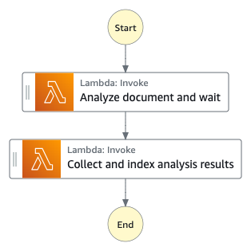
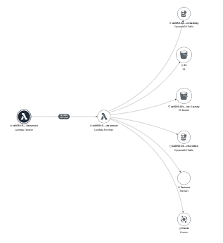

# Analysis Document State Machine

The Analysis Document State Machine runs Amazon Textract service to extract tabular data from the document (PDF format) and indexes the metadata into Amazon OpenSearch cluster.



## Execution input

The state execution input is similar to the [Analysis Main State Machine](../main/README.md#execution-input) with additional fields relevant to the document analysis workflow.

```json
{
    "input": {
        ...,
        "aiOptions": {
            "textract": true
        },
        "document": {
            "enabled": true,
            "prefix": "IMAGE_PROXIES_PREFIX",
            "numPages": 68
        },
        "request": {
            "timestamp": 1637743896177
        }
    }
}

```

## State Descriptions

#### _State: Analyze document and wait_

The lambda function leverages the [Service Backlog Management System](../../../layers/service-backlog-lib/README.md) to queue the document analysis request and wait for the request to be processed. The Backlog system runs the Amazon Textract StartDocumentTextDetection API and sends the task result back to the Analysis Document State Machine when the analysis is completed.

#### _State: Index analysis results_

The lambda function parses the text per page and indexes the text with the corresponding page number to an Amazon OpenSearch cluster.

## Metadata location

The Document Analysis State Machine generates one metadata output file, which is stored in the specified location.

|Output|Location|
|:--|:--|
|Textract JSON|s3://[PROXY_BUCKET]/[UUID]/[FILE_BASENAME]/raw/[DATE_TIME]/textract/textract.json|


## AWS Lambda function (analysis-document)

The analysis-document lambda function provides the implementation to support different states of the Analysis Document state machine.

## IAM Role Policy

The IAM role policy for the analysis-document lambda function is provided.

```json
{
    "Version": "2012-10-17",
    "Statement": [
        {
            "Action": [
                "logs:CreateLogGroup",
                "logs:CreateLogStream",
                "logs:PutLogEvents"
            ],
            "Resource": "[CLOUDWATCH_LOGS]",
            "Effect": "Allow"
        },
        {
            "Action": "s3:ListBucket",
            "Resource": "[INGEST_BUCKET]",
            "Effect": "Allow"
        },
        {
            "Action": "s3:GetObject",
            "Resource": "[INGEST_BUCKET]",
            "Effect": "Allow"
        },
        {
            "Action": "s3:ListBucket",
            "Resource": "[PROXY_BUCKET]",
            "Effect": "Allow"
        },
        {
            "Action": [
                "s3:GetObject",
                "s3:PutObject"
            ],
            "Resource": "[PROXY_BUCKET]",
            "Effect": "Allow"
        },
        {
            "Action": [
                "dynamodb:Scan",
                "dynamodb:Query",
                "dynamodb:UpdateItem",
                "dynamodb:DeleteItem",
                "dynamodb:PutItem",
                "dynamodb:BatchGetItem",
                "dynamodb:BatchWriteItem"
            ],
            "Resource": "[SERVICE_TOKEN_TABLE]",
            "Effect": "Allow"
        },
        {
            "Action": [
                "textract:StartDocumentTextDetection",
                "textract:GetDocumentTextDetection"
            ],
            "Resource": "*",
            "Effect": "Allow"
        },
        {
            "Action": [
                "es:ESHttpGet",
                "es:ESHttpHead",
                "es:ESHttpPost",
                "es:ESHttpPut",
                "es:ESHttpDelete"
            ],
            "Resource": "[OPENSEARCH_DOMAIN]",
            "Effect": "Allow"
        },
        {
            "Action": "aoss:APIAccessAll",
            "Resource": "[OPENSEARCH_SERVERLESS_COLLECTION]",
            "Effect": "Allow"
        },
        {
            "Action": "iam:PassRole",
            "Resource": "[DATA_ACCESS_ROLE]",
            "Effect": "Allow"
        },
        {
            "Action": "events:PutEvents",
            "Resource": "[SERVICE_BACKLOG_EVENTBUS]",
            "Effect": "Allow"
        }
    ]
}

```

## X-Ray Trace

The AWS XRAY trace diagram demonstrates the AWS services the analysis-document lambda function communicates with.



## Related topics

- [Service Backlog Management System](../../../layers/service-backlog-lib/README.md)

__

Back to [Analysis Main State Machine](../main/README.md) | Back to [Table of contents](../../../../README.md#table-of-contents)
