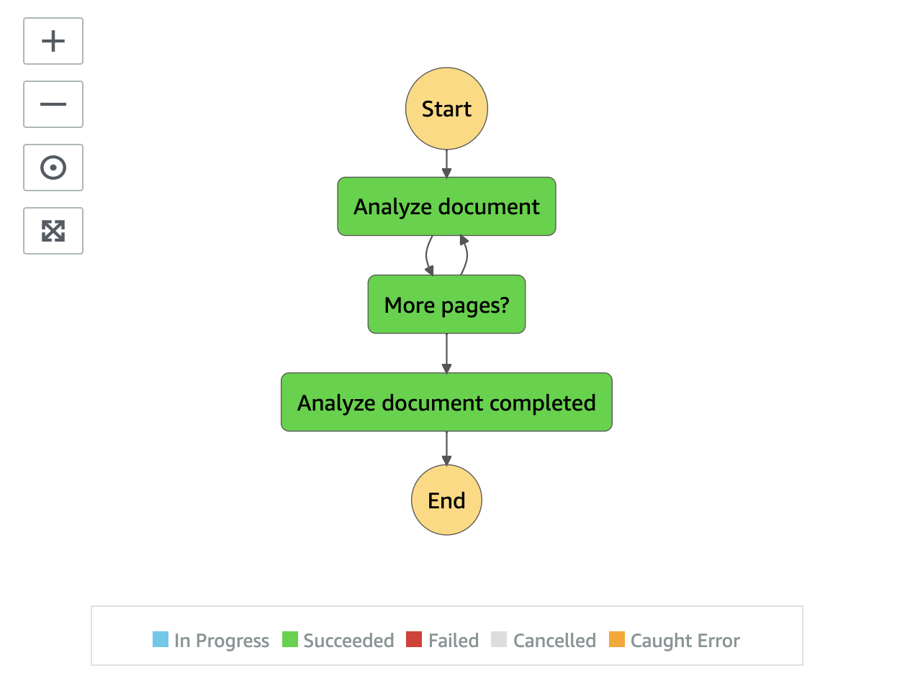

# Document Analysis State Machine

Document Analysis state machine uses Amazon Textract to extract AI metadata from a PDF file.

__

* **Analyze document** state uses Amazon Textract AnalyzeDocument API to process all pages from a PDF document and stores results to Amazon S3 proxy bucket
* **More pages?** state is a Choice state to ensure there is no more pages to be processed
* **Analyze document completed** state is an end state

__

Back to [Analysis State Machine](../main/README.md) | Back to [README](../../../../README.md)
