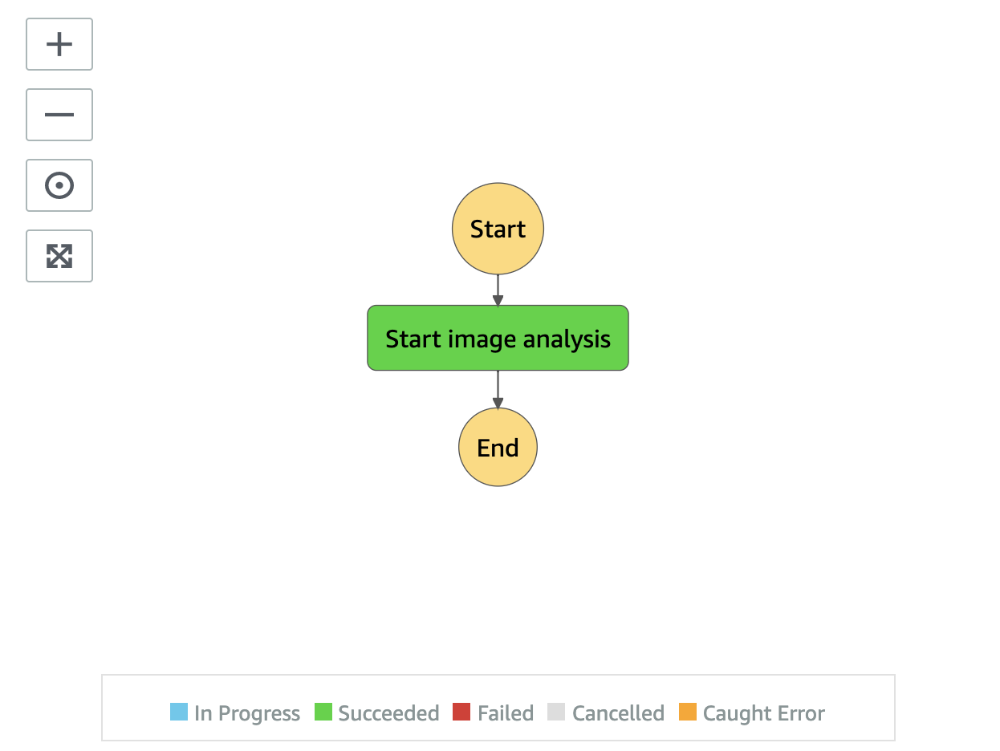

# Image Analysis State Machine

Image Analysis state machine extracts AI metadata from an image.

__

* **Start image analysis** state uses Amazon Rekognition Image APIs, RecognizeCelebrities, DetectFaces, DetectLabels, DetectModerationLabels, DetectText, and SearchFacesByImage.

(Note: V3 Preview version currently doesn't support Amazon Rekognition Custom Labels for image.)

__

Back to [Analysis State Machine](../main/README.md) | Back to [Table of contents](../../../../README.md#table-of-contents)
