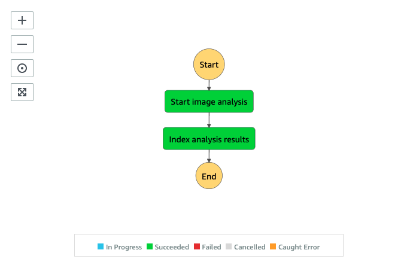
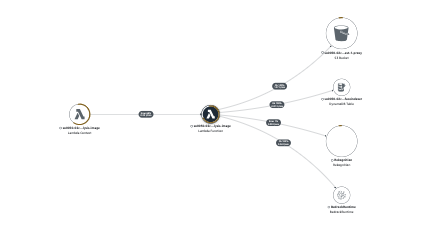

# Analysis Image State Machine

The Analysis Image State Machine runs a set of Amazon Rekognition Image APIs to extract visual metadata from an image file and indexes the metadata to the Amazon OpenSearch cluster.



__

## Execution input
The state execution input is similar to the [Analysis Main State Machine](../main/README.md#execution-input) with additional fields generated (or modified) by the [Prepare analysis](../main/README.md#state-prepare-analysis) state.

```json
{
    "input": {
        ...,
        "aiOptions": {
            ...,
            "minConfidence": 80,
            /* Rekognition Image settings */
            "celeb": true,
            "face": true,
            "facematch": true,
            "faceCollectionId": "REKOGNITION_COLLECTION_ID",
            "label": true,
            "moderation": true,
            "text": true,
            "textROI": [true, true, true, false, false, false, false, false, false]
        },
        "image": {
            "enabled": true,
            "key": "PROXY_IMAGE_KEY"
        },
        "request": {
            "timestamp": 1637743896177
        }
    }
}
```

| Field | Description | Comments |
| :-----| :-----------| :---------|
| input.aiOptions.minConfidence | Minimum confidence level to return from the detection APIs | |
| input.aiOptions.celeb | Run celebrity detection | |
| input.aiOptions.face | Run face detection | |
| input.aiOptions.facematch | Search face against your own Face Collection | faceCollectionId field must be present |
| input.aiOptions.faceCollectionId | Specify the Face Collection to use | facematch field must be true |
| input.aiOptions.label | Run label detection | |
| input.aiOptions.moderation | Run content moderation label detection | |
| input.aiOptions.text | Run text detection | |
| input.aiOptions.textROI | Specify region of interest when running text detection | text field must be true. If region of interest is not present, use the entire image |
| input.image.enabled | indicates image analysis is required | Must be true |
| input.image.key | location of the image proxy file generated from the [Ingest Image State Machine](../../ingest/image/README.md) | Must exist |
| input.request.timestamp | request timestamp | If present, the timestamp (_DATETIME_) is concatenated to the path to store the raw analysis results |

__

## State: Start image analysis

A state where a lambda function runs a set of Amazon Rekognition Image APIs including [RecognizeCelebrities](https://docs.aws.amazon.com/rekognition/latest/dg/API_RecognizeCelebrities.html), [DetectFaces](https://docs.aws.amazon.com/rekognition/latest/dg/API_DetectFaces.html), [SearchFacesByImage](https://docs.aws.amazon.com/rekognition/latest/dg/API_SearchFacesByImage.html), [DetectLabels](https://docs.aws.amazon.com/rekognition/latest/dg/API_DetectLabels.html), [DetectModerationLabels](https://docs.aws.amazon.com/rekognition/latest/dg/API_DetectModerationLabels.html) and [DetectText](https://docs.aws.amazon.com/rekognition/latest/dg/API_DetectText.html) to extract visual metadata from the image file and stores the raw results to _s3://PROXY_BUCKET/UUID/FILE_BASENAME/raw/DATETIME/rekog-image/ANALYSIS_TYPE/output.json_ where ```ANALYSIS_TYPE``` is _celeb_, _label_, _face_, _facematch_, _text_ or _moderation_.

__

## State: Index analysis results
A state where a lambda function downloads and parses each analysis typed metadata and indexes to the Amazon OpenSearch cluster under ```celeb```, ```label```, ```face```, ```facematch```, ```text``` or ```moderation``` indice accordingly.

__

## AWS Lambda function (analysis-image)
The analysis-image lambda function provides the implementation to support different states of the Analysis Image state machine. The following AWS XRAY trace diagram illustrates the AWS resources this lambda function communicates to.



__

## IAM Role Permission

```json
{
    "Version": "2012-10-17",
    "Statement": [
        {
            "Action": "s3:ListBucket",
            "Resource": "PROXY_BUCKET",
            "Effect": "Allow"
        },
        {
            "Action": [
                "s3:GetObject",
                "s3:PutObject"
            ],
            "Resource": "PROXY_BUCKET/*",
            "Effect": "Allow"
        },
        {
            "Action": [
                "dynamodb:Scan",
                "dynamodb:Query",
                "dynamodb:UpdateItem",
                "dynamodb:DeleteItem"
            ],
            "Resource": [
                "SERVICE_TOKEN_TABLE",
            ],
            "Effect": "Allow"
        },
        {
            "Action": [
                "rekognition:DetectFaces",
                "rekognition:DetectLabels",
                "rekognition:DetectModerationLabels",
                "rekognition:DetectText",
                "rekognition:RecognizeCelebrities",
                "rekognition:DescribeCollection",
                "rekognition:SearchFacesByImage"
            ],
            "Resource": "*",
            "Effect": "Allow"
        },
        {
            "Action": [
                "es:ESHttpGet",
                "es:ESHttpHead",
                "es:ESHttpPost",
                "es:ESHttpPut",
                "es:ESHttpDelete"
            ],
            "Resource": "OPENSEARCH_CLUSTER",
            "Effect": "Allow"
        }
    ]
}
```
__

Back to [Analysis Main State Machine](../main/README.md) | Back to [Table of contents](../../../../README.md#table-of-contents)
