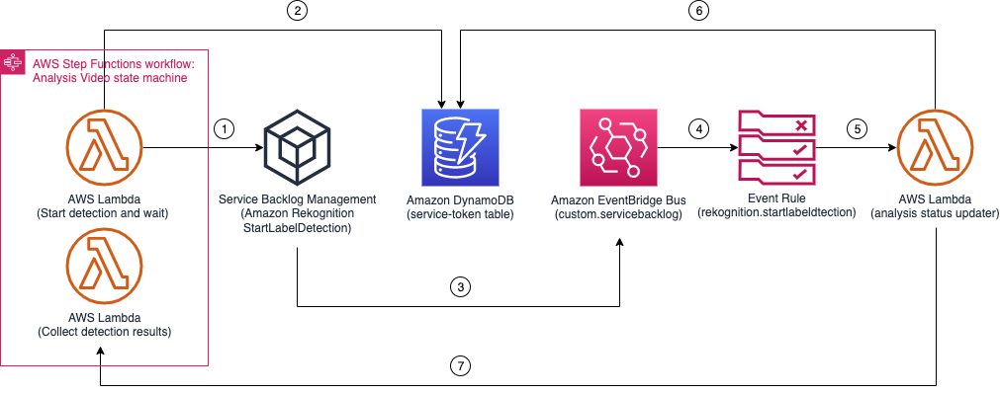

# Analysis Video State Machine

The Analysis Video State Machine is one of the most complex state machines in the Media2Cloud solution as it supports various different scenarios including video-based analysis using Amazon Rekognition Video APIs, frame-based analysis using Amazon Rekognition Image APIs, and custom detection using Amazon Rekognition Custom Labels feature.

The state machine composes with three parallel branches of operations: one handles the video-based analysis, one handles the frame-based analysis, and the last one handles the custom detection. This chapter discusses the operations in each of the parallel branches.

The video-based analysis branch uses the [Service Backlog Management System](../../../layers/service-backlog-lib/README.md) to process in order to support large number of analysis requests and to avoid hitting [Amazon Rekognition Video default concurrent limits](https://docs.aws.amazon.com/rekognition/latest/dg/limits.html#:~:text=Amazon%20Rekognition%20Video%20can%20analyze,20%20concurrent%20jobs%20per%20account.) which is 20 concurrent jobs.


__

## Execution input
The state execution input is similar to the [Analysis Main State Machine](../main/README.md#execution-input) with additional fields generated (or modified) by the [Prepare analysis](../main/README.md#state-prepare-analysis) state.


```json
{
    "input": {
        ...,
        "duration": 1508414,
        "framerate": 30,
        "aiOptions": {
            ...,
            "minConfidence": 80,
            /* Rekognition settings */
            "celeb": true,
            "face": true,
            "facematch": true,
            "faceCollectionId": "REKOGNITION_COLLECTION_ID",
            "label": true,
            "moderation": true,
            "person": true,
            "text": true,
            "textROI": [true, true, true, false, false, false, false, false, false],
            "segment": true,
            "customlabel": true,
            "customLabelModels": [
                "REKONIGTION_CUSTOM_LABEL_01",
                "REKONIGTION_CUSTOM_LABEL_02"
            ],
            /* frame based analysis */
            "framebased": false,
            "frameCaptureMode": 1003,
        },
        "video": {
            "enabled": true,
            "key": "PROXY_VIDEO_KEY"
        },
        "request": {
            "timestamp": 1637743896177
        }
    }
}
```

| Field | Description | Comments |
| :-----| :-----------| :---------|
| input.duration | indicates the video duration | Information extracted from MediaInfo |
| input.framerate | indicates the video framerate | Information extracted from MediaInfo |
| input.aiOptions.minConfidence | Minimum confidence level to return from the detection APIs | |
| input.aiOptions.celeb | Run celebrity detection | |
| input.aiOptions.face | Run face detection | |
| input.aiOptions.facematch | Search face against your own Face Collection | ```faceCollectionId``` field must be present |
| input.aiOptions.faceCollectionId | Specify the Face Collection to use | facematch field must be true |
| input.aiOptions.label | Run label detection | |
| input.aiOptions.moderation | Run content moderation label detection | |
| input.aiOptions.person | Run people pathing detection | Amazon Rekogintion Video API only |
| input.aiOptions.text | Run text detection | |
| input.aiOptions.textROI | Specify region of interest when running text detection | text field must be true. If region of interest is not present, use the entire image |
| input.aiOptions.segment | Run video segment detection | Amazon Rekogintion Video API only |
| _input.aiOptions.customlabel_ | Run custom detection using Amazon Rekognition Custom Labels (CL) models | ```customLabelModels``` field must be specified |
| _input.aiOptions.customLabelModels_ | Specify the CL model(s) to be used to run the analysis. This field is an array of the model names. You can specify _TWO_ models at most | ```customlabel``` field must also be _true_ |
| input.aiOptions.segment | Run video segment detection | Amazon Rekogintion Video API only |
| input.aiOptions.framebased | Run detections on the frame images extracted from the video file using Amazon Rekognition Image APIs instead of Amazon Rekognition Video APIs | ```segment``` and ```person``` detections continue to use Amazon Rekognition Video APIs |
| input.aiOptions.frameCaptureMode | When opt-in to use Frame-based analysis, this field specifies the frame capture rate such as ```1 frame every 2 seconds```, ```1 frame every second```, and so forth. The full list can be found in [source/layers/core-lib/lib/frameCaptureMode.js](../../../layers/core-lib/lib/frameCaptureMode.js)  |  ```framebased``` field must be _true_ or custom label detection is enabled. |
| input.video.enabled | indicates video analysis is required | Must be true |
| input.video.key | the MP4 proxy video generated by AWS Elemental MediaConvert | Must exist |
| input.request.timestamp | request timestamp | If present, the timestamp (_DATETIME_) is concatenated to the path to store the raw analysis results |

__

## _Frame-based detection branch_

_The Frame-based analysis is a new feature in V3 that allows you to analyze the video file by using the frame images extracted from the video file and using Amazon Rekognition Image APIs instead of the Video APIs. It also allows you to specify the rate (1 frame per second, 2 frames per second, and so forth) to run the detections. The Frame-based detection uses [RecognizeCelebrities](https://docs.aws.amazon.com/rekognition/latest/dg/API_RecognizeCelebrities.html), [DetectFaces](https://docs.aws.amazon.com/rekognition/latest/dg/API_DetectFaces.html), [SearchFacesByImage](https://docs.aws.amazon.com/rekognition/latest/dg/API_SearchFacesByImage.html), [DetectLabels](https://docs.aws.amazon.com/rekognition/latest/dg/API_DetectLabels.html), [DetectModerationLabels](https://docs.aws.amazon.com/rekognition/latest/dg/API_DetectModerationLabels.html) and [DetectText](https://docs.aws.amazon.com/rekognition/latest/dg/API_DetectText.html) APIs._

__

## State: Frame-based detection iterators
A state where a lambda function prepares the map data which is an array of JSON objects (iterators) providing the data required to run in the [Amazon Step Functions Map state iterator](https://docs.aws.amazon.com/step-functions/latest/dg/amazon-states-language-map-state.html). Each iterator within the Map state runs the corresponding Amazon Rekognition Image API.

The iterators (JSON objects) created by the lambda function are as follows:

```json
[
    {
        "uuid": "UUID",
        "status": "NOT_STARTED",
        "progress": 0,
        "data": {
            "label": {
                "bucket": "PROXY_BUCKET",
                "prefix": "OUTPUT_PREFIX/",
                "key": "PROXY_VIDEO_KEY",
                "duration": 62439,
                "frameCaptureMode": 1002,
                "framerate": 30,
                "requestTime": 1637756776971,
                "minConfidence": 80,
                "sampling": 2000,
                "cursor": 0,
                "numOutputs": 0,
                "frameCapture": {
                    "prefix": "FRAME_IMAGES_PREFIX/",
                    "numFrames": 31,
                    "numerator": 500,
                    "denominator": 1000
                },
            }
        }
    },
    {
        ...,
        "data": {
            "celeb": {...}
        }
    },
    {
        ...,
        "data": {
            "face": {...}
        }
    },
    ...
]
```

| Field | Description | Comments |
| :-----| :-----------| :---------|
| uuid | UUID of the video file | |
| status | current status of the operation | Optional |
| progress | current progress of the operation | Optional |
| data.\[label\|celeb\|face\] | a key that identifies the specific detection type to run within the Map state iterator | Mandatory |
| data.label.bucket | proxy bucket name | A bucket to store the detection outputs |
| data.label.prefix | output prefix | A prefix folder of where the outputs should be stored in the proxy bucket |
| data.label.key | the proxy video location | |
| data.label.duration | duration of the video file | |
| data.label.frameCaptureMode | frame capture mode | |
| data.label.framerate | actual framerate of the video file | |
| data.label.requestTime | request time of when the workflow starts | This field is used to concatenate as _DATETIME_ to the output prefix to store the raw results |
| data.label.minConfidence | Minimum confidence level to return the detection results | |
| data.label.sampling | indicates the distance (in milliseconds) between two image frames | This field is used later on to compute the drift of the detected label between frames |
| data.label.cursor | current position of the process | Used to keep track of the process such as how many of the frames remained to process |
| data.label.numOutputs | total number of outputs created | |
| data.label.frameCapture.prefix | indicates the locations of the frame images extracted by AWS Elemental MediaConvert service | |
| data.label.frameCapture.numFrames | indicates total number of frames extracted | The number of frames to run the detections |
| data.label.frameCapture.numerator | frame capture rate | This field is used to convert the frame number to the timestamp related to the video file |
| data.label.frameCapture.denominator | frame capture rate | This field is used to convert the frame number to the timestamp related to the video file |

__

## State: Detect frame (Iterator)
A Map Iterator state where a lambda function loops through frame images, runs the specific detection, parses and stores the raw results to the proxy bucket under _s3://PROXY_BUCKET/OUTPUT_PREFIX/raw/DATETIME/rekognition/\[celeb\|label\|face\|facematch\|moderation\|text\]/XXX.json_.

__

## State: More frames (Iterator)?
A Choice state checks _$.status_ field to ensure all the frames are processed. If _$.status_ is not set to _COMPLETED_, it transitions back to ```Detect frame (Iterator)``` state to continue.

__

## State: Detect frame completed
An End state to indicate the detection of this specific Map state iteration has completed.

__

## State: Frame-based track iterators
A state where a lambda function joins the outputs from the previous Map iterations and prepares the next Map iterations to create tracks and index the metadata.

__

## State: Create frame-based track (Iterator)
A state where a lambda function parses the raw detection results and creates numbers of metadata files, _timeseries_, _timelines_, _WebVTT_, and _EDL_ files.

The timeseries metadata files are used by the frontend webapp to construct the time sequeunce graph, see [Appendix A: Timeseries metadata format](#appendix-a-timeseries-metadata-format). Unlike the timeseries metadata where it provides discrete timestamp of the detected label, the timelines metadata files are created to consolidate individual timestamps of a detected label to provide continuous segments (with start and end time) of the detected label by computing drifts of the adjacent timestamps and position, see [Appendix B: Timelines metadata format](#appendix-b-timelines-metadata-format). The timelines metadata is used to generate the WebVtt track as well as to index into the Amazon OpenSearch cluster. The WebVTT track file converts the timelines metadata into .vtt files, see [Appendix C: WebVTT format](#appendix-c-webvtt-format). The EDL (Edit Decision List) file is specific to the Amazon Rekognition Segment detection, see [Appendix D: Edit Decision List format](#appendix-d-edit-decision-list-format).

All metadata files are stores in the proxy bucket with the path pattern as follows:

_s3://PROXY_BUCKET/OUTPUT_PREFIX/\[timeseries\|metadata\|vtt\|edl\]/\[celeb\|label\|face\|facematch\|moderation\|text\]/LABEL.json_

__

## State: More frame-based tracks (Iterator)?
A Choice state checks _$.status_ field. If the field is set to _COMPLETED_ indicating all labels are processed, it transitions to ```Index frame-based analysis (Iterator)``` state. Otherwise, it moves back to ```Create frame-based track (Iterator)``` state to continue the rest of the labels.

__

## State: Index frame-based analysis (Iterator)
A state where a lambda function downloads, parses the timelines metadata file, and index the detected label with timestamps to the Amazon OpenSearch cluster under \[celeb\|label\|face\|facematch\|moderation\|text\] indice correspondingly.

__

## _Video-based detection branch_

_The Video-based analysis branch analyzes the video file by using Amazon Rekognition Video APIs instead of the Video APIs included [StartCelebrityRecognition](https://docs.aws.amazon.com/rekognition/latest/dg/API_StartCelebrityRecognition.html), [StartContentModeration](https://docs.aws.amazon.com/rekognition/latest/dg/API_StartContentModeration.html), [StartFaceDetection](https://docs.aws.amazon.com/rekognition/latest/dg/API_StartFaceDetection.html), [StartFaceSearch](https://docs.aws.amazon.com/rekognition/latest/dg/API_StartFaceSearch.html), [StartLabelDetection](https://docs.aws.amazon.com/rekognition/latest/dg/API_StartLabelDetection.html), [StartPersonTracking](https://docs.aws.amazon.com/rekognition/latest/dg/API_StartPersonTracking.html), [StartSegmentDetection](https://docs.aws.amazon.com/rekognition/latest/dg/API_StartSegmentDetection.html) and [StartTextDetection](https://docs.aws.amazon.com/rekognition/latest/dg/API_StartTextDetection.html) APIs._

__

## State: Video-based detection iterators
Similar to [State: Frame-based detection iterators](#state-frame-based-detection-iterators), the state lambda function prepares the Map Iterator data to run the video based detection map state.

__

## State: Start detection and wait (Iterator)

A Map Iterator state where a lambda function starts a specific video detection by registering the request to the [Service Backlog Management System](../../../layers/service-backlog-lib/README.md) and waits for the Backlog service to start the process by using the [Step Functions Service Integration Pattern](https://docs.aws.amazon.com/step-functions/latest/dg/connect-to-resource.html) discussed in an earlier chapter. The diagram shown below demonstrates the wiring of the service integration pattern and backlog management system. 




In _Step 1_, the _Start detection and wait_ state lambda function registers a request to the Service Backlog Management System to start the video detection. The Service Backlog queues the request internally and starts the process whenever possilbe.

The state lambda then stores the backlog request ID and the state machine execution token to the _service-token_ table in _Step 2_.

When Amazon Rekognition Video service picks up the job from the backlog queue and finishes, the Service Backlog Management System sends an event to the Amazon EventBridge where an Event Rule is configured to listen to _Service Backlog Status Change_ event and triggers a lambda function (_analysis-status-updater_) to process in _Step 3, 4 and 5_.

The _analysis-status-updater_ lambda function fetches the execution token from the _service-token_ table using the backlog request ID and notifies the state machine to resume the execution in _Step 6 & 7_, described in [Analysis Workflow Status Updater](../automation/status-updater/README.md)

The state machine transitions to the next state, _Collect detection results_ state.

__

## State: Collect detection results (Iterator)
A Map Iterator state where a lambda function calls Amazon Rekognition GetXXXDetection API to download the detection results and stores them to _s3://PROXY_BUCKET/OUTPUT_PREFIX/raw/DATETIME/rekognition/\[celeb\|label\|face\|facematch\|moderation\|text\|segment\|person\]/XXX.json_

__

## State: Create video-based track (Iterator)
Similar to [State: Create frame-based track (Iterator)](#state-create-frame-based-track-iterator)

__

## State: More video-based tracks (Iterator)?
Similar to [State: More frame-based tracks (Iterator)?](#state-more-frame-based-tracks-iterator)

__

## State: Index video-based analysis (Iterator)
Similar to [State: Index frame-based analysis (Iterator)](#state-index-frame-based-analysis-iterator)

__

## _Custom detection branch_

_The Custom detection branch is specific to detection that uses Amazon Rekognition Custom Labels (CL) model. Unlike the frame-based or the video-based analysis where the Media2Cloud solution simply calls the Amazon Rekognition APIs and waits for the results, using Amazon Rekognition Custom Labels (CL) model requires us to start the model [StartProjectVersion](https://docs.aws.amazon.com/rekognition/latest/dg/API_StartProjectVersion.html), wait for the model to become active, run the analysis, stop the model [StopProjectVersion](https://docs.aws.amazon.com/rekognition/latest/dg/API_StopProjectVersion.html) when no other process is using the model. The Media2Cloud solution has a built-in logic to manage the runtime of the CL models to minimze the cost, see more details in [Backlog Custom Labels State Machine](../../../backlog/custom-labels/README.md)._

__

## State: Custom detection iterators
Similar to [State: Frame-based detection iterators](#state-frame-based-detection-iterators), the state lambda function prepares the Map Iterator data to run the custom detection map state.

The difference is that each of the map iterator data also contains information about the Custom Labels model.

```json
[
    {
        "data": {
            "customlabel": {
                ...,
                "customLabelModels": "CUSTOM_LABEL_MODEL_1",
                "inferenceUnits": 5,
            }
        }
    },
    {
        "data": {
            "customlabel": {
                ...,
                "customLabelModels": "CUSTOM_LABEL_MODEL_2",
                "inferenceUnits": 5,
            }
        }
    }
]
```
| Field | Description | Comments |
| :-----| :-----------| :---------|
| data.customlabel.customLabelModels | A specific CL model name and version | |
| data.customlabel.inferenceUnits | Numbers of inference unit to start the model (1 to 5) | To reduce the analysis time, the Media2Cloud solution always starts the CL model with 5 inference unit. |

__

## State: Start custom and wait (Iterator)
A state where a lambda function finds the most latest and runnable CL model using [DescribeProjectVersions](https://docs.aws.amazon.com/rekognition/latest/dg/API_DescribeProjectVersions.html) API. It then registers the request to the [Service Backlog Management System](../../../layers/service-backlog-lib/README.md) and waits for the process to complete.

Internally the Service Backlog Management System starts a new state machine execution, [Backlog Custom Labels State Machine](../../../backlog/custom-labels/README.md) to process the request.

__

## State: Collect custom results (Iterator)
A state where a lambda function downloads, parses the Custom Labels detection results and stores the detection results to _s3://PROXY_BUCKET/OUTPUT_PREFIX/raw/DATETIME/rekognition/customlabel/CUSTOM_LABEL_MODEL/XXX.json_.

__

## State: Create custom track (Iterator)
Similar to [State: Create frame-based track (Iterator)](#state-create-frame-based-track-iterator)

__

## State: More custom tracks (Iterator)?
Similar to [State: More frame-based tracks (Iterator)?](#state-more-frame-based-tracks-iterator)

__

## State: Index custom analysis (Iterator)
Similar to [State: Index frame-based analysis (Iterator)](#state-index-frame-based-analysis-iterator)

__

## State: Video analysis completed
The final state of the video analysis state machine where a lambda function collects and joins the outputs from all detection branches

__

## AWS Lambda function (analysis-video)
The analysis-video lambda function provides the implementation to support different states of the Analysis Video state machine. The following AWS XRAY trace diagram demonstrates the AWS services this lambda function communicates to.


__

## IAM Role Permission

```json
{
    "Version": "2012-10-17",
    "Statement": [
        {
            "Action": "s3:ListBucket",
            "Resource": "PROXY_BUCKET",
            "Effect": "Allow"
        },
        {
            "Action": [
                "s3:GetObject",
                "s3:PutObject"
            ],
            "Resource": "PROXY_BUCKET/*",
            "Effect": "Allow"
        },
        {
            "Action": [
                "dynamodb:Scan",
                "dynamodb:Query",
                "dynamodb:PutItem",
                "dynamodb:UpdateItem",
                "dynamodb:DeleteItem"
            ],
            "Resource": [
                "SERVICE_TOKEN_TABLE",
                "SERVICE_BACKLOG_TABLE"
            ],
            "Effect": "Allow"
        },
        {
            "Action": [
                "rekognition:DescribeCollection",
                "rekognition:StartContentModeration",
                "rekognition:StartCelebrityRecognition",
                "rekognition:StartFaceDetection",
                "rekognition:StartFaceSearch",
                "rekognition:StartLabelDetection",
                "rekognition:StartPersonTracking",
                "rekognition:StartSegmentDetection",
                "rekognition:StartTextDetection",
                "rekognition:GetContentModeration",
                "rekognition:GetCelebrityRecognition",
                "rekognition:GetFaceDetection",
                "rekognition:GetFaceSearch",
                "rekognition:GetLabelDetection",
                "rekognition:GetPersonTracking",
                "rekognition:GetSegmentDetection",
                "rekognition:GetTextDetection",
                "rekognition:DetectFaces",
                "rekognition:DetectLabels",
                "rekognition:DetectModerationLabels",
                "rekognition:DetectText",
                "rekognition:RecognizeCelebrities",
                "rekognition:SearchFacesByImage"
            ],
            "Resource": "*",
            "Effect": "Allow"
        },
        {
            "Action": "iam:PassRole",
            "Resource": "SERVICE_DATA_ACCESS_ROLE",
            "Effect": "Allow"
        },
        {
            "Action": "events:PutEvents",
            "Resource": "SERVICE_BACKLOG_EVENT_BUS",
            "Effect": "Allow"
        },
        {
            "Action": "states:StartExecution",
            "Resource": "CUSTOM_LABELS_STATE_MACHINE",
            "Effect": "Allow"
        },
        {
            "Action": "states:DescribeExecution",
            "Resource": "CUSTOM_LABELS_STATE_MACHINE",
            "Effect": "Allow"
        },
        {
            "Action": "rekognition:DescribeProjectVersions",
            "Resource": "arn:aws:rekognition:REGION:ACCOUNT:project/*/*",
            "Effect": "Allow"
        },
        {
            "Action": [
                "es:ESHttpGet",
                "es:ESHttpHead",
                "es:ESHttpPost",
                "es:ESHttpPut",
                "es:ESHttpDelete"
            ],
            "Resource": "OPENSEARCH_CLUSTER",
            "Effect": "Allow"
        }
    ]
}
```

__

## Appendix A: Timeseries metadata format
The timeseries metadata file provides a consolidated view of the detected label which can be used to plot data in a graph.

```json
{
    "label": "Werner Vogels",
    "desc": "www.wikidata.org/wiki/Q2536951",
    "duration": 62439,
    "appearance": 14000,
    "data": [
        {
            "x": 2000,
            "y": 1,
            "details": [
                {
                    "c": 99.66,
                    "w": 0.1012,
                    "h": 0.2314,
                    "l": 0.4417,
                    "t": 0.0707
                }
            ]
        },
        ...,
    ]
}
```

| Field | Description | Comments |
| :-----| :-----------| :---------|
| label | Detected label | Used as Display name |
| desc | Additional information | Optional field |
| duration | Duration of the video file | Used to compute the show rate of the label |
| appearance | Total duration of the appearances of the lable | Used to compute the show rate of the label |
| data.x | Timestamp in milliseconds | Used to plot the time sequence graph |
| data.y | Number of detected instances in the specific timestamp (data.x) | Used to plot the time sequence graph |
| data.details.* | Confidence score and coordinate of each detected instances at the timestamp (data.x) | Used to draw a bounding box around the detected label on the preview video |
| data.details.c | Confidence score | |
| data.details.w | Width of the bounding box | |
| data.details.h | Height of the bounding box | |
| data.details.l | Left position of the bounding box | |
| data.details.t | Top position of the bounding box | |

__

## Appendix B: Timelines metadata format
The timelines metadata file presents continuous view of the detected label which can be used to convert into timed text track (WebVTT) file.

```json
[
    {
        "name": "Werner Vogels",
        "confidence": 98.00,
        "begin": 40000,
        "end": 42000,
        "cx": 0.5312022713162194,
        "cy": 0.18263602476166096,
        "count": 2
    },
    ...
]
```
| Field | Description | Comments |
| :-----| :-----------| :---------|
| name | Detected label | Used as Display name |
| confidence | Overall confidence score | |
| begin | Start time of the timeline | |
| end | End time of the timeline | |
| cx | Average center point of the detected label in the X-axis | |
| cy | Average center point of the detected label in the Y-axis | |
| count | Number of labels within the time span | |

__

## Appendix C: WebVTT format

WebVTT file is a format to display timed text tracks on video file. See more details on [Mozilla Web Video Text Tracks Format (WebVTT)](https://developer.mozilla.org/en-US/docs/Web/API/WebVTT_API).

The WebVTT file generated by the Media2Cloud solution uses _align_, _line_, _position_ and _size_ attributes to display the label name closest to its position. The position is computed used the cx and cy coordinate from the timeline metadata file.

```
WEBVTT

0
00:00:40.000 --> 00:00:42.000 align:center line:18% position:53% size:25%
Werner Vogels
<c.confidence>(98.35)</c>

1
00:00:24.000 --> 00:00:34.000 align:center line:18% position:47% size:25%
Werner Vogels
<c.confidence>(99.44)</c>
```

__

## Appendix D: Edit Decision List format
The Edit Decision List (EDL) file generated by the Media2Cloud solution follows the [CMX3600](https://en.wikipedia.org/wiki/Edit_decision_list) format. The EDL file can be imported to popular editing software including Adobe Premiere Pro or Blackmagic Design Davinci Resolve.

[Streamline content preparation and quality control for VOD platforms using Amazon Rekognition Video](https://aws.amazon.com/blogs/media/streamline-content-preparation-and-quality-control-for-vod-platforms-using-amazon-rekognition-video/) blog explains how we use Amazon Rekognition Video Segment API and convert the segment results into EDL format that can be used in editing software.

__

## Related topics
* [Service Backlog Management System](../../../layers/service-backlog-lib/README.md)
* [Backlog Custom Labels State Machine](../../../backlog/custom-labels/README.md)
* [Analysis Workflow Status Updater](../automation/status-updater/README.md)

__

Back to [Analysis Main State Machine](../main/README.md) | Back to [Table of contents](../../../../README.md#table-of-contents)
