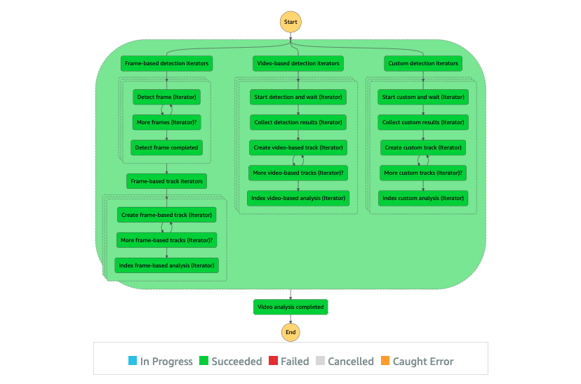
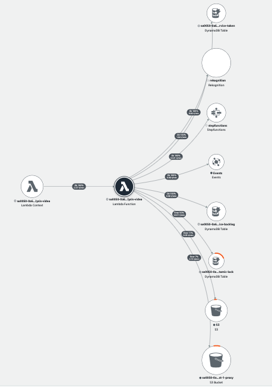

# Video Analysis State Machine

The Video Analysis State Machine focuses on analyzing the "visual" part of the media file. It is the core component of the Media2Cloud analysis workflow but is also the most complex state machine. The Video Analysis workflow is built to handle different scenarios such as leveraging Amazon Rekognition Video APIs for asynchronous processes, processing frame images by using Amazon Rekognition Image APIs and custom machine learning models (Amazon Rekognition Custom Label models or opensource ML models).

The state machine starts with executing two parallel branches: one branch handles the Video Based analysis leveraging Amazon Rekognition Video asynchronous APIs and another branch handles the Frame Based analysis leveraging Amazon Rekognition Image APIs and other opensource machine learning models.

The Video Based analysis branch also uses the [Service Backlog Management System](../../../layers/service-backlog-lib/README.md) to support a large number of analysis requests and to avoid hitting [Amazon Rekognition Video default concurrent limits](https://docs.aws.amazon.com/rekognition/latest/dg/limits.html#:~:text=Amazon%20Rekognition%20Video%20can%20analyze,20%20concurrent%20jobs%20per%20account.) which is `20` concurrent jobs.



## Execution input

The state execution input is similar to the [Analysis Main State Machine](../main/README.md#execution-input) with additional fields generated (or modified) by the [Prepare analysis](../main/README.md#state-prepare-analysis) state.

Here is the subset of the input parameters that are relevant to this workflow.


```json
{
    "input": {
        ...,
        "duration": 1508414,
        "framerate": 30,
        "aiOptions": {
            ...,
            "minConfidence": 80,
            /* Rekognition settings */
            "celeb": true,
            "face": true,
            "facematch": true,
            "faceCollectionId": "REKOGNITION_COLLECTION_ID",
            "label": true,
            "moderation": true,
            "person": true,
            "text": true,
            "textROI": [true, true, true, false, false, false, false, false, false],
            "segment": true,
            "customlabel": true,
            "customLabelModels": [
                "REKONIGTION_CUSTOM_LABEL_01",
                "REKONIGTION_CUSTOM_LABEL_02"
            ],
            /* frame based analysis */
            "framebased": false,
            "frameCaptureMode": 1003,
        },
        "video": {
            "enabled": true,
            "key": "PROXY_VIDEO_KEY"
        },
        "request": {
            "timestamp": 1637743896177
        }
    }
}
```

## State Descriptions

#### _State: Start video analysis_

A Parallel state executes the Video Based analysis and Frame Based analysis branches concurrently.

#### _State: Video based detection iterators_

The lambda function prepares the iterators to run the video based analysis for specific Rekognition features such as celebrity, face match, and others.

Here is a snippset of two iterators: one for `celeb` and one for `facematch` detections.

```json
{
  "data": {
    "iterators": [
      {
        "uuid": "[UUID]",
        "status": "NOT_STARTED",
        "progress": 0,
        "data": {
          "celeb": {
            "bucket": "[PROXY_BUCKET]",
            "prefix": "[PREFIX]",
            "key": "[MP4_KEY]",
            "duration": 90070,
            "framerate": 29.97,
            "requestTime": 1711719992712,
            "minConfidence": 80,
            "cursor": 0,
            "numOutputs": 0
          }
        }
      },
      {
        "uuid": "[UUID]",
        "status": "NOT_STARTED",
        "progress": 0,
        "data": {
          "facematch": {
            "bucket": "[PROXY_BUCKET]",
            "prefix": "[PREFIX]",
            "key": "[MP4_KEY]",
            "duration": 90070,
            "framerate": 29.97,
            "requestTime": 1711719992712,
            "minConfidence": 80,
            "cursor": 0,
            "numOutputs": 0,
            "faceCollectionId": "autofaceindexer"
          }
        }
      }
    ]
  }
}

```

#### _State: Video based analysis_

The Map state maps the array items specified in the `$.data.iterators[*]` to each Map iteration and executes them concurrently.

#### _State: Run video based detection_

This is the sub-state machine that handles the video based analysis workflow. Refer to [Video Based Detection State Machine](./README_VIDEO_BASED_WORKFLOW.md) for more details.

#### _State: Run dynamic frame segmentation_

This is the sub-state machine that handles the Dynamic Frame Segmentation workflow. Refer to [Dynamic Frame Segmentation State Machine](./README_DYNAMIC_FRAME_WORKFLOW.md) for more details.

#### _State: Start frame-based analysis_

Once the frame images have been selected, the Parallel state executes both Frame based detection and Custom model detection branches concurrently.

#### _State: Frame based detection iterators_

The lambda function prepares the iterators to run the frame based detection in parallel.

#### _State: Frame based analysis_

The Map state maps the array items to each Map iterator and executes them concurrently.

#### _State: Run frame based detection_

This is the sub-state machine that handles the frame based analysis workflow. Refer to [Frame Based Detection State Machine](./README_FRAME_BASED_WORKFLOW.md) for more details.

#### _State: Custom model detection iterators_

The lambda function prepares the iterators to run the custom model detection in parallel.

#### _State: Custom model analysis_

The Map state maps the array items to each Map iterator and executes them concurrently.

#### _State: Run custom model detection_

This is the sub-state machine that handles the custom model analysis workflow. Refer to [Custom Model Detection State Machine](./README_CUSTOM_MODEL_WORKFLOW.md) for more details.

#### _State: Video analysis completed_

After the parallel branches have completed, the lambda function merges the parallel outputs.

## Metadata location

The Video Analysis State Machine generates various output files, which are stored in the specified locations.

|Output|Location|
|:--|:--|
|####|**Amazon Rekognition Celebrity**|
|Original JSON|s3://[PROXY_BUCKET]/[UUID]/[FILENAME]/raw/[DATE_TIME]/rekognition/celeb/00000000.json|
|Generated mapfile|s3://[PROXY_BUCKET]/[UUID]/[FILENAME]/raw/[DATE_TIME]/rekognition/celeb/mapFile.json|
|Generated metadata|s3://[PROXY_BUCKET]/[UUID]/[FILENAME]/metadata/celeb/celeb.json|
|Generated timeseries|s3://[PROXY_BUCKET]/[UUID]/[FILENAME]/timeseries/celeb/celeb.json|
|Generated vtt track|s3://[PROXY_BUCKET]/[UUID]/[FILENAME]/vtt/celeb/celeb.json|
|####|**Amazon Rekognition Face**|
|Original JSON|s3://[PROXY_BUCKET]/[UUID]/[FILENAME]/raw/[DATE_TIME]/rekognition/face/00000000.json|
|Generated mapfile|s3://[PROXY_BUCKET]/[UUID]/[FILENAME]/raw/[DATE_TIME]/rekognition/face/mapFile.json|
|Generated metadata|s3://[PROXY_BUCKET]/[UUID]/[FILENAME]/metadata/face/face.json|
|Generated timeseries|s3://[PROXY_BUCKET]/[UUID]/[FILENAME]/timeseries/face/face.json|
|Generated vtt track|s3://[PROXY_BUCKET]/[UUID]/[FILENAME]/vtt/face/face.json|
|####|**Amazon Rekognition SearchFace**|
|Original JSON|s3://[PROXY_BUCKET]/[UUID]/[FILENAME]/raw/[DATE_TIME]/rekognition/facematch/00000000.json|
|Generated mapfile|s3://[PROXY_BUCKET]/[UUID]/[FILENAME]/raw/[DATE_TIME]/rekognition/facematch/mapFile.json|
|Generated metadata|s3://[PROXY_BUCKET]/[UUID]/[FILENAME]/metadata/facematch/facematch.json|
|Generated timeseries|s3://[PROXY_BUCKET]/[UUID]/[FILENAME]/timeseries/facematch/facematch.json|
|Generated vtt track|s3://[PROXY_BUCKET]/[UUID]/[FILENAME]/vtt/facematch/facematch.json|
|####|**Amazon Rekognition Label**|
|Original JSON|s3://[PROXY_BUCKET]/[UUID]/[FILENAME]/raw/[DATE_TIME]/rekognition/label/00000000.json|
|Generated mapfile|s3://[PROXY_BUCKET]/[UUID]/[FILENAME]/raw/[DATE_TIME]/rekognition/label/mapFile.json|
|Generated metadata|s3://[PROXY_BUCKET]/[UUID]/[FILENAME]/metadata/label/label.json|
|Generated timeseries|s3://[PROXY_BUCKET]/[UUID]/[FILENAME]/timeseries/label/label.json|
|Generated vtt track|s3://[PROXY_BUCKET]/[UUID]/[FILENAME]/vtt/label/label.json|
|####|**Amazon Rekognition Content Moderation**|
|Original JSON|s3://[PROXY_BUCKET]/[UUID]/[FILENAME]/raw/[DATE_TIME]/rekognition/moderation/00000000.json|
|Generated mapfile|s3://[PROXY_BUCKET]/[UUID]/[FILENAME]/raw/[DATE_TIME]/rekognition/moderation/mapFile.json|
|Generated metadata|s3://[PROXY_BUCKET]/[UUID]/[FILENAME]/metadata/moderation/moderation.json|
|Generated timeseries|s3://[PROXY_BUCKET]/[UUID]/[FILENAME]/timeseries/moderation/moderation.json|
|Generated vtt track|s3://[PROXY_BUCKET]/[UUID]/[FILENAME]/vtt/moderation/moderation.json|
|####|**Amazon Rekognition Text**|
|Original JSON|s3://[PROXY_BUCKET]/[UUID]/[FILENAME]/raw/[DATE_TIME]/rekognition/text/00000000.json|
|Generated mapfile|s3://[PROXY_BUCKET]/[UUID]/[FILENAME]/raw/[DATE_TIME]/rekognition/text/mapFile.json|
|Generated metadata|s3://[PROXY_BUCKET]/[UUID]/[FILENAME]/metadata/text/text.json|
|Generated timeseries|s3://[PROXY_BUCKET]/[UUID]/[FILENAME]/timeseries/text/text.json|
|####|**Amazon Rekognition Segment**|
|Original JSON|s3://[PROXY_BUCKET]/[UUID]/[FILENAME]/raw/[DATE_TIME]/rekognition/segment/00000000.json|
|Generated mapfile|s3://[PROXY_BUCKET]/[UUID]/[FILENAME]/raw/[DATE_TIME]/rekognition/segment/mapFile.json|
|Generated metadata|s3://[PROXY_BUCKET]/[UUID]/[FILENAME]/metadata/segment/segment.json|
|Generated vtt track|s3://[PROXY_BUCKET]/[UUID]/[FILENAME]/vtt/segment/segment.json|
|Generated EDL track|s3://[PROXY_BUCKET]/[UUID]/[FILENAME]/edl/segment/segment.zip|
|####|**Scene detection**|
|Generated mapfile|s3://[PROXY_BUCKET]/[UUID]/[FILENAME]/metadata/scene/scene.json|
|Generated vtt track|s3://[PROXY_BUCKET]/[UUID]/[FILENAME]/vtt/scene/scene.json|
|####|**Ad Break detection**|
|Generated mapfile|s3://[PROXY_BUCKET]/[UUID]/[FILENAME]/metadata/adbreak/adbreak.json|
|####|**Dynamic Frame Analysis**|
|Frame Segmentation JSON|s3://[PROXY_BUCKET]/[UUID]/[FILENAME]/transcode/frameCapture/framesegmentation.json|


## AWS Lambda function (analysis-video)

The analysis-video lambda function provides the implementation to support different states of the Analysis Video state machine.

## IAM Role Policy

The IAM role policy for the analysis-video lambda function is provided.

```json
{
    "Version": "2012-10-17",
    "Statement": [
        {
            "Action": [
                "logs:CreateLogGroup",
                "logs:CreateLogStream",
                "logs:PutLogEvents"
            ],
            "Resource": "[CLOUDWATCH_LOGS]",
            "Effect": "Allow"
        },
        {
            "Action": "s3:ListBucket",
            "Resource": "[PROXY_BUCKET]",
            "Effect": "Allow"
        },
        {
            "Action": [
                "s3:GetObject",
                "s3:PutObject",
                "s3:DeleteObject"
            ],
            "Resource": "[PROXY_BUCKET]",
            "Effect": "Allow"
        },
        {
            "Action": [
                "dynamodb:Scan",
                "dynamodb:Query",
                "dynamodb:PutItem",
                "dynamodb:UpdateItem",
                "dynamodb:DeleteItem",
                "dynamodb:BatchGetItem",
                "dynamodb:BatchWriteItem"
            ],
            "Resource": "[SERVICE_TOKEN_TABLE]",
            "Effect": "Allow"
        },
        {
            "Action": [
                "rekognition:DescribeCollection",
                "rekognition:StartContentModeration",
                "rekognition:StartCelebrityRecognition",
                "rekognition:StartFaceDetection",
                "rekognition:StartFaceSearch",
                "rekognition:StartLabelDetection",
                "rekognition:StartPersonTracking",
                "rekognition:StartSegmentDetection",
                "rekognition:StartTextDetection",
                "rekognition:GetContentModeration",
                "rekognition:GetCelebrityRecognition",
                "rekognition:GetFaceDetection",
                "rekognition:GetFaceSearch",
                "rekognition:GetLabelDetection",
                "rekognition:GetPersonTracking",
                "rekognition:GetSegmentDetection",
                "rekognition:GetTextDetection",
                "rekognition:DetectFaces",
                "rekognition:DetectLabels",
                "rekognition:DetectModerationLabels",
                "rekognition:DetectText",
                "rekognition:RecognizeCelebrities",
                "rekognition:SearchFacesByImage"
            ],
            "Resource": "*",
            "Effect": "Allow"
        },
        {
            "Action": "rekognition:IndexFaces",
            "Resource": "[REKOGNITION_COLLECTION_ID]",
            "Effect": "Allow"
        },
        {
            "Action": "iam:PassRole",
            "Resource": "[DATA_ACCESS_ROLE]",
            "Effect": "Allow"
        },
        {
            "Action": "events:PutEvents",
            "Resource": "[SERVICE_BACKLOG_EVENTBUS]",
            "Effect": "Allow"
        },
        {
            "Action": "states:StartExecution",
            "Resource": "[CUSTOM_LABEL_STATE_MACHINE]",
            "Effect": "Allow"
        },
        {
            "Action": "states:DescribeExecution",
            "Resource": "[CUSTOM_LABEL_STATE_MACHINE]",
            "Effect": "Allow"
        },
        {
            "Action": "rekognition:DescribeProjectVersions",
            "Resource": "[REKOGNITION_CUSTOM_LABEL_PROJECTS]",
            "Effect": "Allow"
        },
        {
            "Action": [
                "es:ESHttpGet",
                "es:ESHttpHead",
                "es:ESHttpPost",
                "es:ESHttpPut",
                "es:ESHttpDelete"
            ],
            "Resource": "[OPENSEARCH_DOMAIN]",
            "Effect": "Allow"
        },
        {
            "Action": "aoss:APIAccessAll",
            "Resource": "[OPENSEARCH_SERVERLESS_COLLECTION]",
            "Effect": "Allow"
        }
    ]
}

```

#### _IAM Role Policy (Amazon Bedrock)_

```json
{
    "Version": "2012-10-17",
    "Statement": [
        {
            "Action": "bedrock:ListFoundationModels",
            "Resource": "*",
            "Effect": "Allow"
        },
        {
            "Action": "bedrock:InvokeModel",
            "Resource": "[ANTHROPIC_CLAUDE_3_MODEL]",
            "Effect": "Allow"
        }
    ]
}

```

## X-Ray Trace

The AWS XRAY trace diagram demonstrates the AWS services the analysis-video lambda function communicates with.



## Appendices

The appendices provide more details on the generated timeline metadata, timeseries metadata, and Edit Decision List (EDL) formats.

### _Appendix A: Generated timeline metadata output format_

The timeline metadata file presents continuous view of the detected label which can be used to convert into timed text track (WebVTT) file.

```json
{
  "Werner Vogels": [
    {
      "name": "Werner Vogels",
      "confidence": 99.95,
      "begin": 12012,
      "end": 12912,
      "cx": 0.5941577404737473,
      "cy": 0.4794244170188904,
      "count": 1
    },
    ...
  ],
  ...
}

```

|Name|Description|
|:--|:--|
|name| The detected label or celebrity name|
|confidence|Overall confidence score|
|begin|Start time of the timeline|
|end|End time of the timeline|
|cx|Overall center position of X of the detected label|
|cy|Overall center position of Y of the detected label|
|count|Total counts within the timeline|

__

### _Appendix B: Generated timeseries metadata output format_

The timeseries metadata file provides a consolidated view of the detected label which can be used to plot data in a graph.

```json
{
  "Werner Vogels": {
    "label": "Werner Vogels",
    "desc": "www.wikidata.org/wiki/Q55585213",
    "duration": 90070,
    "appearance": 1800,
    "data": [
      {
        "x": 12012,
        "y": 1,
        "details": [
          {
            "c": 99.95,
            "w": 0.1435,
            "h": 0.3433,
            "l": 0.5224,
            "t": 0.3078
          }
        ]
      },
      ...
    ]
  },
  ...
}

```
|Name|Description|
|:--|:--|
|label|The name of the detected label or celebrity name|
|desc|Additional description|
|duration|Duration of the video file|
|appearance|Duration of the detected label in the video file|
|data[\*].\*|An array of data by timestamp|
|data.x|Timestamp in milliseconds|
|data.y|Number of instances of the detected label at the timestamp|
|data.details[\*].\*|Confidence score and position of the detected labeld at this timestamp|
|data.details.c|Confidence score|
|data.details.t|Top position of the bounding box|
|data.details.l|Left position of the bounding box|
|data.details.w|Width of the bounding box|
|data.details.h|Height of the bounding box|

__

### _Appendix C: Edit Decision List format_

The Edit Decision List (EDL) file generated by the Media2Cloud solution follows the [CMX3600](https://en.wikipedia.org/wiki/Edit_decision_list) format. The EDL file can be imported to popular editing software including Adobe Premiere Pro or Blackmagic Design Davinci Resolve.

[Streamline content preparation and quality control for VOD platforms using Amazon Rekognition Video](https://aws.amazon.com/blogs/media/streamline-content-preparation-and-quality-control-for-vod-platforms-using-amazon-rekognition-video/) blog explains how we use Amazon Rekognition Video Segment API and convert the segment results into EDL format that can be used in editing software.

## Related topics

- [Video Based Detection State Machine](./README_VIDEO_BASED_WORKFLOW.md)
- [Dynamic Frame Segmentation State Machine](./README_DYNAMIC_FRAME_WORKFLOW.md)
- [Frame Based Detection State Machine](./README_FRAME_BASED_WORKFLOW.md)
- [Custom Model Detection State Machine](./README_CUSTOM_MODEL_WORKFLOW.md)
- [Service Backlog Management System](../../../layers/service-backlog-lib/README.md)
- [Backlog Custom Labels State Machine](../../../backlog/custom-labels/README.md)
- [Analysis Workflow Status Updater](../automation/status-updater/README.md)

__

Back to [Analysis Main State Machine](../main/README.md) | Back to [Table of contents](../../../../README.md#table-of-contents)
