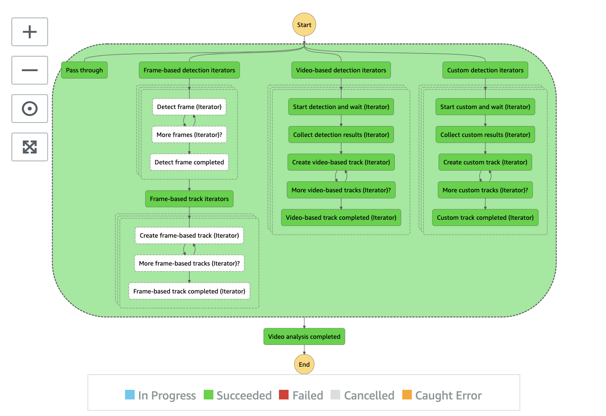

# Video Analysis State Machine

Video Analysis state machine is the most interesting one since it handles various different scenarios with three parallel branches processing frame based detection, video based detection, and custom detection.

__

## Frame-based detection branch

Frame-based analysis is a new feature added to V3 that allows you to choose Amazon Rekognition Image APIs to analyze the video file at the framerate you specified. Frame-based detections include RecognizeCelebrities, DetectFaces, DetectLabels, DetectModerationLabels, DetectText, and SearchFacesByImage.

If you opt to use frame based detection, this branch is activated where
* **Frame-based detection iterators** state prepares the map data for the next state [AWS Step Functions Map state](https://docs.aws.amazon.com/step-functions/latest/dg/amazon-states-language-map-state.html) where each map iterator loops through frames extracted from a video file and processes a specific type of detection using Amazon Rekognition Image APIs listed above.
* **Detect frame (Iterator)** state runs the Amazon Rekognition Image API for all frames
* **More frame (Iterator)?** state checks to ensure all frames are processed. Otherwise, it re-enters Detect frame (Iterator) state to process the rest.
* **Detect frame completed** state is an end of the map iterator
* **Frame-based track iterators** state collects all the detection results and prepares the map data for the next AWS Step Functions Map state where each map iterator joins the frame detection results to form a track with timestamps such as webvtt track
* **Create frame-based track (Iterator)** converts frame numbers into timestamps and creates webvtt track and metadata
* **More frame-based track (Iterator)?** state checks to ensure all tracks are created. Otherwise, it re-enters Create frame-based track (Iterator) state to process the rest.
* **Frame-based track completed (Iterator)** state is an end state

__

## Video-based detection branch

Video-based detections analyze video files using asynchronized Amazon Rekognition Video APIs which include StartCelebrityRecognition, StartFaceDetection, StartLabelDetection, StartContentModeration, StartFaceSearch, StartPersonTracking, StartSegmentDetection, and StartTextDetection APIs.

If you opt to use video-based analysis, this branch is activated.

* **Video-based detection iterators** state prepares the map data for the next state [AWS Step Functions Map state](https://docs.aws.amazon.com/step-functions/latest/dg/amazon-states-language-map-state.html) where each map iterator starts and wait for Amazon Rekognition Video API to complete
* **Start detection and wait (Iterator)** state sends a request to Amazon Rekognition Video and waits for the completion. The _wait_ logic uses [AWS Step Functions Service Integration](https://docs.aws.amazon.com/step-functions/latest/dg/concepts-service-integrations.html) technique; thus no resource is consumed during waiting
* **Collect detection results (Iterator)** state where once the state machine execution is _signaled_ an Amazon Rekognition Video detection job is completed, this state collects and stores the detection results to Amazon S3 proxy bucket
* **Create video-based track (Iterator)** state creates webvtt and metadata tracks
* **More video-based track (Iterator)?** state checks to ensure all tracks are created. Otherwise, it re-enters Create video-based track (Iterator) state to process the rest.
* **Video-based track completed (Iterator)** state is an end state

__

## Custom label detection branch

Custom detection branch is currently used for detection custom labels using [Amazon Rekognitoin Custom Labels feature](https://aws.amazon.com/rekognition/custom-labels-features/). It is also designed to support other computer vision machine learning models trained by [Amazon SageMaker](https://aws.amazon.com/sagemaker/) service.

* **Custom detection iterators** state prepares the map data for the next state [AWS Step Functions Map state](https://docs.aws.amazon.com/step-functions/latest/dg/amazon-states-language-map-state.html) where each map iterator loops through all the frames and analyzes the frame by using Amazon Rekognition DetectCustomLabels API. Currently it supports upto _two_ Custom Labels models
* **Start custom and wait (Iterator)** state starts a backend Custom Labels state machine that manages the runtime of the Custom Labels model to optimze the cost, discussed in the later section
* **Collect custom results (Iterator)** state where once the state machine execution is _signaled_ a Custom Labels detection job is completed, this state collects and stores the detection results to Amazon S3 proxy bucket
* **Create custom track (Iterator)** state creates webvtt and metadata tracks
* **More custom track (Iterator)?** state checks to ensure all tracks are created. Otherwise, it re-enters Create custom track (Iterator) state to process the rest.
* **Custom track completed (Iterator)** state is an end state

__

Next to [Custom Labels state machine](../../../backlog/custom-labels/README.md) | Back to [Analysis State Machine](../main/README.md) | Back to [Table of contents](../../../../README.md#table-of-contents)
