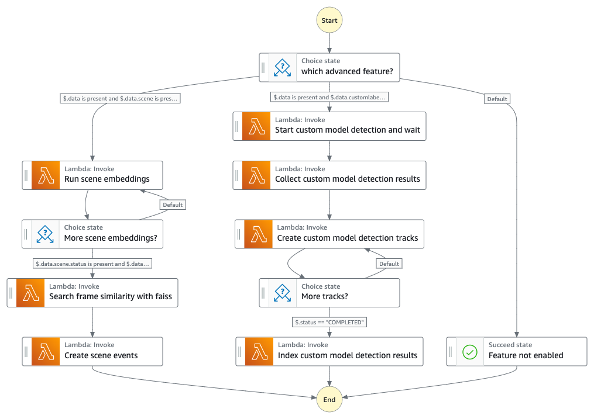
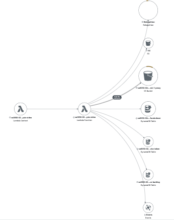

# Custom Model Detection State Machine

The Custom Model Detection State Machine is a substate of the Analysis Video Workflow. It leverages the Amazon Rekognition Custom Labels feature to detect custom models in the video frames or opensource machine learning models to create scene events from the video frames.



#### _Execution input_

```json

{
  "uuid": "[UUID]",
  "operation": "start-detection-iterator",
  "status": "NOT_STARTED",
  "progress": 0,
  "data": {
    // Amazon Rekognition Custom Label Feature
    "customlabel": {
      "customLabelModels": "[REKOGNIION_CUSTOM_LABEL_MODEL]",
      "bucket": "[PROXY_BUCKET]",
      "prefix": "[PREFIX]",
      "key": "[MP4_VIDEO]",
      "duration": 60019,
      "frameCaptureMode": 9999,
      "framerate": 23.976,
      "requestTime": 1711734442768,
      "minConfidence": 80,
      "inferenceUnits": 5,
      "frameCapture": {
        "prefix": "[PREFIX_FRAMECAPTURE]",
        "numFrames": 61,
        "numerator": 1,
        "denominator": 1
      },
      "sampling": 1000,
      "cursor": 0,
      "numOutputs": 0
    },
    // scene detection feature
    "scene": {
      "bucket": "[PROXY_BUCKET]",
      "prefix": "[PREFIX_FRAMECAPTURE]",
      "json": "framesegmentation.json",
      "embeddings": "scene_embeddings.json",
      "similarity": "scene_similarity.json",
      "filterSettings": {
        "enhanceWithTranscript": true,
        "enhanceWithLLM": true
      }
    },
    "segment": {
      ...
      "output": "[SEGMENT_OUTPUT]",
    },
    "framesegmentation": {
      "key": "[FRAME_SEGMENTATION_JSON]",
      "framesExtracted": 61,
      "framesAnalyzed": 12
    }
  }
}

```

## State Descriptions

#### _State: which advanced feature?_

- This is a Choice state that checks the input data to determine which advanced feature should be used - either "Run scene embeddings" or "Start custom model detection and wait".
- If the input data contains `scene`, `segment`, and `framesegmentation` information, it will transition to the "Run scene embeddings" state.
- If the input data contains `customlabel` and `customLabelModels` information, it will transition to the "Start custom model detection and wait" state.
- If neither of these conditions are met, it will transition to the "Feature not enabled" state.

#### _State: Run scene embeddings_

- This is a Task state that runs the `RunImageEmbeddingsLambda` to generate scene embeddings.
- The input data for the scene is passed to the lambda function.
- The state has retry logic to handle lambda function exceptions.
- After the scene embeddings are generated, it transitions to the "More scene embeddings?" state.

The "RunImageEmbeddingsLambda" is a containerized lambda function of a docker image that contains the zeroshot image classification opensource machine learning model, [CLIP](https://huggingface.co/openai/clip-vit-base-patch32). The model is used to generate the image embeddings of the selected frames. The result of the embeddings is stored in the `scene_embeddings.json` for later use.


#### _State: More scene embeddings?_

- This is a Choice state that checks if the scene embeddings have been completed.
- If the scene status is "COMPLETED", it transitions to the "Search frame similarity with faiss" state.
- If the scene status is not "COMPLETED", it transitions back to the "Run scene embeddings" state.

#### _State: Search frame similarity with faiss_

- This is a Task state that runs the `SearchFrameSimilarityLambda` to search for similar frames using the FAISS library.
- The scene embeddings data is passed as input to the lambda function.
- The state has retry logic to handle lambda function exceptions.
- After the frame similarity search, it transitions to the "Create scene events" state.

The "SearchFrameSimilarityLambda" is a containerized lambda function of a docker image that contains the opensource vector search engine, [FAISS](https://github.com/facebookresearch/faiss). It is used to temporarily index all the frame embeddings output from the "Run scene embeddings" step and perform a similar search for each of the frame.

_Design choice: Ideally we can store the frame embeddings in an Amazon OpenSearch service in which the data will be persistent. We choose to use FAISS because we are only interested in the frame simliarity per video basis which doesn't require a persistent vector based storage._


#### _State: Create scene events_

- This is a Task state that runs the `AnalysisVideoLambda` to create scene events based on the output of the frame similarity search and Amazon Rekognition Shot Segment to group "shots" into scenes.
- This state is the end of the state machine.

#### _State: Start custom model detection and wait_

- This is a Task state that runs the `AnalysisVideoLambda` to start the custom model detection process and waits for the task token.
- The input data, operation, and status information are passed as input to the lambda function.
- The state uses the `arn:aws:states:::lambda:invoke.waitForTaskToken` resource to wait for the task to complete.
- After the custom model detection is started, it transitions to the "Collect custom model detection results" state.

The "Start custom model detection and wait" uses the [Backlog Custom Labels State Machine](../../../backlog/custom-labels/README.md) to manage the runtime of the Amazon Rekognition Custom Label model to ensure the model shuts down when it is no longer in use.

#### _State: Collect custom model detection results_

- This is a Task state that runs the `AnalysisVideoLambda` to collect the results of the custom model detection.
- The input data, uuid, status, and progress information are passed as input to the lambda function.
- The state has retry logic to handle lambda function exceptions.
- After the results are collected, it transitions to the "Create custom model detection tracks" state.

#### _State: Create custom model detection tracks_

- This is a Task state that runs the `AnalysisVideoLambda` to create the custom model detection tracks.
- The input data, uuid, status, and progress information are passed as input to the lambda function.
- The state has retry logic to handle lambda function exceptions.
- After the tracks are created, it transitions to the "More tracks?" state.

#### _State: More tracks?_

- This is a Choice state that checks if all the custom model detection tracks have been created.
- If the status is "COMPLETED", it transitions to the "Index custom model detection results" state.
- If the status is not "COMPLETED", it transitions back to the "Create custom model detection tracks" state.

#### _State: Index custom model detection results_

- This is a Task state that runs the `AnalysisVideoLambda` to index the custom model detection results.
- The input data, uuid, status, and progress information are passed as input to the lambda function.
- The state has retry logic to handle lambda function exceptions.
- This state is the end of the state machine.

#### _State: Feature not enabled_

- This is a Succeed state that is entered if the input data does not contain the necessary information for either the "Run scene embeddings" or "Start custom model detection and wait" states.

## IAM Role Policy

### _AnalysisVideoLambda (analysis-video)_

Refer to [Video Analysis State Machine IAM Role Policy](./README.md#iam-role-policy)


### _RunImageEmbeddingsLambda (run-image-embeddings)_

```json
{
    "Version": "2012-10-17",
    "Statement": [
        {
            "Action": [
                "logs:CreateLogGroup",
                "logs:CreateLogStream",
                "logs:PutLogEvents"
            ],
            "Resource": "[CLOUDWATCH_LOGS]",
            "Effect": "Allow"
        },
        {
            "Action": "s3:ListBucket",
            "Resource": "[PROXY_BUCKET]",
            "Effect": "Allow"
        },
        {
            "Action": [
                "s3:GetObject",
                "s3:PutObject"
            ],
            "Resource": "[PROXY_BUCKET]",
            "Effect": "Allow"
        }
    ]
}

```

### _SearchFrameSimilarityLambda (search-frame-similarity)_

Same as [RunImageEmbeddingsLambda](#runimageembeddingslambda-run-image-embeddings)


## X-Ray Trace

The state machine executes various lambda functions, and you can use X-Ray to trace the execution of these functions. This will help you understand the performance and identify any issues in the workflow.





## Related Topics

- [Backlog Custom Labels State Machine](../../../backlog/custom-labels/README.md)
- [Video Analysis State Machine](./README.md)
- [Dynamic Frame Segmentation State Machine](./README_DYNAMIC_FRAME_WORKFLOW.md)
- [Framed Based Detection State Machine](./README_FRAME_BASED_WORKFLOW.md)

__

Back to [Main State Machine](../../README.md) | Back to [Table of contents](../../../../README.md#table-of-contents)
