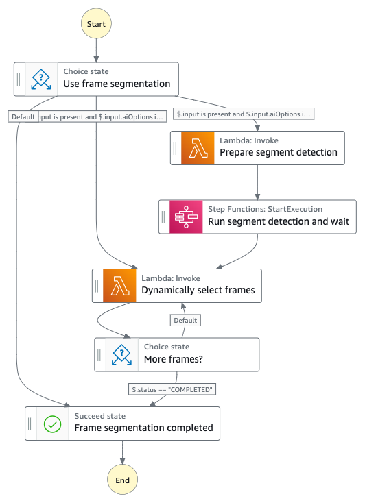
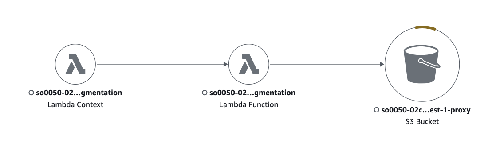

# Dynamic Frame Segmentation State Machine

This state machine is responsible for dynamically segmenting frames from a video using perceptual hash distance, laplacian variant algorithms and optionally Amazon Rekognition Shot Segment.



#### _Execution input_

The state execution input is similar to the [Analysis Main State Machine](../main/README.md#execution-input) with additional fields generated (or modified) by the [Prepare analysis](../main/README.md#state-prepare-analysis) state.

Here is the subset of the input parameters that are relevant to this workflow.

```json
{
  "input": {
    ...
    "destination": {
      "bucket": "[PROXY_BUCKET]",
      "prefix": "[OUTPUT_PREFIX]"
    },
    "aiOptions": {
      "segment": true,
      "framebased": true,
      "frameCaptureMode": 9999,
      ...
    },
  },
}

```

## State Descriptions

#### _State: Use frame segmentation_

This is the starting point of the state machine. It checks the input data to determine if frame segmentation should be performed. The state machine will proceed to the "Prepare segment detection" state if the following conditions are met:

- `$.input` is present
- `$.input.aiOptions` is present
- `$.input.aiOptions.segment` is present and set to `true`
- `$.input.aiOptions.framebased` is present and set to `true`
- `$.input.aiOptions.frameCaptureMode` is present and set to `9999`

If the above conditions are not met, the state machine will proceed to the "Dynamically select frames" state.

#### _State: Prepare segment detection_

This state invokes a Lambda function to prepare the input data for segment detection. It sets the `operation` to `"prepare-segment-detection"`, and passes the `uuid`, `input`, `data`, `status`, and `progress` to the Lambda function.

The state machine then proceeds to the "Run segment detection and wait" state.

#### _State: Run segment detection and wait_

This state invokes another state machine [Video Based Detection State Machine](./README_VIDEO_BASED_WORKFLOW.md#state-start-video-detection-and-wait) synchronously to perform the Amazon Rekognition Segment Detection and waits for it to complete.

The output of this state is then passed to the "Dynamically select frames" state.

#### _State: Dynamically select frames_

To explain how the Dynamic Frame Segmentation works, let's review the frame hash output from the [Video Ingest State Machine, Compute perceptual hashes step](../../ingest/video/README.md#state-compute-perceptual-hashes)

```json
[
  {
    "name": "frame.0000001.jpg",
    "frameNo": 24,
    "timestamp": 1001,
    "hash": "cg880000000",
    "laplacian": 309
  },
  ...
]
```

where `hash` is the **Perceptual Hash** value and laplacian is the **Laplacian Variant** value.

_The **Perceptual Hash** a technique used to generate a unique digital fingerprint or signature for an image or other multimedia content, based on its visual characteristics, allowing for efficient comparison and identification of similar or identical content, even if the original has been slightly modified._

_The **Laplacian variant** is an image processing to enhance the detection of edges and other features by emphasizing areas of rapid intensity changes in an image. In other words, it represents the detail level of an image._

The logic to evaluate and select the frames is as follows:
1. Find the largest `laplacian` value from the frames which becomes the starting point of how to choose the next frames.
2. From the starting frame, we "scan" backward and forward to compare the perceptual hash value of the adjacent frames using Hamming distance methold. If a frame is significantly different than the starting frame (> 85%), the frame is "selected". it also becomes the starting frame. The process continues until we evaluate all the frames in both ends.

The frame evaluation process is slightly different when we have `segment` detection enabled and when we don't have `segment` detection enabled.

##### _With Amazon Rekognition Segment_

Since the Amazon Rekognition Segment provides us the frame accurate "shot" event, the frame selection is evaluated in every shot to ensure we always select a frame from every shot.

##### _Without Amazon Rekognition Segment_

When Amazon Rekognition Segment is disabled, we slice the frames into two minutes time, roughtly 120 frames. We then evaluate and select frames within the two minutes time.

The end result of frame selection process serves as a blueprint for the rest of the frame based analysis process. Here is a snippet of the frame segmentation output.

```json
[
  {
    "name": "frame.0000017.jpg",
    "frameNo": 408,
    "timestamp": 17017,
    "hash": "cP0416xMe20",
    "laplacian": 7,
    "shotIdx": 1
  },
  {
    "name": "frame.0000026.jpg",
    "frameNo": 623,
    "timestamp": 25984,
    "hash": "c0$qs0vYc0_",
    "laplacian": 30,
    "shotIdx": 3
  },
  ...
]

```

The frame selection output, [framesegmentation.json](#metadata-location) is stored to the Amazon S3 bucket (PROXY_BUCKET).

The state machine then proceeds to the "More frames?" state.

#### _State: More frames?_

This is a choice state that checks the `status` of the frame selection process. If the `status` is `"COMPLETED"`, the state machine proceeds to the "Frame segmentation completed" state. Otherwise, it goes back to the "Dynamically select frames" state.

#### _State: Frame segmentation completed_

This is a terminal state that indicates the successful completion of the frame segmentation process.

#### _Metadata location_

|Output|Location|
|:--|:--|
|Frame Segmentation JSON|s3://[PROXY_BUCKET]/[UUID]/[FILENAME]/transcode/frameCapture/framesegmentation.json|


## IAM Role Policy

### _AnalysisVideoFrameSegmentationLambda (analysis-video-frame-segmentation)_

The lambda function is identical to the AnalysiVideoLambda fnction with a different Memory Size settings. Refer to [Video Analysis State Machine lambda function](./README.md#aws-lambda-function-analysis-video).

The IAM Role policy is also identical to [Video Analysis State Machine IAM Role Policy](./README.md#iam-role-policy)


## X-Ray Trace

You can use AWS X-Ray to trace the execution of the state machine and its Lambda functions. This will help you understand the performance and identify any issues in the workflow.



## Related Topics

- [Video Analysis State Machine](./README.md)
- [Video Based Detection State Machine](./README_VIDEO_BASED_WORKFLOW.md)
- [Frame Based Detection State Machine](./README_FRAME_BASED_WORKFLOW.md)
- [Custom Model Detection State Machine](./README_CUSTOM_MODEL_DETECTION.md)

__

Back to [Main State Machine](../../README.md) | Back to [Table of contents](../../../../README.md#table-of-contents)