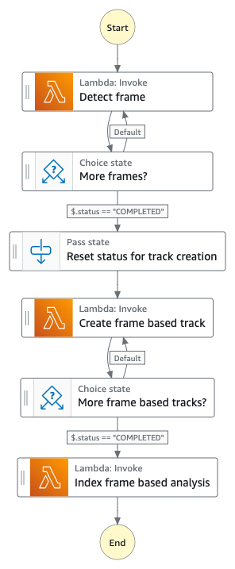

# Frame Based Detection State Machine

The "Frame Based Detection workflow" is executed only when the `framebased` flag is set to `true` and the `frameCaptureMode` is greater than 0.

The Frame Based Detection State Machine orchestrates the workflow to analyze the frame images extracted from the video file by using the Amazon Rekognition Image APIs instead of the Video APIs. This workflow is designed to work with the following Image APIs:

- [RecognizeCelebrities](https://docs.aws.amazon.com/rekognition/latest/APIReference/API_RecognizeCelebrities.html)
- [SearchFacesByImage](https://docs.aws.amazon.com/rekognition/latest/APIReference/API_SearchFacesByImage.html)
- [IndexFaces](https://docs.aws.amazon.com/rekognition/latest/APIReference/API_IndexFaces.html)
- [DetectFaces](https://docs.aws.amazon.com/rekognition/latest/APIReference/API_DetectFaces.html)
- [DetectLabels](https://docs.aws.amazon.com/rekognition/latest/APIReference/API_DetectLabels.html)
- [DetectModerationLabels](https://docs.aws.amazon.com/rekognition/latest/APIReference/API_DetectModerationLabels.html)
- [DetectCustomLabels](https://docs.aws.amazon.com/rekognition/latest/APIReference/API_DetectCustomLabels.html)
- [DetectText](https://docs.aws.amazon.com/rekognition/latest/APIReference/API_DetectText.html)

The "Auto Face Indexer" feature is discussed in [Appendix A: Behind the Auto Face Indexer feature](#appendix-a-behind-the-auto-face-indexer-feature).



#### _Execution input_

The execution input for the Frame Based Detection State Machine is provided in the code block below.

```json
{
  "operation": "detect-frame-iterator",
  "status": "NOT_STARTED",
  "progress": 0,
  "uuid": "[UUID]",
  "data": {
    "[REKOGNITION_ANALYSIS_TYPE]": {
      "bucket": "[PROXY_BUCKET]",
      "prefix": "[PREFIX_OUTPUT]",
      "key": "[MP4_VIDEO]",
      "duration": 60019,
      "frameCaptureMode": 9999,
      "framerate": 23.976,
      "requestTime": 1711734442768,
      "minConfidence": 80,
      "frameCapture": {
        "prefix": "[FRAME_CAPTURE_OUTPUT_PREFIX]",
        "numFrames": 61,
        "numerator": 1,
        "denominator": 1
      },
      "sampling": 1000,
      "cursor": 0,
      "numOutputs": 0
    },
    "framesegmentation": {
      "startTime": 1711734475884,
      "endTime": 1711734476126,
      "key": "[FRAME_SEGMENTATION_JSON]",
      "framesExtracted": 61,
      "framesAnalyzed": 12
    },
    "autofaceindexer": {}
  }
}
```

where "REKOGNITION_ANALYSIS_TYPE" is one of the followings: `celeb`, `face`, `facematch`, `label`, `moderation`, or `text`.

The execution input can include `framesegmentation` options when "Dynamic Frame Analysis" feature is enabled.

## State Descriptions

#### _State: Detect frame_

The lambda function iterates the frame images stored in the `frameCapture.prefix` location. It then uses one of the Amazon Rekognition Image APIs to analyze the frame image (one frame at a time) depending on the "REKOGNITION_ANALYSIS_TYPE" value. This step continues until all the frame images have been processed.

##### _With Auto Face Indexer feature_

Auto Face Indexer feature runs slightly different and is discussed in more details in [Appendix A: Behind the Auto Face Indexer feature](#appendix-a-behind-the-auto-face-indexer-feature).

##### _With Dynamic Frame Analysis feature_

_When "Dynamic Frame Analysis" feature is enabled, the lambda function use the selected frames from the "FRAME_SEGMENTATION_JSON" instead of iterating the frame images over the `frameCapture.prefix` location._


#### _State: More frames?_

A Choice state checks the `$.status` flag. If it is set to "COMPLETED", the workflow continues to the next step, "Reset status for track creation". Otherwise, the workflow transitions back to the "Detect frame" state to continue analyzing the remaining frame images.

#### _State: Reset status for track creation_

A Pass state resets the `$.operation` and `$.status` before it executes the next step, "Create frame based track".

#### _State: Create frame based track_

This state is responsible for creating video detection tracks based on the analysis results from the "Detect frame" state. Refer to the [State: Create video detection tracks of the Video Based Detection State Machine](./README_VIDEO_BASED_WORKFLOW.md#state-create-video-detection-tracks) for more details.

#### _State: More frame based track?_

This state checks if there are more video detection tracks to be created. Refer to the [State: More tracks? of the Video Based Detection State Machine](./README_VIDEO_BASED_WORKFLOW.md#state-more-tracks) for more details.

#### _State: Index frame based analysis_

This state is responsible for indexing the video detection results. Refer to the [State: Index video detection results of the Video Based Detection State Machine](./README_VIDEO_BASED_WORKFLOW.md#state-index-video-detection-results) for more details.

## Metadata location

The metadata outputs are discussed in the [Video Analysis Metadata location](./README.md#metadata-location).

## AWS Lambda function (analysis-video)

Refer to the [Video Analysis State Machine lambda function](./README.md#aws-lambda-function-analysis-video) section.

## IAM Role Policy

Refer to the [Video Analysis State Machine IAM Role Policy](./README.md#iam-role-policy) section.

## X-Ray Trace

Refer to the [Video Analysis State Machine X-Ray trace](./README.md#x-ray-trace) section.


## Appendix A: Behind the Auto Face Indexer feature

The "Auto Face Indexer" feature is discussed in this section, which explains the automatic registration of new faces and the late binding face tagging process.

When you would like to find "people" who are not recognized by Amazon Rekogintion Celebrity detection (such as locally famous celebrity, local politician, or college sport players) in your archive library, typically you are required to manually index the faces of the people you would like to recognize to your face collection before you start analyzing your video files. In other words, there is a time consuming preprocessing step to create your face collection before it can be used.

The Auto Face Indexer feature proactively identifies new faces from your media files and registers them to an Amazon Rekognition Face Collection that you own. Without re-analyzing the video content, this feature uses a "late binding" technique that allows you to tag the names after the fact and automatically propagate the "names" in your archive library.

The Auto Face Indexer feature requires the following criteria:
- Auto Face Indexer, `autofaceindexer` is enabled
- Celebrity detection, `celeb` is enabled
- Face Match detection, `facematch` is enabled and a valid Amazon Rekognition Face Collection, `faceCollectionId`
- Frame based analysis, `framebased` is enabled and `frameCaptureMode` is not `0`

The execution input should include:

```json
{
  ...
  "data": {
    "celeb": {...},
    "facematch": {...},
    "autofaceindexer": {
      // OPTIONAL fine tuning settings
      "filterSettings": {
        "minFaceW": 58,
        "minFaceH": 58,
        "minBrightness": 26,
        "minSharpness": 10,
        "maxPitch": 23,
        "maxRoll": 23,
        "maxYaw": 23,
        "minCelebConfidence": 99.5
      }
    },
  }
}

```

The Auto Face Indexer feature consists of two phases:
- Automatic registering new faces in the analysis process
- Late binding face tagging

#### _Automatic registering new faces_

Behind the scene, the lambda function in the [Detect frame state](#state-detect-frame) performs the following steps on the frame image to identify "new" face and register it to the face collection:
1. Run "RecognizeCelebrities" API - the response contains two arrays.
    - **CelebrityFaces** array indicates faces that are recognized by the API
    - **UnrecognizedFaces** array indicates faces in the frame images are not recognized by the API
2. The lambda function examines the CelebrityFaces array and filter "out" faces that have `MatchConfidence` score higher than the `minCelebConfidence`.
3. The lambda function then combines the low confident celebrity faces with the faces identified in "UnrecognizedFaces" array and runs "SearchFacesByImage" API to check if the face is already in the face collection.
4. For faces that are not in the face collection, the lambda function begins to filter out the faces that don't meet the minimum requirements specified in the filterSettings such as minimum face with, height, brightness, sharpness, and etc. The filter settings are explained in [input.aiOptions](../../README.md#inputaioptions).
5. For faces that pass the quality check, the lambda function runs "DetectFaces" API with [FACE_OCCLUDED](https://docs.aws.amazon.com/rekognition/latest/APIReference/API_DetectFaces.html#rekognition-DetectFaces-request-Attributes) atribute enabled to further confirm the faces are not occluded.
6. For the remaining faces, the lambda function runs "IndexFaces" API to index the faces to the face collection. When the faces are indexed successfully, each of the face is given an unique "FaceId". 
7. For each of the indexed face, the lambda function registers the "FaceId" and other face properties to the Amazon DynamoDB, "FACEINDEXER_TABLE". This table enables the late binding logic, discussed below.
8. After the face is registered, it can be identified in the subsequent frame images of the same video (or any other video).


```json
{
  "faceId": "[UNIQUE_FACEID]",
  "ageRange": "63,71",
  "collectionId": "[REKOGNITION_FACE_COLLECTION_ID]",
  "confidence": 100,
  "externalImageId": "...",
  "fullImageKey": "[FRAME_IMAGE]",
  "gender": "Male",
  "key": "FACE_THUMBNAIL_IMAGE",
  "timestamp": 1709221282863,
  "uuid": "[UUID]"
}

```

_Pro Tip: Setting `minCelebConfidence` to 100 enables the lambda function to register all celebrities found by RecognizeCelebrities in the frame image in the face collection you own._


#### _Late binding face tagging_

When the video analysis completes, Media2Cloud provides the web user interface to "tag" the new faces the workflow identified without the need of re-analyzing the video file(s).

The tagging process triggers an update operation to bind the "FaceId" to the new name and update all metadata files that contains the "FaceId" with the name.

## Related topics

- [Analysis Video State Machine](../video/README.md)

__

Back to [Main State Machine](../../README.md) | Back to [Table of contents](../../../../README.md#table-of-contents)