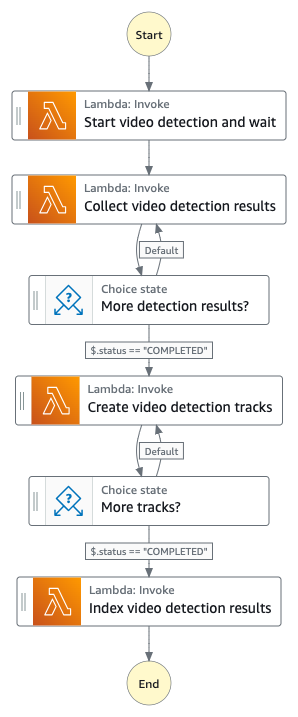

# Video Based Detection State Machine

The Video Based Detection State Machine orchestrates the workflow to analyze the video file with specific Video APIs of the Amazon Rekognition service. This workflow is designed to work with the following Video APIs:

- [StartCelebrityRecognition](https://docs.aws.amazon.com/rekognition/latest/APIReference/API_GetCelebrityRecognition.html)
- [StartContentModeration](https://docs.aws.amazon.com/rekognition/latest/APIReference/API_StartContentModeration.html)
- [StartFaceDetection](https://docs.aws.amazon.com/rekognition/latest/APIReference/API_StartFaceDetection.html)
- [StartFaceSearch](https://docs.aws.amazon.com/rekognition/latest/APIReference/API_StartFaceSearch.html)
- [StartLabelDetection](https://docs.aws.amazon.com/rekognition/latest/APIReference/API_StartLabelDetection.html)
- [StartSegmentDetection](https://docs.aws.amazon.com/rekognition/latest/APIReference/API_StartSegmentDetection.html)
- [StartTextDetection](https://docs.aws.amazon.com/rekognition/latest/APIReference/API_StartTextDetection.html)

To support a large number of concurrent requests, this workflow also leverages the [Service Backlog Management System](../../../layers/service-backlog-lib/README.md) to queue the Rekognition video job request and report back to the state machine when the request has been processed.



#### _Execution input_

The execution input for the Video Based Detection State Machine is provided in the code block below.

```json
{
  "uuid": "[UUID]",
  "operation": "start-detection-iterator",
  "status": "NOT_STARTED",
  "progress": 0,
  "data": {
    "[REKOGNITION_ANALYSIS_TYPE]": {
      "bucket": "[PROXY_BUCKET]",
      "prefix": "[PREFIX_OUTPUT]",
      "key": "[MP4_VIDEO]",
      "duration": 90070,
      "framerate": 29.97,
      "requestTime": 1711719992712,
      "minConfidence": 80,
      "cursor": 0,
      "numOutputs": 0,
      "faceCollectionId": "REKOGNITION_COLLECTION_ID",
      "textROI": [...]
    }
  }
}

```

where "REKOGNITION_ANALYSIS_TYPE" is one of the followings: `celeb`, `face`, `facematch`, `label`, `moderation`, `text`, or `segment`

## State Descriptions

#### _State: Start video detection and wait_

The lambda function creates a job request and sends it to the backlog management system to handle. The backlog management system configures a [NotificationChannel](https://docs.aws.amazon.com/rekognition/latest/APIReference/API_NotificationChannel.html) to allow Amazon Rekognition service to publish the job status through Amazon SNS service. It then submits the job to the Amazon Rekognition service and waits for the SNS notification. When the backlog management system receives a job notification, it sends the task result back to the caller, the state machine execution. The state machine can then resume and execute the next step, "Collect video detection results".

#### _State: Collect video detection results_

The lambda function fetches the responses from the Amazon Rekognition Video using one of the GET APIs depending on the Rekognition detection type.

- [GetCelebrityRecognition](https://docs.aws.amazon.com/rekognition/latest/APIReference/API_GetCelebrityRecognition.html)
- [GetContentModeration](https://docs.aws.amazon.com/rekognition/latest/APIReference/API_GetContentModeration.html)
- [GetFaceDetection](https://docs.aws.amazon.com/rekognition/latest/APIReference/API_GetFaceDetection.html)
- [GetFaceSearch](https://docs.aws.amazon.com/rekognition/latest/APIReference/API_GetFaceSearch.html)
- [GetLabelDetection](https://docs.aws.amazon.com/rekognition/latest/APIReference/API_GetLabelDetection.html)
- [GetSegmentDetection](https://docs.aws.amazon.com/rekognition/latest/APIReference/API_GetSegmentDetection.html)
- [GetTextDetection](https://docs.aws.amazon.com/rekognition/latest/APIReference/API_GetTextDetection.html)

It then stores the original responses in the Amazon S3 bucket (PROXY_BUCKET). Refer to the [Metadata location](./README.md#metadata-location) for more details.

_(Note: When processing a very large video file, the lambda function makes multiple GetXxxDetection calls sequentially to Amazon Rekognition to fetch the responses. This can potentially lead to the lambda function timeouts (in 15 minutes) before it can fetch all the results. To handle that, the lambda function periodically checks the remaining time and quits the execution before it reaches the timeout. It also sets the `$.status` to "PROCESSING" indicating that it has not completed the task and requests to re-enter this "Collect video detection results".)_

#### _State: More detection results?_

A Choice state checks the `$.status` flag. If it is set to "COMPLETED" indicating there are no more response files to be fetched, it continues to the next step, "Create video detection tracks". If it is set to "PROCESSING" indicating there are more response files to be processed, it transitions back to the "Collect video detection results" state to resume the process.

#### _State: Create video detection tracks_

The lambda function parses the original detection response files and consolidates the results to create metadata outputs, timeline metadata, timeseries metadata, WebVTT tracks, and EDL files. Refer to the [Appendix A: Generated timeline metadata output format](./README.md#appendix-a-generated-timeline-metadata-output-format), [Appendix B: Generated timeseries metadata output format](./README.md#appendix-b-generated-timeseries-metadata-output-format), and [Appendix C: Edit Decision List format](./README.md#appendix-c-edit-decision-list-format) for more details.

#### _State: More tracks?_

The Choice state checks the `$.status` flag. If it is set to "COMPLETED" indicating all labels have been processed, it then continues to the next step, "Index video detection results". If it is set to "PROCESSING" indicating there are more labels to be processed, it transitions back to the "Create video detection tracks" state to resume the process.

#### _State: Index video detection results_

The lambda function downloads and parses the timeline metadata output and indexes the detected labels with their start and end times to the Amazon OpenSearch cluster.

## AWS Lambda function (analysis-video)

Refer to the [Video Analysis State Machine lambda function](./README.md#aws-lambda-function-analysis-video) section.

## IAM Role Policy

Refer to the [Video Analysis State Machine IAM Role Policy](./README.md#iam-role-policy) section.

## X-Ray Trace

Refer to the [Video Analysis State Machine X-Ray Trace](./README.md#x-ray-trace) section.

## Related topics

- [Video Analysis State Machine](./README.md)
- [Dynamic Frame Segmentation State Machine](./README_DYNAMIC_FRAME_WORKFLOW.md)
- [Framed Based Detection State Machine](./README_FRAME_BASED_WORKFLOW.md)
- [Custom Model Detection State Machine](./README_CUSTOM_MODEL_WORKFLOW.md)

__

Back to [Main State Machine](../../README.md) | Back to [Table of contents](../../../../README.md#table-of-contents)
