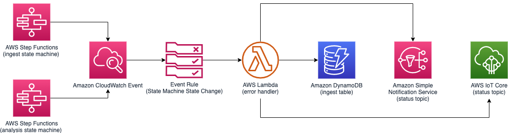
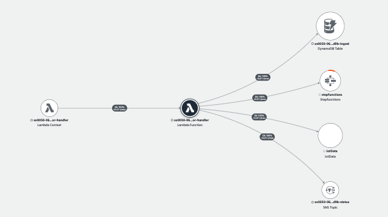

# Main State Machine Error Handling

The error handling of the Main State Machine execution is handled by using an Amazon CloudWatch Event Rule where an AWS Lambda function attaches to.



The event rule is configured to listen to ```Step Functions Execution Status Change``` event with error statuses of ```FAILED```, ```ABORTED```, and ```TIMED_OUT``` of the ingest and analysis state machine executions. It then invokes an AWS Lambda function, error-handler to process the state machine execution error.

__

## Amazon CloudWatch Event Rule Pattern

```json
{
    "detail-type": [
        "Step Functions Execution Status Change"
    ],
    "source": [
        "aws.states"
    ],
    "detail": {
        "stateMachineArn": [
            "<INGEST_STATE_MACHINE_ARN>",
            "<ANALYSIS_STATE_MACHINE_ARN>"
        ],
        "status": [
            "FAILED",
            "ABORTED",
            "TIMED_OUT"
        ]
    },
    "region": [
        "<REGION>"
    ]
}

```

__

## AWS Lambda function (main-error-handler)
The error-handler lambda function parses the execution histories to find the last error from the state machine, updates the status on an Amazon DynamoDB (ingest table), publishes the status to an Amazon Simple Notification Service (a status topic) to notify subscribers, and publishes the status to an AWS Iot Core Pub/Sub Service (a status topic) to notify the frontend web application.

The following AWS XRAY trace diagram illustrates the AWS resources this lambda function communicates to.



__

## IAM Role Permission

```json
{
    "Version": "2012-10-17",
    "Statement": [
        {
            "Action": "states:DescribeStateMachine",
            "Resource": [
                "INGEST_STATE_MACHINE_ARN",
                "ANALYSIS_STATE_MACHINE_ARN"
            ],
            "Effect": "Allow"
        },
        {
            "Action": [
                "states:DescribeExecution",
                "states:GetExecutionHistory"
            ],
            "Resource": [
                "INGEST_STATE_MACHINE_EXECUTIONS",
                "ANALYSIS_STATE_MACHINE_EXECUTIONS"
            ],
            "Effect": "Allow"
        },
        {
            "Action": [
                "dynamodb:Scan",
                "dynamodb:Query",
                "dynamodb:UpdateItem",
                "dynamodb:DeleteItem"
            ],
            "Resource": "INGEST_TABLE",
            "Effect": "Allow"
        },
        {
            "Action": "iot:Publish",
            "Resource": "IOT_STATUS_TOPIC",
            "Effect": "Allow"
        },
        {
            "Action": "sns:Publish",
            "Resource": "SNS_STATUS_TOPIC",
            "Effect": "Allow"
        }
    ]
}
```

__

Back to [Main State Machine](../../README.md) | Back to [Table of contents](../../../../README.md#table-of-contents)
