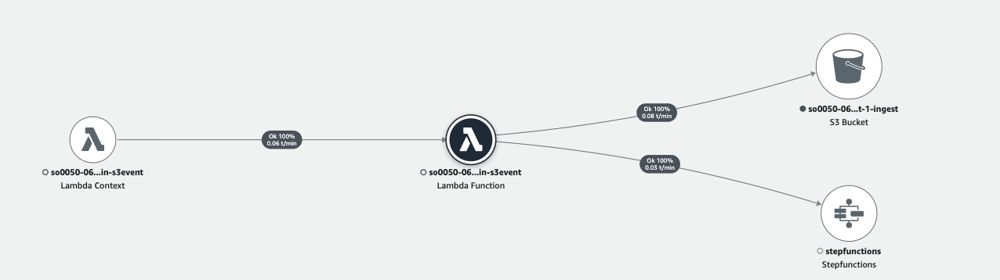

# Amazon S3 Event Notification (Automation)

Media2Cloud guidance allows you to direct upload media files to the Amazon S3 ingest bucket and automatically triggers the ingest and analysis processes.

The guidance configures an Amazon S3 Event Notification of the ingest bucket to invoke an AWS Lambda function (main-s3event) when a new object is created. The lambda function invokes the Main state machine if certain criteria are met.


__

## AWS Lambda function (main-s3event)
The main-s3event lambda function checks the following criteria:
* ```Object size``` must be greater than zero bytes (to filter out folder)
* ```webupload``` object metadata must not be defined. The ```webupload``` metadata, an indicator to differentiate how the media file is uploaded to, is only being set when the media file is uploaded through the guidance web user interface.
* ```Magic number``` and ```mime type``` of the media file must be image, video, audio, or document (to filter out unsupported file type).

If the criteria are met, the lambda function generates an UUID and starts the Main State Machine execution to process the request.

The following AWS XRAY trace diagram illustrates the AWS resources this lambda function communicates to.



__

## IAM Role Permission

```json
{
    "Version": "2012-10-17",
    "Statement": [
        {
            "Action": "s3:GetObject",
            "Resource": "INGEST_BUCKET",
            "Effect": "Allow"
        },
        {
            "Action": [
                "states:DescribeStateMachine",
                "states:StartExecution"
            ],
            "Resource": "MAIN_STATE_MACHINE_EXECUTION",
            "Effect": "Allow"
        }
    ]
}
```
__

Back to [Main State Machine](../../README.md) | Back to [Table of contents](../../../../README.md#table-of-contents)
