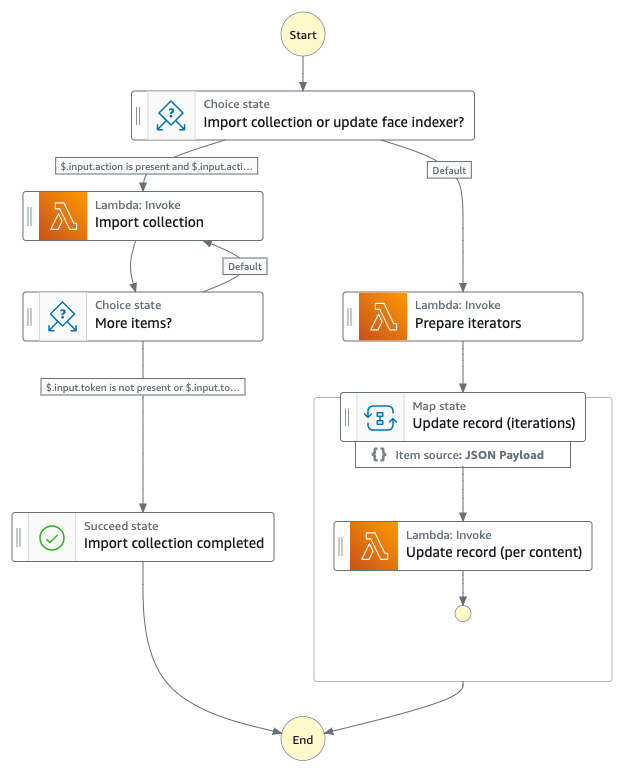
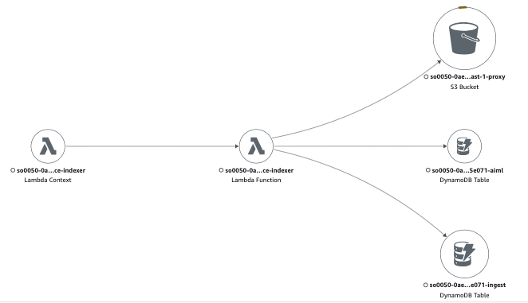

# Update Face Indexer State Machine

This state machine is designed to update the indexed faces in the search engine, database table, and metadata files generated by Media2Cloud.




## _Execution input_

```json
{
    "input": {
        // importing a collection
        "action": "import",
        "token": "...",
        // update or delete faces
        "updated": [
          {
            "faceId": "[UNIQUE_FACEID]",
            "celeb": "[CELEB_NAME]"
          }
        ],
        "deleted": [],
        "prioritizedUuid": "[UUID]"
    }
}
```

## State Descriptions

#### _State: Import collection or update face indexer?_

- This is a choice state that determines whether to import a collection or update the face indexer.

#### _State: Import collection_

The "UpdateFaceIndexerLambda" lambda function imports an existing Amazon Rekognition Face Collection into "Auto Face Indexer" namespace and be managed by "Auto Face Indexer" going forward.

#### _State: More items?_

- This choice state checks if there are more items to process.
- If there are no more items, it transitions to the "Import collection completed" state.
- Otherwise, it transitions back to the "Import collection" state.

#### _State: Import collection completed_

- This is a successful terminal state.

#### _State: Prepare iterators_

The lambda function prepares the update operation by first seaching the Amazon OpenSearch cluster with the FaceIds to get a list of the media files that contains the FaceIds. The metadata outputs of this media files are needed to be updated and then creates the Map iterations to execute the operation in parallel.

The input parameter to the Map iterator is as follows:

```json
{
  "operation": "StateUpdateRecord",
  "itemId": 0,
  "itemData": {
    "uuid": "[UUID]",
    "updated": [
      {
        "faceId": "[FACEID]",
        "celeb": "[CELEB_NAME]"
      }
    ],
    "deleted": []
  }
}
```

#### _State: Update record (iterations)_

The update operation takes places in multiple areas:
- updating the Amazon Rekognition SearchFace original results and the metadata outputs generated by Media2Cloud by either adding the "new" name or marking the name "Deleted"
- updating the Amazon OpenSearch document to reflect the "new" name or deleting the name from the document

Each Map iterator is done in parallel, with a maximum concurrency of 40.

## IAM Role Policy

### _UpdateFaceIndexerLambda_

```json
{
    "Version": "2012-10-17",
    "Statement": [
        {
            "Action": [
                "logs:CreateLogGroup",
                "logs:CreateLogStream",
                "logs:PutLogEvents"
            ],
            "Resource": "[CLOUDWATCH_LOGS]",
            "Effect": "Allow"
        },
        {
            "Action": "s3:ListBucket",
            "Resource": "[PROXY_BUCKET]",
            "Effect": "Allow"
        },
        {
            "Action": [
                "s3:GetObject",
                "s3:PutObject",
                "s3:DeleteObject"
            ],
            "Resource": "[PROXY_BUCKET]",
            "Effect": "Allow"
        },
        {
            "Action": [
                "dynamodb:Scan",
                "dynamodb:Query",
                "dynamodb:UpdateItem",
                "dynamodb:DeleteItem",
                "dynamodb:BatchWriteItem"
            ],
            "Resource": "[AIML_TABLE]",
            "Effect": "Allow"
        },
        {
            "Action": [
                "es:ESHttpGet",
                "es:ESHttpHead",
                "es:ESHttpPost",
                "es:ESHttpPut",
                "es:ESHttpDelete"
            ],
            "Resource": "[OPENSEARCH_DOMAIN]",
            "Effect": "Allow"
        },
        {
            "Action": "aoss:APIAccessAll",
            "Resource": "[OPENSEARCH_SERVERLESS_COLLECTION]",
            "Effect": "Allow"
        },
        {
            "Action": [
                "rekognition:DescribeCollection",
                "rekognition:ListFaces"
            ],
            "Resource": "*",
            "Effect": "Allow"
        }
    ]
}
```

## X-Ray Trace

The state machine executes the `UpdateFaceIndexerLambda` function, and you can use X-Ray to trace the execution of this function. This will help you understand the performance and identify any issues in the workflow.



## Related Topics

- [Video Analysis State Machine](../analysis/video/README.md)

__

Back to [Main State Machine](../README.md) | Back to [Table of contents](../../../README.md#table-of-contents)
