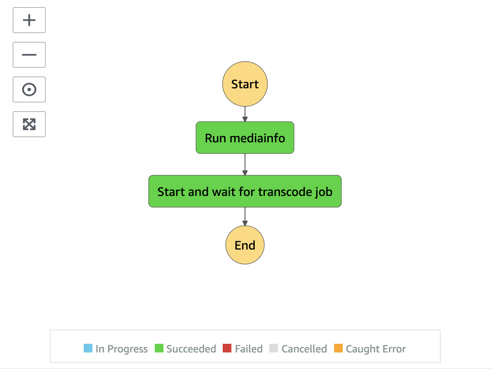

# Audio Ingest State Machine

Audio Ingest state machine uses AWS Elemental MediaConvert to convert the incoming audio file into m4a file.

Please check the details of [the supported input audio codec and container](https://docs.aws.amazon.com/mediaconvert/latest/ug/reference-codecs-containers-input.html#reference-codecs-containers-input-audio).

__

* **Run mediainfo** state extracts media technical metadata from the audio file
* **Start and wait for transcode job** state uses AWS Elemental MediaConvert to convert the input audio into MP4 format. Media2Cloud uses [Amazon CloudWatch Event, MediaConvert Job State Change](https://docs.aws.amazon.com/mediaconvert/latest/ug/mediaconvert_cwe_events.html) to _signal_ back to the state machine execution when a job is completed

__

Back to [Ingest State Machine](../main/README.md) | Back to [README](../../../../README.md)
