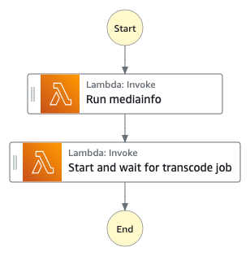
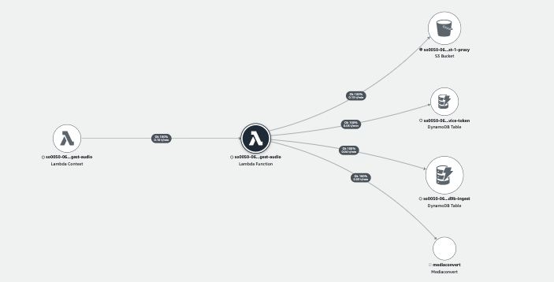

# Ingest Audio State Machine

The Ingest Audio State Machine runs [MediaInfo](https://github.com/MediaArea/MediaInfo) tool to extract technical metadata and uses [AWS Elemental MediaConvert](https://aws.amazon.com/mediaconvert/) service to convert the incoming audio file into M4A format.

Please check the details of [the supported input audio codec and container](https://docs.aws.amazon.com/mediaconvert/latest/ug/reference-codecs-containers-input.html#reference-codecs-containers-input-audio).



__

## Execution input
The state execution input is passed in from the [Ingest Main State Machine](../main/README.md) with a few additional fields where ```input.type``` identifies the type of the media and ```operation```, ```status```, and ```progress``` represent the current state status that are used internally by the ingest-audio lambda function.

```json
{
  "operation": "run-mediainfo",
  "status": "NOT_STARTED",
  "progress": 0,
  "input": {
    "type": "audio",
    ...
  }
}
```

| Field | Description | Required? |
| :-----| :-----------| :---------|
| operation | the state of the execution used to identify which operation to run within the ingest-audio lambda function (use internally) | Mandatory |
| _status_ | current status of the state (use internally) | Optional |
| _progress_ | current progress of the state (use internally) | Optional |
| input.type | must be ```audio``` | Mandatory |
| _input.*_ | Other parameters are pass through from the Ingest Main State Machine | Mandatory |

__

## State: Run mediainfo
A state where a lambda function uses [MediaInfo](https://github.com/MediaArea/MediaInfo) tool to extract technical metadata and cover art of the audio file. It stores the mediainfo metadata in JSON format in the Amazon S3 proxy bucket and updates the ```mediainfo``` field in the Amazon DynamoDB ingest table.

__

## State: Start and wait for transcode job
A state where a lambda function uses [AWS Elemental MediaConvert](https://aws.amazon.com/mediaconvert/) service to create a M4A audio proxy file for Amazon Transcribe processing and for streaming to the web application.

This state is an asynchronous wait state (```arn:aws:states:::lambda:invoke.waitForTaskToken```) that waits for the transcoding job to complete before it exits. The ```waitForTaskToken``` implies that this state waits for an external source to send the task status (using the execution token) back to the state machine execution. It uses [Step Functions Service Integration Pattern](https://docs.aws.amazon.com/step-functions/latest/dg/connect-to-resource.html) which is discussed in [Using State Machine Service Integration with AWS Elemental MediaConvert service](../automation/README.md#state-machine-service-integration).

__

## AWS Lambda function (ingest-audio)
The ingest-audio lambda function provides the implementation to support different states of the Ingest Audio state machine. The following AWS XRAY trace diagram illustrates the AWS resources this lambda function communicates to.



__

## IAM Role Permisssion

```json
{
    "Version": "2012-10-17",
    "Statement": [
        {
            "Action": "s3:ListBucket",
            "Resource": "INGEST_BUCKET",
            "Effect": "Allow"
        },
        {
            "Action": "s3:GetObject",
            "Resource": "INGEST_BUCKET",
            "Effect": "Allow"
        },
        {
            "Action": "s3:ListBucket",
            "Resource": "PROXY_BUCKET",
            "Effect": "Allow"
        },
        {
            "Action": [
                "s3:GetObject",
                "s3:PutObject"
            ],
            "Resource": "PROXY_BUCKET",
            "Effect": "Allow"
        },
        {
            "Action": [
                "mediaConvert:CreateJob",
                "mediaConvert:GetJob"
            ],
            "Resource": "arn:aws:mediaconvert:REGION:ACCOUNTID:*",
            "Effect": "Allow"
        },
        {
            "Action": [
                "iam:GetRole",
                "iam:PassRole"
            ],
            "Resource": "SERVICE_DATA_ACCESS_ROLE",
            "Effect": "Allow"
        },
        {
            "Action": [
                "dynamodb:DescribeTable",
                "dynamodb:Scan",
                "dynamodb:Query",
                "dynamodb:UpdateItem",
                "dynamodb:DeleteItem"
            ],
            "Resource": [
                "INGEST_TABLE",
                "SERVICE_TOKEN_TABLE"
            ],
            "Effect": "Allow"
        }
    ]
}
```
__

## Related topics
* [Using State Machine Service Integration with AWS Elemental MediaConvert service](../automation/README.md#state-machine-service-integration)
* [Handling changes on Ingest Table with Amazon DynamoDB Streams](../automation/README.md#handling-changes-on-ingest-table)

__

Back to [Ingest Main State Machine](../main/README.md) | Back to [Table of contents](../../../../README.md#table-of-contents)
