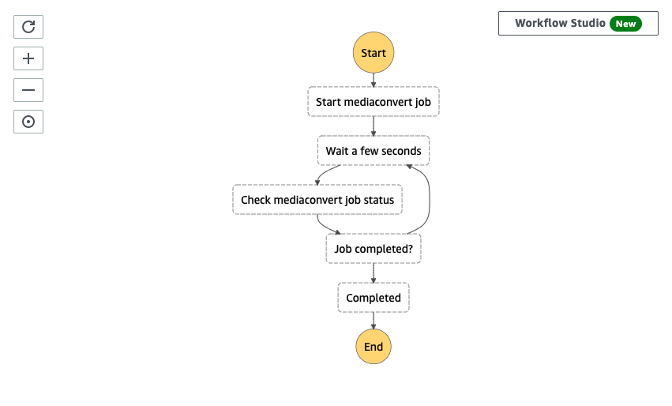
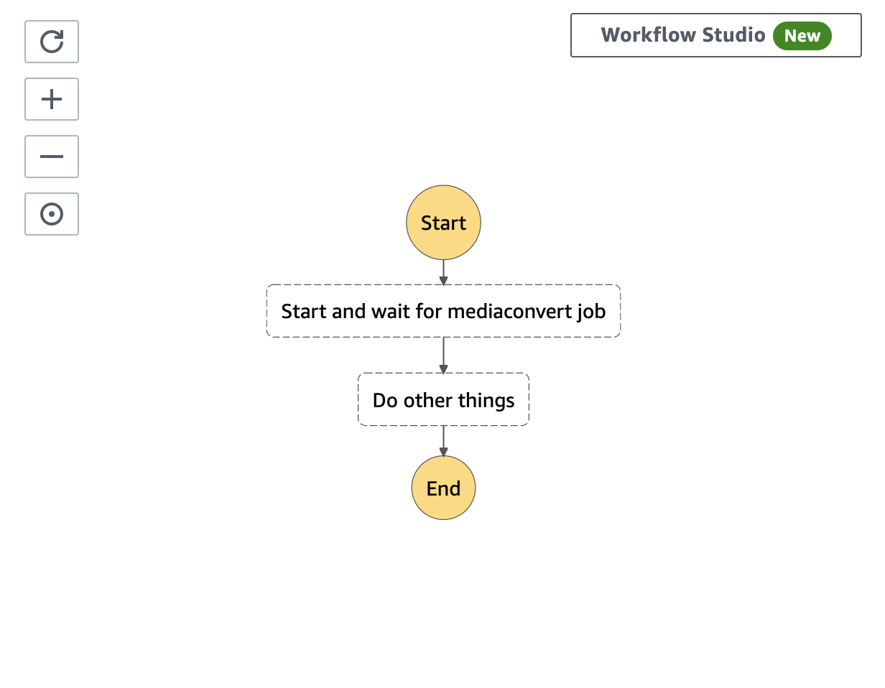
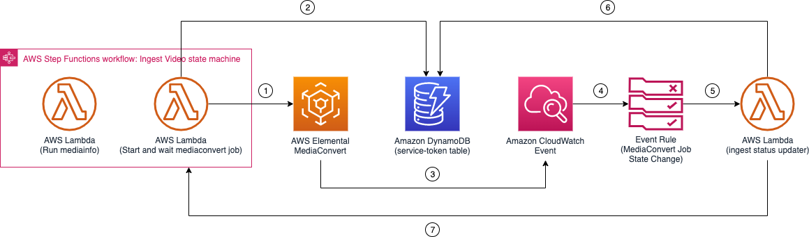
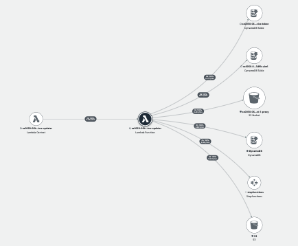

# Ingest Workflow Status Updater

## State Machine Service Integration

Traditionally, when you start a process that takes a long time to finish, a common technique is to use a `for loop` to periodically check the status of the process (polling) and wait for the process to complete, as illustrated in the following diagram.



While polling the status works fine, it is not an optimal approach, as it requires resources to periodically wake up and check the status.

The Media2Cloud solution uses an event-driven (async wait) approach using the [Step Functions Service Integration Pattern](https://docs.aws.amazon.com/step-functions/latest/dg/connect-to-resource.html), where we pause the state machine execution, release the Lambda resource, and wait for an _external signal_ to resume the execution. This technique allows us to optimize the use of resources and simplify the workflow. The following diagram demonstrates an event-driven approach.



This technique is used in both [Ingest Video State Machine](../video/README.md) and [Ingest Audio State Machine](../audio/README.md) workflows, where an asynchronous wait state operation (starting a MediaConvert job) is implemented. In this chapter, we explain how it is accomplished by exploring the service components involved and walking through the connections (wiring) behind the scenes.



### Service components
* An Amazon DynamoDB table (service-token) is used to store a `Job ID` of the transcoding job and a `state machine execution token`, which is used to communicate back to the state machine execution.
* An Amazon CloudWatch Event Rule (mediaconvert-status-change-event) is configured to listen to [MediaConvert Job State Change](https://docs.aws.amazon.com/mediaconvert/latest/ug/mediaconvert_cwe_events.html) events with the status of _COMPLETE_, _CANCELED_, and _ERROR_.
* An AWS Lambda function (ingest-status-updater) is attached to the _mediaconvert-status-change-event_ Event Rule and sends the job result back to the state machine execution.

### Walkthrough

To enable the asynchronous wait state in the state machine, we will first configure the state as follows:
```json
{
  "StartAt": "Run mediainfo",
  "States": {
    "Run mediainfo": {
      ...
      "Next": "Start and wait for mediaconvert job"
    },
    "Start and wait for mediaconvert job": {
      "Type": "Task",
      "Resource": "arn:aws:states:::lambda:invoke.waitForTaskToken",
      "Parameters": {
        "FunctionName": "[INGEST_VIDEO_LAMBDA]",
        "Payload": {
          "token.$": "$$.Task.Token",
          ...
        }
      },
      "End": true
    }
  }
}
```

In the `Start and wait for mediaconvert job` state definition, we specify the _Resource_ to be [arn:aws:states:::lambda:invoke.waitForTaskToken](https://docs.aws.amazon.com/step-functions/latest/dg/connect-to-resource.html#connect-wait-token), which instructs the state machine to wait for a task result to come back before the state should exit. We also set _token.$_ to [$$.Task.Token](https://docs.aws.amazon.com/step-functions/latest/dg/connect-to-resource.html#connect-wait-token) to pass the unique execution token to the Lambda function. The execution token is used to identify the current state machine execution and will be used by an external process to signal back to the current execution.

When the `Start and wait for mediaconvert job` state executes, a Lambda function starts a MediaConvert job by calling the [MediaConvert.CreateJob](https://docs.aws.amazon.com/mediaconvert/latest/apireference/jobs.html#jobspost) API in _Step 1_. The response of the API returns a unique Job ID. The Lambda function then registers the Job ID and the unique state machine execution token to the service-token DynamoDB table in _Step 2_. At this point, the Lambda function exits, and the state machine execution is put in a _Pause_ state, waiting for the task result to come back.

When the MediaConvert job is completed, it emits a [MediaConvert Job State Change](https://docs.aws.amazon.com/mediaconvert/latest/ug/mediaconvert_cwe_events.html) event to Amazon CloudWatch Event in _Step 3_, where our Amazon CloudWatch Event Rule (mediaconvert-status-change-event) invokes the ingest-status-updater Lambda function to process in _Step 4 and 5_.

The ingest-status-updater Lambda function looks up the execution token from the service-token DynamoDB table using the MediaConvert Job ID in _Step 6_. It then calls the [StepFunctions.SendTaskSuccess](https://docs.aws.amazon.com/step-functions/latest/apireference/API_SendTaskSuccess.html) API to notify the state machine execution in _Step 7_.

The state machine execution resumes from the _Pause_ state and continues the rest.

### Handling changes on Ingest table
[DynamoDB Streams](https://docs.aws.amazon.com/amazondynamodb/latest/developerguide/Streams.html) captures data changes in an Amazon DynamoDB table, allowing you to react to changes that have been made to a specific table.

The ingest DynamoDB table enables the DynamoDB Stream feature, which allows us to react to changes on the ingest table and enable logics such as cleaning up generated proxies and metadata files when an item has been removed from the table or updating the Amazon OpenSearch indices when certain ingest fields have been modified.

The DynamoDB Stream attaches the ingest-status-updater Lambda function, which implements the actions.

### On item removed event
When an item has been removed from the `ingest` table, the ingest-status-change Lambda function removes proxies and metadata files from the Amazon S3 proxy bucket and deletes documents from the Amazon OpenSearch indices. It also deletes corresponding items from the `aiml` DynamoDB table.

### On item modified event
When the _status_ or _overallStatus_ field is updated in the `ingest` table, the Lambda function updates the document in the Amazon OpenSearch indices to refresh the changes.

### AWS Lambda function (ingest-status-updater)

The ingest-status-updater Lambda function requires permission to access various resources:
- Send task results to `INGEST_VIDEO_STATE_MACHINE` and `INGEST_AUDIO_STATE_MACHINE`
- Get or update status in `SERVICE_TOKEN_TABLE`, `INGEST_TABLE`, `AIML_TABLE`
- Get events from `INGEST_TABLE_DDB_STREAM`
- Access to both Amazon S3 `INGEST_BUCKET` and `PROXY_BUCKET`
- Update changes to `OPENSEARCH_CLUSTER`


#### _IAM Role Policy_

```json
{
    "Version": "2012-10-17",
    "Statement": [
        {
            "Action": [
                "states:SendTaskSuccess",
                "states:SendTaskFailure"
            ],
            "Resource": [
                "[INGEST_VIDEO_STATE_MACHINE]",
                "[INGEST_AUDIO_STATE_MACHINE]"
            ],
            "Effect": "Allow"
        },
        {
            "Action": [
                "dynamodb:Scan",
                "dynamodb:Query",
                "dynamodb:UpdateItem",
                "dynamodb:DeleteItem"
            ],
            "Resource": [
                "[SERVICE_TOKEN_TABLE]",
                "[INGEST_TABLE]",
                "[AIML_TABLE]",
            ],
            "Effect": "Allow"
        },
        {
            "Action": "iot:Publish",
            "Resource": "[IOT_TOPIC]",
            "Effect": "Allow"
        },
        {
            "Action": "sns:Publish",
            "Resource": "[SNS_TOPIC]",
            "Effect": "Allow"
        },
        {
            "Action": [
                "dynamodb:DescribeStream",
                "dynamodb:GetRecords",
                "dynamodb:GetShardIterator",
                "dynamodb:ListStreams"
            ],
            "Resource": "[INGEST_TABLE_DDB_STREAM]",
            "Effect": "Allow"
        },
        {
            "Action": "s3:ListBucket",
            "Resource": "[PROXY_BUCKET]",
            "Effect": "Allow"
        },
        {
            "Action": [
                "s3:GetObject",
                "s3:DeleteObject"
            ],
            "Resource": "[PROXY_BUCKET]",
            "Effect": "Allow"
        },
        {
            "Action": [
                "es:ESHttpGet",
                "es:ESHttpHead",
                "es:ESHttpPost",
                "es:ESHttpPut",
                "es:ESHttpDelete"
            ],
            "Resource": [
                "[OPENSEARCH_CLUSTER]"
            ],
            "Effect": "Allow"
        }
    ]
}
```

#### _X-Ray Trace_

The AWS XRAY trace diagram, shown below, illustrates the AWS services this lambda function communicates to.



__

Back to [Ingest Main State Machine](../main/README.md) | Back to [Table of contents](../../../../README.md#table-of-contents)
