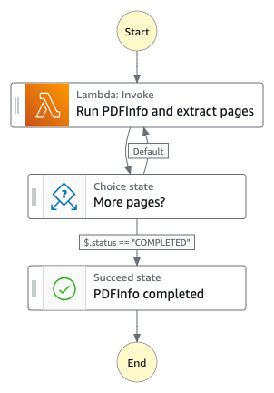
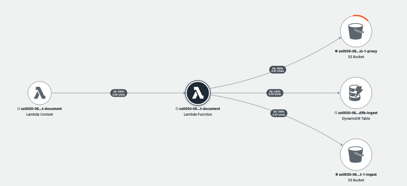

# Ingest DocumentState Machine

The Ingest Document state machine uses third party tools, [Mozillia PDF.JS](https://github.com/mozilla/pdf.js) and [Node Canvas](https://github.com/Automattic/node-canvas) to extract PDF metadata and to convert individual pages into image files.



__

## Run PDFInfo and extract pages
A state where a lambda function uses [Mozillia PDF.JS](https://github.com/mozilla/pdf.js) tool to extract document metadata and pages and uses [Node Canvas](https://github.com/Automattic/node-canvas) to convert pages into PNG images. The document metadata and the PNG proxy images are stored to the Amazon S3 proxy bucket. The lambda function also updates the ```docinfo``` field in the Amazon DynamoDB ingest table.

__

## More pages?
A Choice state to ensure all the pages have been converted by checking _$.status_ flag. If the flag is set to _COMPLETED_, it moves to the next state, ```PDFInfo completed``` state. Otherwise, it transitions back to ```Run PDFInfo and extract pages``` state to continue.

__

## PDFInfo completed
A Succeed state indicated the process completes.

__

## AWS Lambda function (ingest-document)
The ingest-document lambda function provides the implementation to support multiple states of the ingest document state machine. The AWS XRAY trace diagram, shown below, illustrates the AWS services this lambda function communicates to.



__

## IAM Role Permisssion

```json
{
    "Version": "2012-10-17",
    "Statement": [
        {
            "Action": "s3:ListBucket",
            "Resource": "INGEST_BUCKET",
            "Effect": "Allow"
        },
        {
            "Action": "s3:GetObject",
            "Resource": "INGEST_BUCKET",
            "Effect": "Allow"
        },
        {
            "Action": "s3:ListBucket",
            "Resource": "PROXY_BUCKET",
            "Effect": "Allow"
        },
        {
            "Action": [
                "s3:GetObject",
                "s3:PutObject"
            ],
            "Resource": "PROXY_BUCKET",
            "Effect": "Allow"
        },
        {
            "Action": [
                "dynamodb:Scan",
                "dynamodb:Query",
                "dynamodb:UpdateItem",
                "dynamodb:DeleteItem"
            ],
            "Resource": "INGEST_TABLE",
            "Effect": "Allow"
        }
    ]
}
```

__

Back to [Ingest State Machine](../main/README.md) | Back to [Table of contents](../../../../README.md#table-of-contents)
