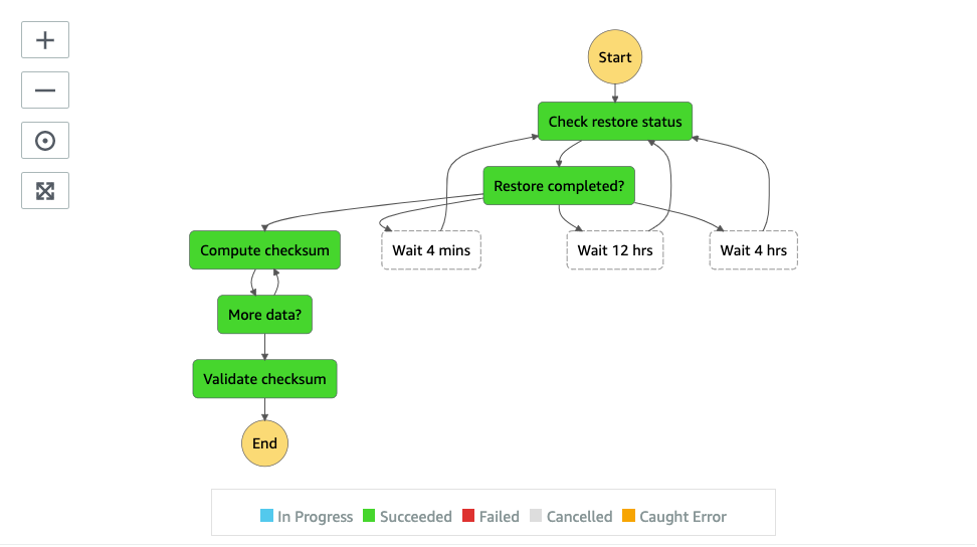
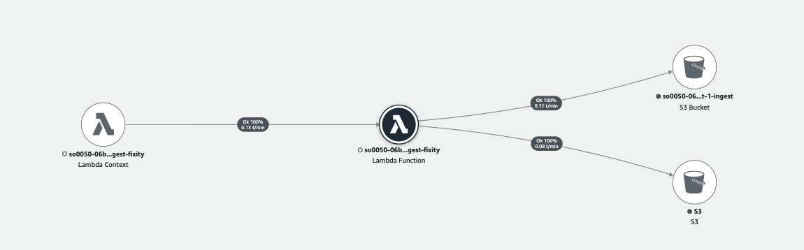

# Ingest Fixity State Machine

The Ingest Fixity State Machine is a sub-state machine that focuses on computing and validating the MD5 checksum of the ingested file. If the file is stored in the "GLACIER" or "DEEP_ARCHIVE" storage class, the state machine temporarily restores the object before the checksum is performed.



#### _State: Check restore status_

The state machine starts with a "Check restore status" Lambda function, which checks the current storage class of the ingested media using the `s3:HeadObject` API. If the media file is in the "STANDARD" storage class, the Lambda function sets the `$.status` to "COMPLETED," indicating the media file is ready for the fixity check process. If the media file is in the "GLACIER" or "DEEP_ARCHIVE" storage class, the Lambda function initiates an object restore process by using the `s3.RestoreObject` API. The Lambda function sets the `$.status` to "PROCESSING," indicating the object is being processed (restored).

#### _State: Restore completed?_

If the restoration is completed (status = "COMPLETED"), the workflow moves to the "Compute checksum" Lambda function, which calculates a checksum for the restored data.

If the restoration is still in progress (status = "PROCESSING"), the workflow enters one of the Wait states: "Wait 4 mins" for 4 minutes, "Wait 12 hrs" for 12 hours, or "Wait 4 hrs" for 4 hours, depending on the storage class the media file is currently in. It then transitions back to the "Check restore status" Lambda function. This loop continues until the restoration is completed.

#### _State: Wait 4 mins, Wait 12 hrs, Wait 4 hrs_

The state machine waits for a specific duration before rechecking the restoration status, depending on the storage class the media file is in.

#### _State: Compute checksum_

A Lambda function calculates a checksum for the media file using `s3.GetObject`. Without downloading the media file locally, the Lambda function uses the byte range feature to fetch 20 GB chunks at a time, computes the incremental MD5 hash value of each chunk, and stores the hash value in `$.checksum.intermediateHash`. This allows the computation to be resumed in the next call. The Lambda function sets `$.status` to "COMPLETED" if the checksum of the entire media file has been calculated, or "PROCESSING" to resume the next computation.

#### _State: More data?_

If the status is "COMPLETED," the workflow proceeds to the "Validate checksum" Lambda function, which validates the computed checksum against an expected value.

#### _State: Validate checksum_

The validation is performed under the following conditions:
1. If an object metadata (`x-amz-metadata-md5`) is specified when the media file is uploaded, the Lambda function validates the computed checksum against the value of the object metadata.
2. If the checksum of the media file has been calculated by Media2Cloud in the past, Media2Cloud stores the computed checksum to the object taggings, named **computed-md5**, along with the last computed date, named **computed-md5-last-modified**. The Lambda function validates the newly computed checksum against this previously computed-md5 value, and updates the computed-md5-last-modified taggings with the current date and time.

Once the "Validate checksum" Lambda function completes, the state machine ends.

### AWS Lambda function (ingest-fixity)

The Ingest-Fixity Lambda function provides the implementation to support the different states of the Ingest Fixity state machine. It requires permission to access media files stored in the Amazon S3 bucket and modify the object taggings of the media file.

#### _IAM Role Policy_

```json
{
  "Version": "2012-10-17",
  "Statement": [
    {
      "Action": [
        "logs:CreateLogGroup",
        "logs:CreateLogStream",
        "logs:PutLogEvents"
      ],
      "Resource": "[CLOUDWATCH_LOGS]",
      "Effect": "Allow"
    },
    {
      "Action": [
        "s3:GetObject",
        "s3:GetObjectTagging",
        "s3:GetObjectVersionTagging",
        "s3:PutObject",
        "s3:PutObjectTagging",
        "s3:PutObjectVersionTagging",
        "s3:RestoreObject"
      ],
      "Resource": "[INGEST_BUCKET]",
      "Effect": "Allow"
    }
  ]
}
```

#### _X-Ray Trace_

The following AWS X-Ray trace diagram demonstrates the AWS services that this Lambda function communicates with.



__

Back to [Ingestion Main State Machine](../main/README.md) | Back to [Table of contents](../../../../README.md#table-of-contents)
