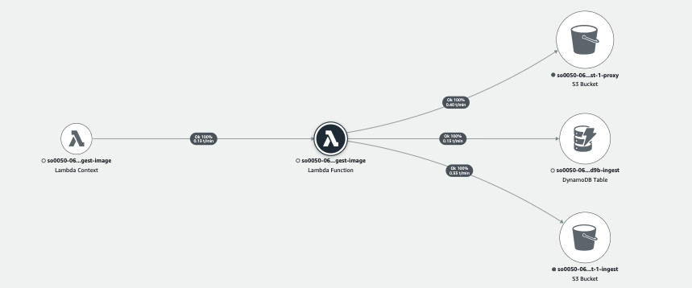

# Ingest Image State Machine

The Ingest Image State Machine is a simple state machine with one state in which it extracts image metadata and create image proxy file.


__

## State: Run imageinfo
A state where a lambda function extracts EXIF information from the image using [ExifTool by Phil Harvey](https://github.com/exiftool/exiftool) and using [JIMP](https://github.com/oliver-moran/jimp) to create JPEG proxy image. The lambda function stores the EXIF metadata and proxy image to the Amazon S3 proxy bucket and updates the ```imageinfo``` field in the Amazon DynamoDB ingest table.

__

## AWS Lambda function (ingest-image)
The ingest-image lambda function provides the implementation to support the Ingest Image state machine. The following AWS XRAY trace diagram illustrates the AWS resources this lambda function communicates to.



__

## IAM Role Permisssion

```json
{
    "Version": "2012-10-17",
    "Statement": [
        {
            "Action": "s3:ListBucket",
            "Resource": "INGEST_BUCKET",
            "Effect": "Allow"
        },
        {
            "Action": "s3:GetObject",
            "Resource": "INGEST_BUCKET",
            "Effect": "Allow"
        },
        {
            "Action": "s3:ListBucket",
            "Resource": "PROXY_BUCKET",
            "Effect": "Allow"
        },
        {
            "Action": [
                "s3:GetObject",
                "s3:PutObject"
            ],
            "Resource": "PROXY_BUCKET",
            "Effect": "Allow"
        },
        {
            "Action": [
                "dynamodb:Scan",
                "dynamodb:Query",
                "dynamodb:UpdateItem",
                "dynamodb:DeleteItem"
            ],
            "Resource": "INGEST_TABLE",
            "Effect": "Allow"
        }
    ]
}
```

__

Back to [Ingest State Machine](../main/README.md) | Back to [Table of contents](../../../../README.md#table-of-contents)
