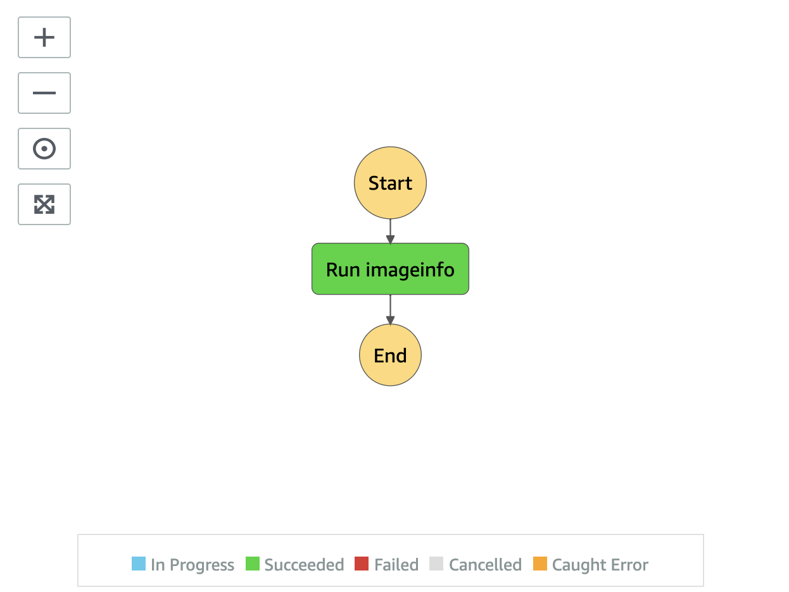

# Image Ingest State Machine

Image Ingest state machine uses third party tools, [ExifTool by Phil Harvey](https://exiftool.org/) and [JIMP](https://github.com/oliver-moran/jimp) to extract metadata from an image.

__

* **Run imageinfo** state extracts image metadata and stores the result to Amazon S3 proxy bucket

__

Back to [Ingest State Machine](../main/README.md) | Back to [README](../../../../README.md)
