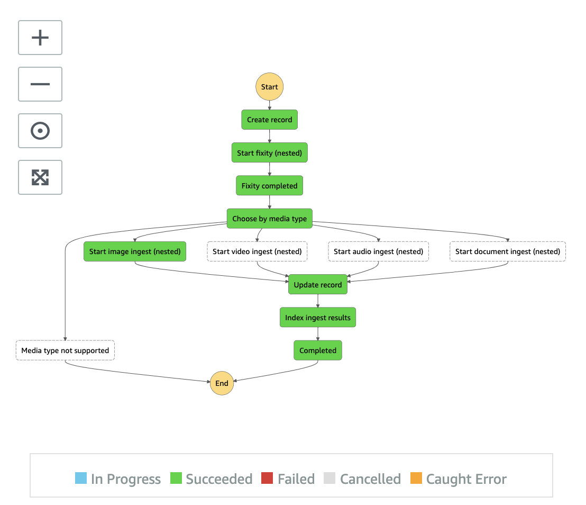

# Ingest State Machine

Ingest state machine is composed of numbers of states where
* **Create record** state registers the asset to an Amazon DynamoDB (ingest) table
* **Start fixity (nested)** state starts yet another nested/child state machine where it restores the file from Glacier or Deep Archive storage if needed and runs the MD5 checksum
* Depending on the asset type, the ingest state machine runs either
  * **Start image ingest (nested)** state where it extracts EXIF info from an image
  * **Start video ingest (nested)** state where it runs MediaInfo and creates MP4 proxy video using AWS Elemental MediaConvert
  * **Start audio ingest (nested)** state where it runs MediaInfo and creates MP4 proxy audoi using AWS Elemental MediaConvert
  * or **Start document ingest (nested)** state where it runs PDFInfo and converts PDF pages into JPEG images
* **Update record** state updates the technical metadata to the DynamoDB (ingest) table
* **Index ingest results** state indexes all information to an Amazon Elasticsearch Service cluster for search purpose

__

Next to [Image Ingest state machine](../image/README.md), [Video Ingest state machine](../video/README.md), [Audio Ingest state machine](../audio/README.md), [Document Ingest state machine](../document/README.md) |
Back to [Main state machine](../../README.md) | Back to [README](../../../../README.md)
