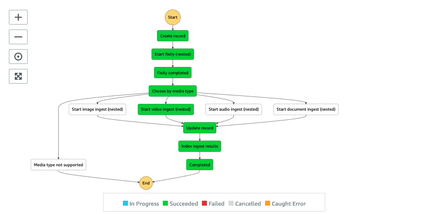
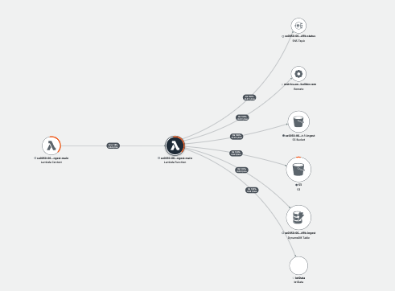

# Ingest Main State Machine

The Ingest Main State Machine manages the ingestion process in which it registers the asset to an Amazon DynamoDB table (ingest table), runs fixity check workflow, runs media type specific ingest workflow to create proxy files, updates the ingestion status, and indexes technical metadata to an Amazon OpenSearch Service.



__

## Execution input
The state machine execution input is a pass through from the [Main State Machine](../README.md).

```json
{
  "input": {
    "uuid": "UUID",
    "bucket": "INGEST_BUCKET",
    "key": "S3_OBJECT_KEY",
    "destination": {
      "bucket": "PROXY_BUCKET",
      "prefix": "PREFIX"
    },
    "group": "GROUP",
    "attributes": {
        "key01": "value01",
        ...
    },
    "aiOptions": {
        "celeb": true,
        "label": false,
        ...
    }
  }
}
```

| Field | Description | Required? |
| :-----| :-----------| :---------|
| input.uuid | Universally unique identifier (Version 4) | Mandatory |
| input.bucket | Ingest bucket where it stores the uploaded media file | Mandatory |
|input.key | Location of the uploaded media file | Mandatory |
| _input.destination.bucket_ | Proxy bucket where it stores generated proxies, thumbnail images, AI/ML metadata JSON files. If not specified, it uses the proxy bucket created by the solution | Optional |
| _input.destination.prefix_ | Location of where to store generated proxies, thumbnail images, AI/ML metadata JSON files. If not specified, it uses the UUID prefix. | Optional |
| _input.group_ | Grouping multiple uploaded media files and store them in the ingest bucket with a top-level prefix of the specified "GROUP" | Optional |
| _input.attributes.*_ | key value pair of additional attributes of the media file, stored as object metadata. | Optional |
| _input.aiOptions.*_ | AI/ML options to run the analysis workflow. If not specified, the solution uses the default AI/ML options specified when the Amazon CloudFormation stack was created | Optional |

__

## State: Create record
A state where a lambda function creates and registers a new item to the Amazon DynamoDB ingest table. Information includes S3 object key of the file and uuid.

__

## State: Start fixity (nested)
Start fixity (nested) is a sub-state machine to perform fixity check. The Fixity State Machine is discussed later.

__

## State: Fixity completed
A state where a lambda function updates the fixity result to the Amazon DynamoDB ingest table.

__

## State: Choose by media type
A Choice state delegates the proxy generation workflow based on the media type of the file. The media type can be image, video, audio, or document.

__

## State: Start image ingest (nested)
A sub-state machine to process image type file. The Ingest Image State Machine is discussed later.

__

## State: Start video ingest (nested)
A sub-state machine to process video type file. The Ingest Video State Machine is discussed later.

__

## State: Start audio ingest (nested)
A sub-state machine to process audio type file. The Ingest Audio State Machine is discussed later.

__

## State: Start document ingest (nested)
A sub-state machine to process document type file. The Ingest Document State Machine is discussed later.

__

## State: Update record
Upon completion of the media type specific state machine execution, a lambda function updates the locations of the technical metadata, proxies, thumbnails to the Amazon DynamoDB ingest table.

__

## State: Index ingest results
A state where a lambda function indexes the ingest metadata to an Amazon OpenSearch index.

__

## State: Completed
A state where a lambda function to update the ingest status to the Ingest table and sends status to an Amazon SNS topic.

__

## State: Media type not supported
A state where the media type is not supported.

__

## AWS Lambda function (ingest-main)
The ingest-main lambda function provides the implementation to support different states of the Ingest Main state machine. The following AWS XRAY trace diagram demonstrates the AWS services this lambda function communicates to.



__

## IAM Role Permission

```json
{
    "Version": "2012-10-17",
    "Statement": [
        {
            "Action": "s3:ListBucket",
            "Resource": "INGEST_BUCKET",
            "Effect": "Allow"
        },
        {
            "Action": [
                "s3:GetObject",
                "s3:GetObjectTagging",
                "s3:GetObjectVersionTagging",
                "s3:PutObjectTagging",
                "s3:PutObjectVersionTagging"
            ],
            "Resource": "INGEST_BUCKET",
            "Effect": "Allow"
        },
        {
            "Action": "s3:ListBucket",
            "Resource": "PROXY_BUCKET",
            "Effect": "Allow"
        },
        {
            "Action": [
                "s3:GetObject",
                "s3:PutObject"
            ],
            "Resource": "PROXY_BUCKET",
            "Effect": "Allow"
        },
        {
            "Action": [
                "dynamodb:DescribeTable",
                "dynamodb:Scan",
                "dynamodb:Query",
                "dynamodb:UpdateItem",
                "dynamodb:DeleteItem"
            ],
            "Resource": "INGEST_TABLE",
            "Effect": "Allow"
        },
        {
            "Action": "iot:Publish",
            "Resource": "IOT_STATUS_TOPIC",
            "Effect": "Allow"
        },
        {
            "Action": [
                "es:ESHttpGet",
                "es:ESHttpHead",
                "es:ESHttpPost",
                "es:ESHttpPut",
                "es:ESHttpDelete"
            ],
            "Resource": "OPENSEARCH_DOMAIN",
            "Effect": "Allow"
        },
        {
            "Action": "sns:Publish",
            "Resource": "SNS_STATUS_TOPIC",
            "Effect": "Allow"
        }
    ]
}

```

__

## Related topics
* [Ingest Fixity State Machine](../fixity/README.md)
* [Ingest Image State Machine](../image/README.md)
* [Ingest Video State Machine](../video/README.md)
* [Ingest Audio State Machine](../audio/README.md)
* [Ingest Document State Machine](../document/README.md)
* Ingest Status Updater
    * [Using State Machine Service Integration with AWS Elemental MediaConvert service](../automation/README.md#state-machine-service-integration)
    * [Handling changes on Ingest Table with Amazon DynamoDB Streams](../automation/README.md#handling-changes-on-ingest-table)


__

Back to [Main State Machine](../../README.md) | Back to [Table of contents](../../../../README.md#table-of-contents)

