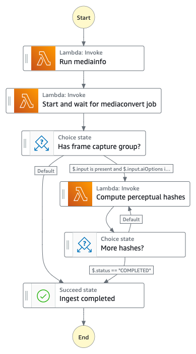
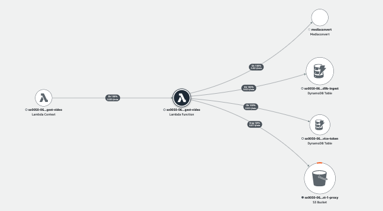

# Ingest Video State Machine

The Ingest Video State Machine runs [MediaInfo](https://github.com/MediaArea/MediaInfo) tool to extract technical metadata and uses [AWS Elemental MediaConvert](https://aws.amazon.com/mediaconvert/) service to convert the incoming video file into MP4 format, create thumbnail images, and optionally extract frames when you specify to use ```frame-based``` analysis or enable [Amazon Rekognition Custom Labels](https://aws.amazon.com/rekognition/custom-labels-features/) models.

Please check the details of [the supported input video codec and container](https://docs.aws.amazon.com/mediaconvert/latest/ug/reference-codecs-containers-input.html#reference-codecs-containers-input-video).



__

## Execution input
The state execution input is passed in from the [Ingest Main State Machine](../main/README.md) with a few additional fields where ```input.type``` identifies the type of the media and ```operation```, ```status```, and ```progress``` represent the current state status that are used internally by the ingest-video lambda function.

```json
{
  "operation": "run-mediainfo",
  "status": "NOT_STARTED",
  "progress": 0,
  "input": {
    "type": "video",
    ...
  }
}
```

| Field | Description | Required? |
| :-----| :-----------| :---------|
| operation | the state of the execution used to identify which operation to run within the ingest-video lambda function (use internally) | Mandatory |
| _status_ | current status of the state (use internally) | Optional |
| _progress_ | current progress of the state (use internally) | Optional |
| input.type | must be ```video``` | Mandatory |
| _input.*_ | Other parameters are pass through from the Ingest Main State Machine | Mandatory |

__

## State: Run mediainfo
A state where a lambda function uses [MediaInfo](https://github.com/MediaArea/MediaInfo) tool to extract technical metadata such as container format, duration, framerate, resolution, video and audio formats. It stores the mediainfo metadata in JSON format in the Amazon S3 proxy bucket and updates the ```mediainfo``` field in the Amazon DynamoDB ingest table.

__

## State: Start and wait for mediaconvert job
A state where a lambda function uses [AWS Elemental MediaConvert](https://aws.amazon.com/mediaconvert/) service to create a MP4 video proxy file, thumbnail images, and frame capture images. The proxies are used for streaming to the web application and also used in the later stage where the analysis workflow uses Amazon Rekognition to process the proxy video and/or images to extract visual metadata.

This state is an asynchronous wait state (```arn:aws:states:::lambda:invoke.waitForTaskToken```) that waits for the mediaconvert job to complete before it exits. The ```waitForTaskToken``` implies that this state waits for an external source to send the task status (using the execution token) back to the state machine execution. It uses [Step Functions Service Integration Pattern](https://docs.aws.amazon.com/step-functions/latest/dg/connect-to-resource.html) which is discussed in [Using State Machine Service Integration with AWS Elemental MediaConvert service](../automation/README.md#state-machine-service-integration).

__

## AWS Lambda function (ingest-video)
The ingest-video lambda function provides the implementation to support different states of the Ingest Video state machine. The following AWS XRAY trace diagram illustrates the AWS resources this lambda function communicates to.



__

## IAM Role Permisssion

```json
{
    "Version": "2012-10-17",
    "Statement": [
        {
            "Action": "s3:ListBucket",
            "Resource": "arn:aws:s3:::so0050-06b5e89d3d9b-255655562678-eu-west-1-ingest",
            "Effect": "Allow"
        },
        {
            "Action": "s3:GetObject",
            "Resource": "INGEST_BUCKET",
            "Effect": "Allow"
        },
        {
            "Action": "s3:ListBucket",
            "Resource": "PROXY_BUCKET",
            "Effect": "Allow"
        },
        {
            "Action": [
                "s3:GetObject",
                "s3:PutObject"
            ],
            "Resource": "PROXY_BUCKET",
            "Effect": "Allow"
        },
        {
            "Action": [
                "mediaConvert:CreateJob",
                "mediaConvert:GetJob"
            ],
            "Resource": "arn:aws:mediaconvert:REGION:ACCOUNT:*",
            "Effect": "Allow"
        },
        {
            "Action": [
                "iam:GetRole",
                "iam:PassRole"
            ],
            "Resource": "SERVICE_DATA_ACCESS_ROLE",
            "Effect": "Allow"
        },
        {
            "Action": [
                "dynamodb:DescribeTable",
                "dynamodb:Scan",
                "dynamodb:Query",
                "dynamodb:UpdateItem",
                "dynamodb:DeleteItem"
            ],
            "Resource": [
                "INGEST_TABLE",
                "SERVICE_TOKEN_TABLE"
            ],
            "Effect": "Allow"
        }
    ]
}
```

__

## Related topics
* [Automation: State Machine Service Integration / DDB Stream Connector](../automation/README.md)

__

Back to [Ingest State Machine](../main/README.md) | Back to [Table of contents](../../../../README.md#table-of-contents)
